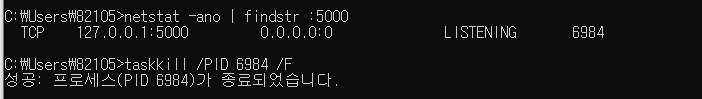

# 2020_04_10 금 / TIL

- #### 4월 8일 피드백

  - 참고링크 : [self 이해하기](https://wikidocs.net/1742), [Class method, static method](https://kwonkyo.tistory.com/243)
  - 메소드 : 클래스 내에 정의된 함수 
  - my = MainClass()		    # 객체 = 클래스이름()
    my.main_function_1()	# 객체.클래스메소드() : 메소드 첫번째 인자는 self 지만 호출 할때는 아무것도 전달하지 않는 이유 : self에 대한 값은 파이썬이 자동으로 넘겨줌 
  - 클래스 내에 정의된 self : 클래스 인스턴스 자체 (주소값 동일)
  - __인스턴스.메서드()__ == __클래스.메서드(인스턴스) __
    - 동일한 표현이지만 전자를 주로 사용
  - static 메소드 (데코레이터로도 표현 가능함)
    - 클래스 안에 있지만 일반 함수와 다를게 없는 메소드
    - 클래스의 인스턴스에서 호출할 수 있다 , self 이용 X

```python
import datetime

class DatetimeDecorator:
    def __init__(self, f):
        self.func = f

    def __call__(self, *args, **kwargs):
        print(datetime.datetime.now())
        self.func(self, *args, **kwargs) # 해결1 : 이 부분에 self 키워드 넣어줌 - 클래스 메소드
        print(datetime.datetime.now())


class MainClass:
    @DatetimeDecorator 
    def main_function_1(self):  		 # 해결2 : 이 부분에 self 키워드 지워줌 - static 메소드
        print("MAIN FUNCTION 1 START")

    @DatetimeDecorator
    def main_function_2(self):
        print("MAIN FUNCTION 2 START")

    @DatetimeDecorator
    def main_function_3(self):
        print("MAIN FUNCTION 3 START")


my = MainClass()		
my.main_function_1()	
my.main_function_2()
my.main_function_3()


```

```
C:\Users\82105\PycharmProjects\Data_Collect_new\venv\Scripts\python.exe C:/Users/82105/PycharmProjects/Data_Collect_new/debugging.py
2020-04-10 09:14:43.330844
MAIN FUNCTION 1 START
2020-04-10 09:14:43.330844
2020-04-10 09:14:43.330844
MAIN FUNCTION 2 START
2020-04-10 09:14:43.330844
2020-04-10 09:14:43.330844
MAIN FUNCTION 3 START
2020-04-10 09:14:43.346465

Process finished with exit code 0

```

***

### Pycharm에서 디버깅 (Window) 

- 참고 영상 : https://www.youtube.com/watch?v=QJtWxm12Eo0&feature=youtu.be

- bp
  - 문제가 발생할 만한 부분이 실행 되기 전 코드를 찍고 하나씩 의도한대로 동작하는지 확인 
  - Ex)
    - Login 페이지에서 버튼을 누르면 post방식으로 submit 버튼이 패킷을 보냄
    - Login 메소드에서 if 문에서 걸림
    - 그 if문이 제대로 걸리는지 확인해보고, 내부 코드도 정상적으로 동작하는지 확인
    - 에러가 난 부분이 post로 request 패킷을 보내고 난 이후에 일어난 일이니 그 부분에 bp를 찍어야함
- bp를 찍었는데 bp가 걸리지 않고 바로 에러가 나와 프로그램이 죽을 떄 
  - IDE의 디버깅 세팅이 잘못되있을 가능성
  - bp 위치가 잘못되어서 bp 위치에 도달하기전에 에러가 발생 가능성 
- Watches
  - "+" 버튼을 눌러서 원하는 변수명이나 식 검색 
- Variables
  - 해당 시점의 로컬 값이 표시 
- Evaluate (Alt + F8)
  1. 특정 변수값에 계산식 결과 볼수 있음 
- Console
  - 변수 입력 : 값나타남 

***

### Window에서 프로세스 확인, 죽이기 

- 웹 어플레케이션 비정상 종료로 인해 검색 해봄 - **localhost 프로세스 종료 검색**

- 참고 링크 : https://lottogame.tistory.com/1131

  1. 관리자 권한 cmd실행

  2. 특정 포트 프로세스 확인

     ```netstat -ano | findstr :포트번호```

  3. 특정 포트 프로세스 죽이기 

     ```taskkill /PID yourPID /F ```



***

### Flask

- Flask가 폼으로 가져온 파일을 읽어내기 위해서는 entype 속성에 반드시 multipart/form-data로 되어야 한다. 

- ##### f = request.files['file']

  - 폼에서 데이터를 가져올 때와 비슷한 방식, request 객체의 'file'이라는 이름의 폼으로 전송된 파일에 해당

- ##### secure_filename(f.filename)

  - 해당 파일명을 보호하기 위한 메소드

- ##### f.save()

  - 해당 파일 객체를 저장하는 메소드, 해당 파일을 포함한 경로를 입력해주면 된다.

  - 파일 경로 변경

    - ```
      f.save("./img/" + secure_filename(f.filename))
      ```