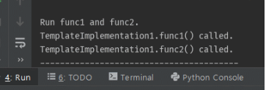

# 2020-04-16 목 / TIL

### side project - tkinter 화면 설계서 작성

### side project - tkinter 진행상황 (10 프레임 중 6프레임 완료)

***

#### tkinter

- grid - 위젯 배치
  - row 행위치 (defalut 0)
  - column 열위치 (default 0)
  - sticky 할당된 공간내에서 위치 조정 (속성 : n, e, s, w, nw, ne, sw, se)

- __다중 Frame 셋팅 이후 메인 첫 이미지 뷰가 안나온 원인 __

  - 프레임 셋팅 이후 Photoimage 처리

  - 하위 위젯들을 해당 첫 프레임에 셋팅

  - window.mainloop() 구문 전에 메인 프레임 이미지 초기화해야함

  - 참고 : [Switch between two frames in tkinter](https://stackoverflow.com/questions/7546050/switch-between-two-frames-in-tkinter)

    ```python
    # 메인 프레임 이미지 초기화
    self.showFrame(self.main_frame)
    ```

- bind - 위젯들의 이벤트와 실행할 함수를 설정할 수 있다.
  - 해당 존(위치)을 클릭하여 화면 프레임 이동하기  
    - 라벨을 이용하여 bind 하려는데 아직 해결 못함


### 디자인 패턴

- 템플릿 메소드 패턴 (Template Method Pattern)
  - 주로 작업단위로 클래스를 생성해서 하위(서브)클래스로 캡슐화 한 후 특정 단계에서 맡은 역할을 수행하게 하는 패턴이라고 볼수있다. 
  - 전체적으로 코드 레이아웃은 동일하게 가져가면서 비슷한 역할을 하는 메소드들의 중복을 최소화 하고 통합하는 작업시 유용하다.


- 4번 라인 : 추상 메소드를 정의하는 상위 클래스
- 26, 34라인 : 추상 메소드를 구현 및 오버라이딩 하는 하위(서브) 클래스
- 45번 라인 : 주석을 해제하면 클래스 관계도 확인
- 46, 52번 라인 : 실행 및 결과 콘솔 출력 
- 

***

### 영단어

- toggle 토글 - 번역기에 정확한 뜻이 안나와있어 검색해봄 

토글이란 하나의 설정 값으로부터 다른 값으로 **전환** 하는 것이다. 토글이라는 용어는 **오직 두 가지 상태밖에는 없는 상황** 에서, 스위치를 한번 누르면 한 값이 되고, 다시 한번 누르면 다른 값으로 변하는 것을 의미한다.