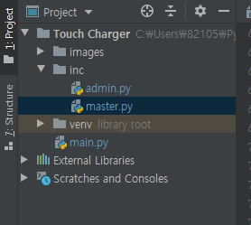

# TIL / 2020-04-17 금 


***

### Q.A

모듈 별로 나누는 중에 어떻게 각각 현재 모듈에서 다른 모듈을 가져와서 변수나 메소드를 쓰려는데 에러 나고 이해가 안되서 질문 드립니다. 메인 프로젝트 디렉토리 구조에서 main.py 모듈말고 inc의 admin.py이나 master.py 모듈에서 main.py의 모듈을 가져오려면 import를 어떤식으로 시켜야 할까요? 

- 현재 디렉토리 구조입니다



```main.py``` 에서 시도한 결과  

- **첫번째 시도**
  - 여기서는 이상 없음 

```python
# 첫번째 시도
from inc import admin
from inc import master

class Application:
    # 전역으로 선언
    admin_class = admin.Admin()
    master_class = master.Master()
    
    # 간단한 예시 코드입니다
    def __init__(self):
        self.admin_class.entry_login = Entry(self.admin_class.frame_login, show="*")
        self.admin_class.entry_login.place(x=387, y=407)
        self.admin_class.btn_login_config = Button(self.admin_class.frame_login, text="확인", width=6,
                                       command=lambda:self.admin_class.adminAuthSuccess(self.admin_class.entry_login.get()))
        self.admin_class.btn_login_config.place(x=540, y=403)
    
if __name__ == '__main__':
    main = Application()
```

- **두번째 시도 **
  - admin_class = admin.Admin()
    AttributeError: partially initialized module 'inc.admin' has no attribute 'Admin' (most likely due to a circular import)
    - 찾아본 사이트 - 에러내용 그대로 검색 
      - https://stackoverflow.com/questions/744373/circular-or-cyclic-imports-in-python
      - https://brunch.co.kr/@princox/209
      - https://thebook.io/007026/xa/02_04/

```python
# 두번째 시도
from inc.admin import Admin
from inc.master import Master

class Application:
    # 전역으로 선언
    admin_class = admin.Admin()
    master_class = master.Master()
    
    # 간단한 예시 코드입니다
    def __init__(self):
        self.admin_class.entry_login = Entry(self.admin_class.frame_login, show="*")
        self.admin_class.entry_login.place(x=387, y=407)
        self.admin_class.btn_login_config = Button(self.admin_class.frame_login, text="확인", width=6,
                                       command=lambda:self.admin_class.adminAuthSuccess(self.admin_class.entry_login.get()))
        self.admin_class.btn_login_config.place(x=540, y=403)
    
if __name__ == '__main__':
    main = Application()
```

***

```admin.py``` 에서 시도한 결과

- __첫번 째 시도__
  - 에러로그
    - 찾아본 사이트
      -  https://qiita.com/VDiUZnM1hUIzKvb/items/4d18ca1d781ed6ff2b2f

```python
# 첫번째 시도
from main import Application

class Admin:
    entry_login = ""
    btn_login_config = ""
    
    def adminAuthSuccess(self, password):
        if password == "12":
            Application.showFrame(Application, self.frame_admin)
        elif password == "ddd":
            Application.showFrame(Application, self.master.frame_master)
        else:
            msg = "잘못된 비밀번호 입니다."
            self.showMsgInfo(msg)
```

```
AttributeError: partially initialized module 'inc.admin' has no attribute 'Admin' (most likely due to a circular import)
```

- __두번째 시도__
  - 에러로그
    - Application.showFrame(self.admin_frame)
      TypeError: showFrame() missing 1 required positional argument: 'frame'
      - 찾아본 사이트 
        - [파이썬 다른 패키지 클래스 호출 검색](https://dojang.io/mod/page/view.php?id=2450)
        - https://wakestand.tistory.com/162
        - https://offbyone.tistory.com/106

```python
# 두번째 시도 
import main

class Admin:
    entry_login = ""
    btn_login_config = ""
    
    def adminAuthSuccess(self, password):
        if password == "12":
            main.showFrame(main, self.frame_admin)
        elif password == "ddd":
            main.showFrame(main, self.master.frame_master)
        else:
            msg = "잘못된 비밀번호 입니다."
            self.showMsgInfo(msg)
```
- __세번째 시도__
  - 에러로그
    -    admin_class = admin.Admin()
      AttributeError: partially initialized module 'inc.admin' has no attribute 'Admin' (most likely due to a circular import)

```python
# 세번째 시도
from .. import main

class Admin:
    entry_login = ""
    btn_login_config = ""
    
    def adminAuthSuccess(self, password):
        if password == "12":
            main.showFrame(main, self.frame_admin)
        elif password == "ddd":
            main.showFrame(main, self.master.frame_master)
        else:
            msg = "잘못된 비밀번호 입니다."
            self.showMsgInfo(msg)
```

- 추가 시도한 부분
  - admin 모듈 이름을 adminclass로 바꿔서 import 모듈명 이름 바꿔주고 실행
  - main 모듈을 inc 패키지에 넣어서 from 문 없애고 실행 