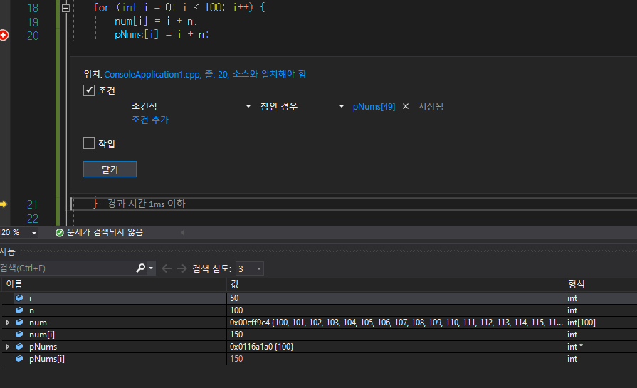

## 2020 04_02 목 / TIL

1. #### 디버깅 고급 page 10~23

   -  프로그램 실행: <Ctrl+F5> 또는 [디버그] > [디버깅하지 않고 시작] 메뉴
      프로그램 디버그: <F5> 키 또는 [디버그] > [디버깅 시작] 메뉴

   - 커서 까지 실행

     - 소스 코드에서 중단점을 설정하지 않고 특정위치 까지 디버깅 할땐 ctrl + F10을 누름

   - 다음에 실행될 문 변경

     - 라인수에 노란 화살표를 드래그 하면 디버깅 코드 범위를 변경 할 수 있다.

     

   - 조사식 창에 변수값 배열 변수 값 확인 -> 디버그 - 창 - 조사식에서 변수이름[위치값]을 입력

   - 조사식 창에서 변수+위치,  알고싶은 인덱스 갯수 입력 

   - 

     

   - 중단점에 조건 넣기 --> ```특수한 상황에서 디버깅 할때 편리 ```

     - 디버깅 할 때 중단점이 설정된 곳에 매번 멈추지 않고 변수값이 변경되거나 변수값이 특정값이 될 때만 멈추기를 원한다면 중단점에 '조건'을 설정하면 된다,
     - 조건은 특정 변수값이 변하거나 특정값이 되는 두 가지 경우에 설정할 수 있다.
     - 조건식 : ```참인 경우``` Ex) num >300
       - num이 300보다 큰 경우에만 중단점 설정에 의해 멈추고 300이하면 멈추지 않게된다.
       - 중단점에 플러스 표시 
     - 조건식 : ```변경된 경우``` Ex) pNums[49]
       - pNums의 50번째 위치 값이 변경된 경우 중단되게 조건을 설정
       - 

     

   - 적중 횟수

     - 반복문에서 디버깅할 때 유용한기능 


***

### 질문

1. QWidget 예제에서 실행을 했는데 keyPressEvent 멤버 함수 구현 부분에서  switch문에 qDebug문은 나오지 않았었습니다 코드가 어떤걸 의미 하는지 잘모르겠습니다. 

   그리고 focusInEvent, focusOutEvent 함수는 실행이 안됬는데 어떤 이벤트 함수인지 잘 모르겠습니다

   - 검색 : qwidget keypressevent
     - https://www.korone.net/bbs/board.php?bo_table=qt_qna&wr_id=19495&sca=QT%2FWin32
     - https://stackoverflow.com/questions/2733668/qwidget-keypressevent-override
     - https://doc.qt.io/qt-5/qfocusevent.html


```c++
#include "widget.h"

Widget::Widget(QWidget *parent)
    : QWidget(parent)
{
    edit = new QLineEdit("", this);
    edit->setGeometry(120, 20, 100, 30); // xpos, ypos, width, height
}

void Widget::paintEvent(QPaintEvent *event)
{
    Q_UNUSED(event); // 에러는 아니지만 신경쓰이는 경우 Q_UNUSED() 매크로를 써서 경고를 발생시키지 않도록 처리
    QString img_full_name;

    QPainter painter(this);

    img_full_name = QString(":resources/browser.png");

    QImage image(img_full_name);
    painter.drawPixmap(50, 20, QPixmap::fromImage(image.scaled(50, 50, Qt::IgnoreAspectRatio, Qt::SmoothTransformation)));
    // QPainter.drawPixmap(xpos, ypos, QPixmap::fromImage()) :
    // QImage.scaled(xpos, ypos, ) : 그림파일의 크기를 바꿔주는 역할
    // IgnoreAspectRatio : 그림 비율 무시
    painter.end();
}

void Widget::resizeEvent(QResizeEvent *event)
{
    Q_UNUSED(event);

    qDebug("[Resize Event call]");
    qDebug("width : %d, height : %d", this->width(), this->height());
}

void Widget::mousePressEvent(QMouseEvent *event)
{
    Q_UNUSED(event);

    qDebug("[Mouse Press] x, y : %d , %d ", event->x(), event->y());
}

void Widget::mouseReleaseEvent(QMouseEvent *event)
{
    Q_UNUSED(event);
    qDebug("[Mouse Release] x, y : %d , %d ", event->x(), event->y());
}

void Widget::mouseDoubleClickEvent(QMouseEvent *event)
{
    Q_UNUSED(event);
    qDebug("[Mouse Double Click] x, y : %d , %d ", event->x(), event->y());
}

void Widget::mouseMoveEvent(QMouseEvent *event)
{
    Q_UNUSED(event);
    qDebug("[Mouse Move] x, y : %d , %d ", event->x(), event->y());
}

void Widget::keyPressEvent(QKeyEvent *event)
{
    Q_UNUSED(event);
    qDebug("Key Press Event.");

    switch(event->key())
    {
        case Qt::Key_A :

            if(event->modifiers())
                qDebug("A");
            else
                qDebug("a");

            qDebug("%x", event->key());
            break;

        default:
            break;
    }
}

void Widget::keyReleaseEvent(QKeyEvent *event)
{
    Q_UNUSED(event);
    qDebug("Key Release Event.");
}

void Widget::focusInEvent(QFocusEvent *event)
{
    Q_UNUSED(event);
    qDebug("focusInEvent Event.");
}

void Widget::focusOutEvent(QFocusEvent *event)
{
    Q_UNUSED(event);
    qDebug("focusOutEvent Event.");
}

Widget::~Widget()
{

}

```


