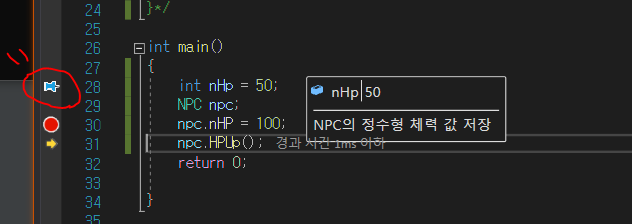
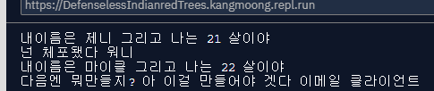
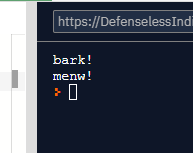

## 2020_04_07 화 / TIL

#### 1. "Pycharm" 디버깅 

- 환경 : Window 10. python3.8

- 참고 링크 : [Pycharm 디버깅기초](https://m.blog.naver.com/passion053/220746046541), [Pycharm Tutorial](https://linuxhint.com/pycharm_debugger_tutorial/)

- 디버깅 모드 : Alt + Shift + F9 / Shift + F9 / 녹색 벌레모양 클릭 / 메뉴  Run - Debug '프로젝트 이름', 

- ```breakpoint``` 찍으면 run을 실행시키거나 디버깅 모드를 꺼버리면 반응X

- break point 찍기 --> ```디버그 모드에서만 작동한다!```
  - 코드 라인 오른쪽 클릭
  - Ctrl + F8 / 메뉴 Run - Toggle Line BreakPoint 클릭
- bp 사용용도 
  - 주로 프로그램 실행도중 변수의 값을 확인하는데 사용
  - 프로그램이 특정 코드 구간을 거쳐가는지 확인하는 용도로 사용
    - Ex) 디버깅 모드로 실행을 했는데도 설정한 bp에서 프로그램이 멈추지 않는다면, 프로그램이 해당 코드를 전혀 실행하지 않았다는 중요한 정보를 얻을 수 있는 것이다. 
- 커맨드라인에서 코드를 실행할 때 인자를 넣어주는 경우 - 디버깅에 앞서 미리 설정을 해주어야 한다.
- Run - Edit Confiogurations 실행 --> Script parameters 에 커맨드 라인에서 아용할 인자를 적어주면 실행인자를 전달할 수 있다. 

***

- 환경 : Linux centos  6.10, python3.6 

- 원격 프로세스 디버깅

  - 참고 링크 : [pycharm 디버깅](https://stackoverflow.com/questions/6989965/how-do-i-start-up-remote-debugging-with-pycharm)

***

### 2.디버깅 교재 (정독 완료)

##### 2-1. 직접 실행 디버깅 

- 직접실행 : 디버그 - 창 - 직접 실행 
- 디버깅 모드에서 변수나 함수에 값을 넣어서 직접 실행 가능하다.
- 직접 실행 창에서 현재 사용 중인 변수값을 변경하면 바로 적용된다는 것을 알 수 있다


예제 소스 1) NPC 

```c++
#include <iostream>
using namespace std;


struct NPC {
    int nHP;

    // 인라인 함수로 지정 
    int HPUp() {
        if (nHP > 100) {
            return 120;
        }
        return nHP + 50;
    }
};

/*int NPC::HPUp() {
    if (nHP > 100) {
        return 120;
    }
    return nHP + 50;
}*/

int main()
{
    int nHp = 50;
    NPC npc;
    npc.nHP = 100;
    return 0;

}
```
- 직접 실행 할때 ```주의할점```
  - NPC 구조체의 멤버 중  int HPUp() 멤버가 인라인으로 되어 있으면 직접 실행으로 HPUp() 멤버를 호출 할 수 없다는 점이다. 

***


##### 2-2. DataTips

- 디버깅할 때 관련된 정보를 볼 수 있는 눈에 잘띄는 곳을 찾는다면 그것은 Visual C++ 내부일 것이다.  그리고 ```메모를 하기에 가장 적합한 기능```이 DataTips이다. 
- 디버깅할 때 DataTips에 필요한 내용을 메모하면 디버깅할 때 참고할 수 있다.
- 이 내용은 디버깅이 끝나도 사라지지 않는다. 
- 디버깅 모드에서 변수에 마우스 커서를 위치시키면 정보가 표시되는데 옆에 고정클립 버튼을 누르면 다음 그림과 같이 메모창이 뜬다. 



- 빨간 표시 부분 : 디버깅 모드 종료 후에도 DataTips 마크 표시확인 할수 있다. 
- 중단점처럼 DataTip도 xml 파일형식으로 가져오거나 내보낼 수 있다. 
  - [메뉴] 디버그 - DataTips 내보내기 / 가져오기 선택


##### 2-3. 실행 중인 프로그램 디버깅

- 버그는 대부분 프로그램을 매번 실행할 때마다 발생하는 버그가 아니라 불특정하게 갑자기 발생하는 버그다.
- 디버그 기능중 '프로세스에 연결' 기능 사용 --> 메뉴 [디버그] - [프로세스에 연결]  :  Ctrl + Alt + P
- 하단에 연결 버튼을 누르면 프로젝트와 실행 중인 프로그램이 서로 연결되면서 디버깅이 실행된다.
- 이 기능은 프로그램의 코드만 가지고 있으면 활용할 수 있는 대단히 유용한 기능이다. 


##### 2-4. 덤프 파일 디버깅

- 프로그램이 실행 중 갑자기 죽어버리는 경우 유용하다. 
- 이를 대비해 프로그램에 어떠한 설정을 하면 갑자기 죽어버릴 때 ```덤프 파일```이라는 것을 남길 수 있다.
- 프로그램이 죽었을 당시의 상황을 파악할 수 있다. (일종의 블랙박스 개념)
- 덤프 파일의 확장자는 ```.dmp``` 이다.
- Visual C++ 9 이후 자체에서 덤프 파일 디버깅 가능해짐 

***

### 3.Python 개념 영상 실습 (수강 완료)

- _repl.it_ --> 바로 코딩할 수 있는 웹 사이트

- 연산자
  
- & : and , | : OR , ^ : XOR , ~ : complement , << / >> : Shift
  - ++ ,-- : python에서 안됨 
  
- 반복문 for  ---> range(반복 횟수)

- while : 무한루프 자주사용 

- continue : 특정 조건일 때 아래 코드 실행 X

- 문자열

  - 단일 인용부호('), 이중 인용부호(") = 동일한 표현 

  - 여러 라인에 걸쳐 있는 문자열 : ''', """

  - 캐스팅 : 형변환 

  - 문자열 포매팅

    - 일정한 포맷에 맞춰 문자열을 조합하는 것을 문자열 포맷팅이라하는데, 문자열 포맷 템플릿 안에 대입값이 들어갈 자리를 지정해 두고 나중에 그 값을 채워 넣는 방식이다. 예를 들어, "답: %s" % "A" 와 같은 표현에서 % 앞 부분은 포맷 템플릿이고, % 뒤는 실제 대입할 값이다. 이때 % 를 포맷팅 연산자 (Formatting Operator)라 부른다. % 앞뒤로 각각 하나의 값만을 받아들이므로 만약 % 뒤의 값이 복수 개이면 튜플로 묶어주어야 한다.

    - ```python
      # Ex)
      print("이름 : %s" % "김유신")
      print("X = %0.3f, Y = %10.2f" % (3.141592, 3.141592))
      ```

  

- str (문자열 클래스)
  
  - 문자열은 내부적으로 **str** 이라는 클래스 타입인데, 파이썬의 문자열은 기본적으로 **유니코드**이고, 한번 설정되면 다시 변경시킬 수 없는 **Immutable 타입**이다.

- List 리스트

  - 숫자, 문자, 문자열 합쳐서 넣기 가능 , 배열의 기능도 있음 

  - ```python
    # 선언
    x = list()
    y = [] # 동일한 표현 
    ```

  - len() : 길이리턴, sorted() : 리스트 정렬, sum() : 리스트합

  - 엘레먼트 위치찾기

    - x.index(리스트 값)

    - print("hello" in y) :True

      print("bye" in y)   : False


- Tuple 튜플

  - ```python
    #선언
    x = tuple()
    x = ()
    ```

  - 튜플과 리스트 차이점

    - assignment(할당) 안됨 --> TypeError: 'set' object does not support item assignment
    - 튜플은 한번 할당한 값을 바꿀수 없다 == immutable (불변)


- Dictionary 딕셔너리

  - ```python
    # 선언
    x = dict()
    x = {}
    ```

  - key, value 로 이루어진 테이블 

  - ```python
    x = {"name":"워니", "age":20,}
    print(x["name"])
    print(x["age"])
    
    x = {
      0:"kang",
      1:"hyunjin",
      "age":27,
    }
    
    print("age" in x)
    
    print(x.keys())   # 모든 키
    print(x.values()) # 모든 값
    
    for key in x:
      print("key : " + str(key))
      print("value " + str(x[key]))
    
    
    # 키, 값을 바꿀수 있다. 
    x[0] = "워니"
    print(x)
    
    x[1] = "한빛"
    print(x)
    
    fruit = ["사과", "사과", "바나나", "바나나", "딸기", "키위", "복숭아", "복숭아", "복숭아"]
    
    d = {}
    
    
    for f in fruit:
      if f in d:  # 사과라는 key가 d 라는 딕셔너리에 들어있나
        d[f] += 1 # 현재 딕셔너리는 아무것도 없다 --> value 값 1증가 
      else:
        d[f] = 1  # 키 값이 있으면 1로 초기화 
    
    print(d)
    
    ```

    

- Class : 빵만들때 빵틀 
- object = instance : 빵틀을 이용해 만들어진 빵

```python
class Person:
  
  def __init__(self, name, age):
    self.name = name
    self.age = age

  def sayHello(self, to_name):
    print("안녕 " + to_name + " 나는 " + self.name)

  def introduce(self):
    print("내이름은 " + self.name + " 그리고 나는 " + str(self.age) + " 살이야")

hyunjin = Person("현진", 20)
jenny = Person("제니", 21)
mich = Person("마이클", 22)

hyunjin.sayHello("철수")
hyunjin.introduce()
jenny.sayHello("영희")
mich.sayHello("미지")
```


- 상속 

```python
class Person:
  
  def __init__(self, name, age):
    self.name = name
    self.age = age

  def sayHello(self, to_name):
    print("안녕 " + to_name + " 나는 " + self.name)

  def introduce(self):
    print("내이름은 " + self.name + " 그리고 나는 " + str(self.age) + " 살이야")


class Police(Person):
  def arrest(self, to_arrest):
    print("넌 체포됐다 " + to_arrest)


class Programmer(Person):
  def program(self, to_program):
    print("다음엔 뭐만들지? 아 이걸 만들어야 겟다 " + to_program)


wonie = Person("워니", 20)
jenny = Police("제니", 21)
mich = Programmer("마이클", 22)

jenny.introduce()
jenny.arrest("워니")

mich.introduce()
mich.program("이메일 클라이언트")

# AttributeError: 'Person' object has no attribute 'arrest'
wonie.arrest("제니")
```




- 패키지 (`라이브러리`라고도 함)
  - 폴더의 이름 
  - 어떤 기능들을 구현하는 모듈들의 합
  - Ex) 날씨정보, 위치정보 


- 모듈
  - 코드들을 잘 모아서 기능하나를 구현해놓은 파일 
  - "코드를 잘정리해서 모듈화한다"
  - 모듈안에는 ```__init__.py``` 파일이 필요하다


main.py

```python
# animal package
# dog, cat modules
# dog, cat modules can say "hi"

from animal import dog # animal 패키지에서 dog 라는 모듈을 갖고와줘
from animal import cat # animal 패키지에서 cat 라는 모듈을 갖고와줘

from animal import * # animal 패키지가 갖고있는 모듈을 다 불러와 

d = dog.Dog()
d.hi()
c = cat.Cat()
c.hi()


```


```__init__.py```

```python
from .cat import Cat # "이 폴더에 있는" cat.py 라는 파일에서 Cat이라는 클래스를 가져와줘
from .dog import Dog # "이 폴더에 있는" dog.py 라는 파일에서 Dog이라는 클래스를 가져와줘

```

cat.py

```python
class Cat:
  def hi(self):
    print("menw!")
```

dog.py

```python
class Dog:
  def hi(self):
    print("bark!")
```



- geopy 모듈 사용 

```python
from geopy.geocoders import Nominatim

geolocator = Nominatim(user_agent="wonie")
location = geolocator.geocode("Gwangju, South Korea")
print(location.latitude)
```


- 모듈 실습 : 코드 써서 핸드폰에 문자 보내기

  - 라이브러리, API(우리같은 개발자(서비스 제공자)들이 코드를 통해서 데이터를 가져갈수 있도록 만들어 놓은 길)
  - 우리가 필요한 기능을 API에서 가져다가 써서 구현가능하다. 
  - twilio사이트 = 보낼 번호 **+12017404433**
  - AC4561d092d337d0713a14cb8365eb45b0
  - a472deae4cdbe2c1e632fe376e0a3276

  ```python
  # +12017404433
  # AC4561d092d337d0713a14cb8365eb45b0
  # a472deae4cdbe2c1e632fe376e0a3276
  
  from twilio.rest import Client
  
  
  # Your Account Sid and Auth Token from twilio.com/console
  # DANGER! This is insecure. See http://twil.io/secure
  account_sid = 'AC4561d092d337d0713a14cb8365eb45b0'
  auth_token = 'a472deae4cdbe2c1e632fe376e0a3276'
  client = Client(account_sid, auth_token)
  
  message = client.messages \
                  .create(
                       body="hyunjin messaged",
                       from_='+12017404433',
                       to='+821066106015'
                   )
  
  print(message.sid)
  ```

***

### 검색 키워드 

- 함수
  - 반복작업의 코드들을 축약 시켜놓고 정의 해논것
  - 과일, 믹서기가 있는데 과일을 믹서기에 넣으면 과일주스가 되는 것처럼 여기서 믹서기가 '함수'의 기능을 수행한다 라고 말할 수 있다. 
- 매개변수
  - 함수에 입력으로 전달된 값을 받는 변수 
- 인수
  - 함수를 호출할 때 전달하는 입력값

- 가변인자

  - 입력 값이 몇개가 될지 모를때 --> *매개변수

    - ```python
      def add_many(*args):
          result = 0
          for i in args:
              result += i
          return result
      
      print(add_many(1,2))
      print(add_many(1,2,3))
      print(add_many(1,2,3,4,5,6,7,8,9))
      
      # result
      # 3 6 45
      ```

- 키워드 가변인자 kwargs

  - ```**kwargs``` 처럼 매개변수 이름앞에 **을 붙이면 매개변수 kwargs는 딕셔너리가 되고 모든 key=value 형태의 결과값이 딕셔너리에 저장된다.

  ```python
  def print_kwargs(**kwargs):
      print(kwargs)
  
  print_kwargs(a=1)
  print_kwargs(name='foo', age=3)
  
  # result
  # {'a': 1}
  # {'name': 'foo', 'age': 3}
  ```

  

(파이썬 함수 검색 - https://wikidocs.net/24) 