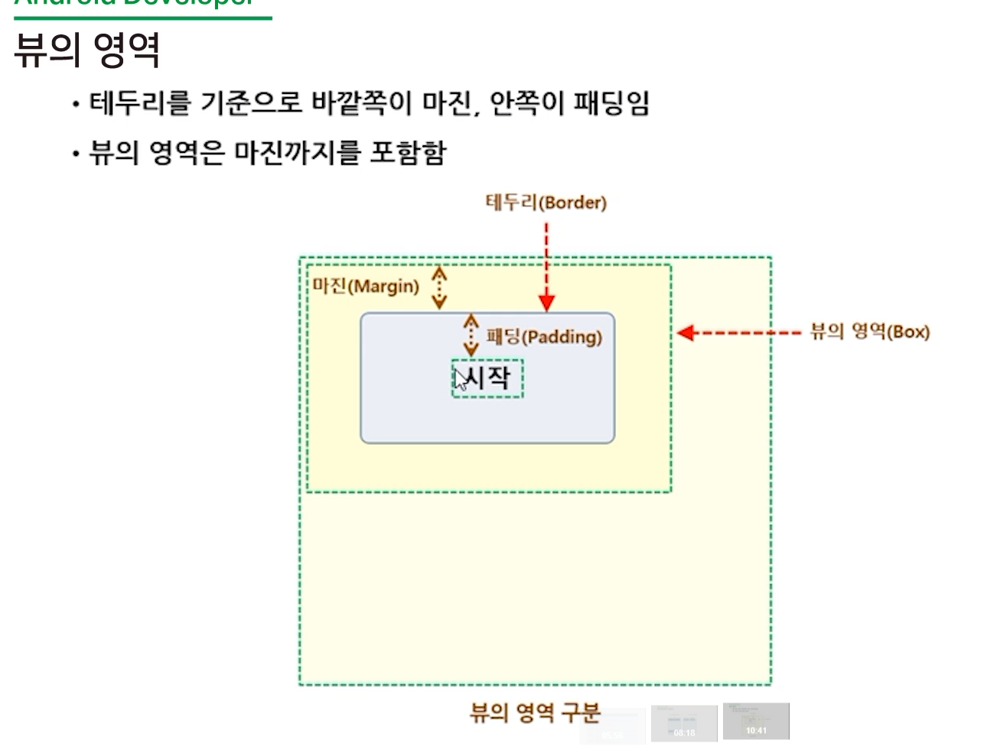

## Android Layout 

#### **ConstraintLayout**  : 제약 레이아웃

- **Button**
  - 가운데 동그란점  :  margin
  - 모서리 점 : handle
    - 위젯의 크기를 결정 
- 자석 아이콘
  - 연결선 만들어주는 역할 
  - 왼쪽벽, 오른쪽 벽 둘다 붙이면 가운데로옴 - 자석역할 그대로 

- bias 바이어스
  - 위치 옴김 좌표 
- id 
  - 자동 입력값 
  - 고유한 값으로 입력되어야 함 
  - = fx_id : lbl_top_start
- **guideline**
  - 정렬 가능 

- android : 기본속성 
- app : 직접만든 속성 , 외부 라이브러리 

#### LinearLayout : 리니어 레이아웃

- All Attributes
  - **gravity** : 위젯의 내용물 정렬 (원래 뜻 중력)
  - **layout_gravity** : 위젯 위치 정렬 
  - **layout_margin** : 
  - **Padding**
  - **layout_weight**

- 이미지 저장
  - res/drawable