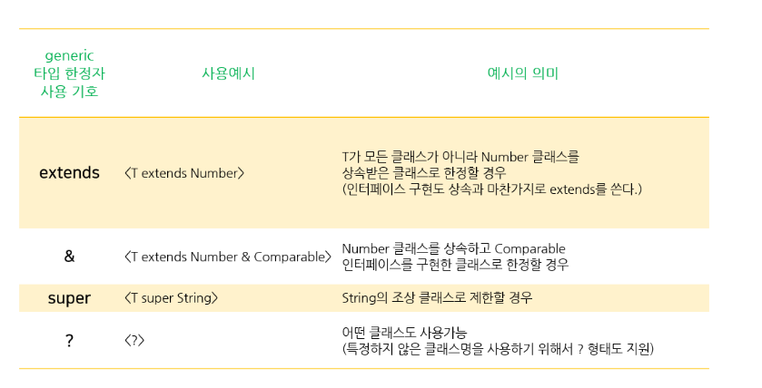

# [2020-07-08 수 TIL]

### Java Collections

- https://developer-ek.tistory.com/17

[11-1] 다음은 정수집합 1, 2, 3, 4와 3, 4, 5, 6의 교집합, 차집합, 합집합을 구하는 코드이다. 코드를 완성하여 실행결과와 같은 결과를 출력하시오. ([Hint] ArrayList클래스의 addAll( ), removeAll( ), retainALL( )을 사용하라.)

```java
[실행결과]
list1=[1, 2, 3, 4]
list2=[3, 4, 5, 6]
kyo=[3, 4]
cha=[1, 2]
hap=[1, 2, 3, 4, 5, 6]
    
ArrayList list1 = new ArrayList();
ArrayList list2 = new ArrayList();
ArrayList kyo = new ArrayList(); // 교집합
ArrayList cha = new ArrayList(); // 차집합
ArrayList hap = new ArrayList(); // 합집합


list1.add(1);
list1.add(2);
list1.add(3);
list1.add(4);

list2.add(3);
list2.add(4);
list2.add(5);
list2.add(6);

kyo.addAll(list1);    // 모든요소 삽입
kyo.retainAll(list2); // list2에 공통된 것만 남기고 나머지 삭제  

cha.addAll(list1);
cha.removeAll(list2); // list2에 공통된 것들 삭제 

hap.addAll(cha);
hap.addAll(list2);

System.out.println("list1=" + list1);
System.out.println("list2=" + list2);
System.out.println("kyo=" + kyo);
System.out.println("cha=" + cha);
System.out.println("hap=" + hap);


Collections.reverse(list1); // 내림차순
System.out.println("list1=" + list1);

list1.remove(3); // 해당 인덱스 제거 
System.out.println("list1=" + list1);

System.out.println(list1.size());

System.out.println(list1.get(0));
System.out.println(list1.get(1));
System.out.println(list1.get(2)); // 해당 인덱스 값 반환 
		
```


### Iterator

- Collection 의 자손인 List, Set 포함되어있다 
- 반복문을 사용하여 요소들을 읽어올수 있음 
- **재사용이 안되므로 다시 얻어와야 한다** 
- **boolean hasNext()**
  -  읽어올 요소가 남아있는지 확인
  -  있으면 true, 없으면 false

- **Object next()**

  -  다음 요소를 읽어온다 

  - next()를 호출하기 전에 hasNext()를 호출해서 읽어올 요소가 있는지 확인하는 것이 안전하다 

  - 반복문 내에서 요소 출력 하려면 

    - ```java
      Object obj = it.next();
      System.out.println(obj);
      ```

- **void remove()**

  - : next() 로 읽어온 요소를 삭제한다 
  - next()를 호출한 다음에 remove()를 호출해야한다 (선택적 기능 )

```java
ArrayList origin = new ArrayList(10);
ArrayList copy1 = new ArrayList(10);
ArrayList copy2 = new ArrayList(10);

for(int i=0; i<10; i++) {
    origin.add(i+"");
}

Iterator it = origin.iterator();

while(it.hasNext()) {
    copy1.add(it.next());
}

System.out.println("origin : " + origin);
System.out.println("copy1 : " + copy1);
System.out.println("copy2 : " + copy2);

it = origin.iterator(); // 재사용이 안되므로 다시 요소를 얻어와야함 

while(it.hasNext()) {
    copy2.add(it.next());
    it.remove(); // origin 요소제거 
}

System.out.println("origin : " + origin);
System.out.println("copy1 : " + copy1);
System.out.println("copy2 : " + copy2);
```


### Arrays

- 배열을 다루는 데 유용한 메서드들이 정의되어 있는 클래스
- **copyOf**(복사할배열, 갯수) : 배열 전체복사
- **copyOfRange**(복사할 배열 , 시작 인덱스 , 끝 인덱스 ) : 배열의 일부 복사 
- **toString**(arr) : 배열 요소 출력
- **equals**(원본 배열, 비교할 배열) : 배열 비교 
- **sort**(정렬할 배열) 

```java
int[] arr = {0,1,2,3,4,5,6,7};
int[] arr2 = Arrays.copyOf(arr, 4);
int[] arr3 = Arrays.copyOf(arr, 7);

int[] arr4 = Arrays.copyOfRange(arr, 2, 4);
int[] arr5 = Arrays.copyOfRange(arr, 0, 7);s

System.out.println(Arrays.toString(arr));
System.out.println(Arrays.toString(arr2));
System.out.println(Arrays.toString(arr3));
System.out.println(Arrays.toString(arr4));
System.out.println(Arrays.toString(arr5));
```


#### Comparator & Comparable

- java.util 패키지
- **Comparable**
  - 기본 정렬기준을 구현하는데 사용
  - **int compareTo(Object o)**
- **Comparator**
  - 기본 정렬기준 외에 다른 기준으로 정렬하고자 할 때 사용 
  - **int compare(Object o1, Object 02)**
- 이 메서드들을 재정의 해야함 (Object -> Comparable)

- 따로 메서드 호출을 하지않고 생성으로 실행가능 

```java
package Collects;

import java.util.*;

public class boolMain{
	
	public static void main(String[] args) {
		String[] strArr = {"cat", "Dog", "lion", "tiger"};
		
		Arrays.sort(strArr); // 정렬
		System.out.println("strArr : "+ Arrays.toString(strArr));
		
		Arrays.sort(strArr, String.CASE_INSENSITIVE_ORDER); // 대소문자 구분안함
		System.out.println("strArr : "+ Arrays.toString(strArr));
		
		Arrays.sort(strArr, new Descending()); // 역순 정렬
		System.out.println("strArr : "+ Arrays.toString(strArr));
		
	}
				
}

package Collects;

import java.util.Comparator;

public class Descending implements Comparator{
	
	@Override 
	public int compare(Object o1, Object o2) {
		if(o1 instanceof Comparable && o2 instanceof Comparable) {
			Comparable c1 = (Comparable) o1;
			Comparable c2 = (Comparable) o2;
			
			return c1.compareTo(c2) * -1; // -1 을 곱해서 기본 정렬방식의 역으로 변경 
		}
		
		return -1;
	}
}

```


### HashMap

- key(키) 와 value(값)을 묶어서 하나의 데이터로 저장한다 

- 해싱을 사용하기 때문에 많은 양의 데이터를 검색하는데 있어서 뛰어난 성능을 보임 

- 키는 중복 X , 값은 중복 허용

- **HashTable**은 키나 값으로 null을 허용하지 않지만 , HashMap은 허용한다 

  

- 주요 메서드

  - **put(key, value)** : 한 쌍의 데이터 삽입 
  - **remove(key)** : 해당 키로 저장된 키, 값 한쌍 삭제 
  - **replace(기존 key, 새로바꿀 value)** : 해당 key의 value값을 바꿈 
  - **values()** : 해당 Hashmap에 모든 value 반환
  - **get(key)** : 해당 키의 값을 반환 

```java
package Collects;

import java.util.Map;
import java.util.Collections;
import java.util.HashMap;
import java.util.Scanner;

public class MainHashMap {
	
	public static void main(String[] args) {
		HashMap map = new HashMap();
		
		map.put("myId", "1234");
		map.put("asdf", "1111");
		map.put("asdf", "1234");
		map.replace("myId", "12"); // value 바꾸기 
		map.remove("myId");
		
		Scanner scan = new Scanner(System.in);
		
		while(true) {
			System.out.println("id 와 password를 입력하세요 ");
			System.out.print("id : ");
			String id = scan.nextLine().trim();
			
			System.out.print("pw : ");
			String pw = scan.nextLine().trim();
			System.out.println();
			
			if(!map.containsKey(id)) {
				System.out.println("아이디 오류");
			} else {
				if(!map.get(id).equals(pw)) {
					System.out.println("패스워드 오류");
				} else {
					System.out.println("로그인 성공");
					System.out.println(map.get(id));
					System.out.println(map.values());
					break;
				}
			}
			
		}
	}
}

```


***

### Generics

- 다양한 타입의 객체들을 다루는 메서드나 컬렉션 클래스에 컴파일 시 타입체크를 해주는 기능 

- 타입 안정성 제공

- 타입 체크와 형변환을 생략할 수 있으므로 코드 간결 

  

- **<> 꺽쇠 기호에 들어가는 기호** 

  **E - Element (자바의 컬렉션에서 널리 사용되고 있다.)**
  **K - Key**
  **N - Number**
  **T - Type**
  **V - Value**



#### 제네릭 클래스의 객체 생성과 사용

```java
package genericss;

import java.util.ArrayList;

class Fruit { public String toString() { return "Fruit"; } }
class Apple extends Fruit { public String toString() { return "Apple"; } }
class Grape extends Fruit { public String toString() { return "Grape"; } }
class Toy { public String toString() { return "Toy"; } }

// 제네릭 클래스 
class Box<T>{
	ArrayList<T> list = new ArrayList<T>();
	
	void add(T item) { list.add(item); } 
	T get(int i) { return list.get(i); }
	int size() { return list.size(); } 
	public String toString() { return list.toString(); }
}

class FruitBox<T extends Fruit> extends Box<T>{} // 과일의 자손만 타입으로 지정가능 

public class genericMain {
	
	public static void main(String[] args) {
		
		Box<Fruit> fruitBox = new Box<Fruit>();
		Box<Apple> appleBox = new Box<Apple>();
		Box<Grape> grapeBox = new Box<Grape>();
		Box<Toy> toyBox = new Box<Toy>();
		FruitBox<Fruit> box = new FruitBox<Fruit>();
		
		fruitBox.add(new Fruit());
		fruitBox.add(new Apple()); // 다형성 성립
		fruitBox.add(new Grape()); // 다형성 성립
//		fruitBox.add(new Toy());
		
		appleBox.add(new Apple());
		appleBox.add(new Apple());
//		grapeBox.add(new Fruit());
//		appleBox.add(new Toy());
		
		grapeBox.add(new Grape());
//		grapeBox.add(new Apple());
//		grapeBox.add(new Fruit());
//		appleBox.add(new Toy());
		
		toyBox.add(new Toy());
//		toyBox.add(new Fruit());
//		toyBox.add(new Apple());
		
		box.add(new Fruit());
		box.add(new Apple());
		box.add(new Grape());
//		box.add(new Toy());
		
		System.out.println("box : " + box);
		System.out.println("fruitBox : " + fruitBox);
		System.out.println("appleBox : " + appleBox);
		System.out.println("grapeBox : " + grapeBox);
		System.out.println("toyBox : " + toyBox);
		
	}
}

```


### Annotation

- 프로그램의 소스코드 안에 다른 프로그램을 위한 정보를 미리 약속된 형식으로 포함시킨 것

- 주석 처럼 프로그래밍 언어에 영향을 미치지 않으면서 다른 프로그램에게 유용한 정보 제공 

- @ 형식

  - 어노테이션은 클래스, 인터페이스, 메소드, 메소드 파라미터, 필드, 지역변수 위에 위치

    

1. **@Override**

- 선언한 메서드가 오버라이드 되었다는 것을 나타냅니다.
- 만약 상위(부모) 클래스(또는 인터페이스)에서 해당 메서드를 찾을 수 없다면 컴파일 에러를 발생 시킵니다.

2. **@Deprecated**

- 해당 메서드가 더 이상 사용되지 않음을 표시합니다.
- 만약 사용할 경우 컴파일 경고를 발생 키십니다.

3. **@SuppressWarnings**

- 선언한 곳의 컴파일 경고를 무시하도록 합니다.

4. **@SafeVarargs**

- Java7 부터 지원하며, 제너릭 같은 가변인자의 매개변수를 사용할 때의 경고를 무시합니다.

5. **@FunctionalInterface**

- Java8 부터 지원하며, 함수형 인터페이스를 지정하는 어노테이션입니다.
- 만약 메서드가 존재하지 않거나, 1개 이상의 메서드(default 메서드 제외)가 존재할 경우 컴파일 오류를 발생 시킵니다.

