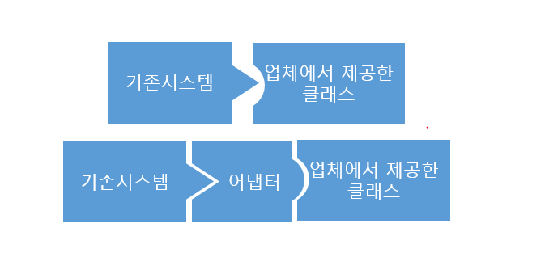
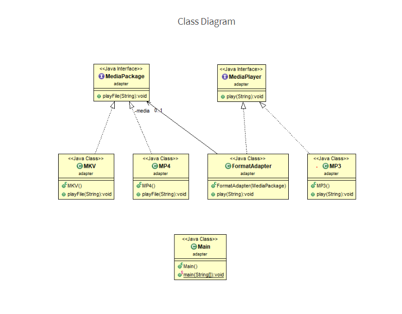

# [2020-06-10] 수 TIL

### `Java Design Pattern` 

- 참고 youtube : [[이야기's ] 자바 디자인 패턴](https://www.youtube.com/watch?v=UEjsbd3IZvA&list=PLsoscMhnRc7pPsRHmgN4M8tqUdWZzkpxY&index=2&t=0s) , https://niceman.tistory.com/141

#### Adapter 사전적의미

- 기계 / 기구 등을 다목적으로 사용하기 위한 부가기구

### Adapter Pattern 어뎁터 패턴

- 알고리즘을 요구사항에 맞춰 사용할 수 있다.
- 한 클래스의 인터페이스를 사용하고자 하는 다른 인터페이스로 변환할 때 주로 사용하며
- 이를 이용하면 인터페이스 호환성이 맞지 않아 같이 쓸수 없는 클래스를 연관 관계로 연결해서 사용할 수 있게 해주는 패턴 
- ex)  전기 콘센트
  - 한국의 표준 플러그를 일본의 전원 소켓에 바로 끼워줄수 없어 동그란 모양을 일자로 바꿔주는 어댑터를 끼워 주어야 한다.
- **장점**
  - 관계가 없는 인터페이스 간 같이 사용가능
  - 프로그램 검사 용이
  - 클래스 재활용성 증가 등 



#### 예제 1.

```
---- 요구사항 ----
두 수에 대한 다음 연산을 수행하는 객체를 만들어주세요

- 수의 두 배의 수를 반환 : twiceOf(FLoat) : Float
- 수의 반(1/2)의 수를 반환 : halfOf(Float) : Float

구현 객체이름은 'Adapter'으로 해주세요
Math 클래스에서 두 배와 절반을 구하는 함수는 이미 구현 되어있다.

--- 알고리즘 변경원함 ----
Math 클래스에 새롭게 두 배를 구할 수 있는 함수가 추가되었다.
새로 구현된 알고리즘을 이용하도록 프로그램을 수정해라

절반을 구하는 기능에서 로그를 찍는 기능을 추가해 주기 바란다.
```

```java
public class Math {
	
	public static double twoTime(double num){
		return num*2;
	}
	
	public static double halF(double num) {
		return num / 2;
	}
	
	public static double twotwoTime(double num) {
		return num * 2;
	}
}


public interface Operator {
	
	// 원하는 기능 
	public abstract Float twiceOf(Float f);
	public abstract Float halfOf(Float f);
	
	// 새로운 기능
	public abstract Float TwiceOf(Float f);
	public abstract Float logging(Float f);
}


public class Adapter implements Operator{
	
	
	@Override
	public Float twiceOf(Float f) {
		return (float) Math.twoTime(f.doubleValue());
	}
	
	@Override
	public Float halfOf(Float f) {
		return (float) Math.halF(f.doubleValue());	
	}
	
	@Override
	public Float TwiceOf(Float f) {
		return (float) Math.twotwoTime(f.doubleValue()); // 언박싱 
	}
	
	@Override
	public Float logging(Float f) {
		float ff = (float) Math.halF(f.doubleValue());
		System.out.println("로그 : " + ff);  
		return ff;
	}
}

public static void main(String[] args) {
    //		test code 
    //		double num = 2.2; 
    //		num = Math.twoTime(num);
    //		System.out.println(num);

    Adapter adapter = new Adapter();
    System.out.println(adapter.twiceOf(100f));
    System.out.println(adapter.halfOf(88f));
    System.out.println(adapter.TwiceOf(100f));
    adapter.logging(100f);
}


```

#### 예제 2.



```java
public interface MediaPlayer {
	public abstract void play(String file_name);
}

public class MP3 implements MediaPlayer{
	@Override
	public void play(String file_name) {
		System.out.println("MP3 play : " + file_name);
	}
}

public interface MediaPackage {
	public abstract void playFile(String filename);
}

public class MKV implements MediaPackage{
	@Override
	public void playFile(String filename) {
		System.out.println("MKV 파일 실행 : " + filename);
	}
}

public class MP4 implements MediaPackage{
	@Override
	public void playFile(String filename) {
		System.out.println("MP4 파일 실행 : " + filename);
	}
}

public class FormatAdapter implements MediaPlayer{	
	
	private MediaPackage m;
	
	public FormatAdapter(MediaPackage mediaPackage) {
		this.m = mediaPackage;
	}
	
	@Override
	public void play(String file_name) {
		System.out.println("FormatAdapter play : " + file_name);
	}
}


package Adapter2;


public class MainAdapter {
	
	public static void main(String[] args) {
		MediaPlayer player = new MP3();
		player.play("file.mp3");
		
		player = new FormatAdapter(new MP4());
		player.play("file.mp4");
		
		player = new FormatAdapter(new MKV());
		player.play("file.mkv");
		
	}
}
/*
MP3 play : file.mp3
FormatAdapter play : file.mp4
FormatAdapter play : file.mkv
*/

```

- 어뎁터 패턴은 기존 클래스의 소스코드를 수정해서 인터페이스에 맞추는 작업보다는
- 기존 클래스의 소스코드의 수정을 전혀 하지않고 타겟 인터페이스에 맞춰서 동작을 가능하게 한다.
- 즉 , 기존 클래스의 명세(사양)만 알면 얼마든지 새로운 클래스도 작성할 수 있다는 것이다.


***

### Wrapper(포장)Class

#### `기본 데이터 타입을 객체 데이터 타입으로 포장하는 클래스 타입`

- **컬렉션 프레임워크에서는 전부 객체형태로 저장하는데 기본값이 아닌 객체 값을 저장할 때 자주 쓰임** 

* 자바는 기본 타입의 값을 갖는 객체를 생성할 수 있습니다. 

* 이러한 객체를 포장 (Wrapper) 객체라고 하는데 그 이유는 기본 타입의 값을 객체 내부에 두고 포장하기 때문입니다. 

* 포장 객체의 특징은 포장하고 있는 기본 타입의 값은 외부에서 변경할 수 없습니다. 만약 변경하고 싶으면 새로운 포장 객체를 생성 해야 합니다. 

  * 생성자 이용

    * ```java
      Byte b = new Byte(10);    // 기본 타입의 값을 줄경우
      Byte b = new Byte("10");  // 문자열을 줄 경우 
      
      Character c = new Character("가");
      
      Long l = new Long(100000);   // 기본 타입의 값을 줄경우
      Long l = new Long("100000"); // 문자열을 줄 경우 
      
      Boolean bool = new Boolean(true);
      Boolean bool = new Boolean("true");
      ```

* **기본 타입의 값을 포장 객체로** 만드는 과정을 **박싱(Boxing)**이라 하며 

  * **valueOf()** 이용

    * ```java
      Integer obj = Integer.valueOf(1000);
      Integer obj = 1000;  // 위랑 같음 
      Integer obj = Integer.valueOf("1000");
      --> 이렇게 하기 귀찮기 때문에
          
      Integer obj3 = 100; // 컴파일러가 자동박싱 만들어줌 
      int num = 200;
      int sum = num + obj3;
      Integer num2 = num;
      /* 객체 + 자료형도 연산이 됨 */
      ```

* **포장 객체에서 기본 타입의 값을 얻어**내는 과정을 **언박싱 (Unboxing)**이라 합니다. 

  * **기본타입명 + Value()**

    * ```java
      byte num = obj.byteValue();
      char c - obj.charValue();
      int i = obj.intValue(); // 원래는 이렇게해야함 (객체에는 주소가 들어있음)
      
      Integer obj = new Integer(200);
      int value1 = obj;		// 자동 언박싱
      int value2 = obj + 100; // 자동 언박싱 
      ```

* 포장 클래스의 주요 용도는 기본 타입의 값을 박싱해서 포장 객체로 만드는 것이지만, 문자열을 기본 타입 값으로 변환할 때도 많이 사용합니다. 

* 대부분의 포장 클래스는 **"parse+기본타입"** 명으로 되어있는 정적 메서드를 제공합니다. 

* **Byte, Short, Integer, Long, Float, Double, Boolean, Character**


#### toString()

- **객체가 가지고 있는 정보나 값들을 문자열로 만들어 리턴하는 메소드**

- 재정의 해서 사용가능
- toString 메소드는 자동으로 호출된다
  - String 클래스 객체를 선언하여 sysout 시 toString() 메소드 없이 객체에 담겨있는 문자열 값이 호출됨 

