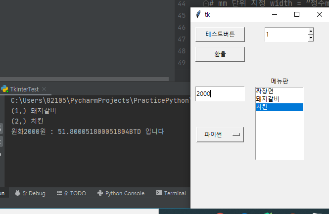
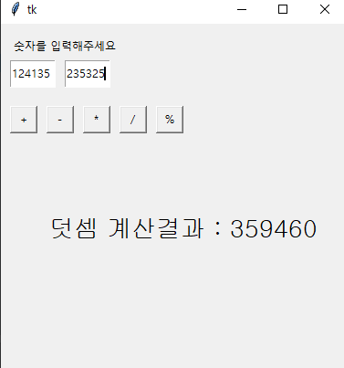
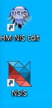

# [2020-06-15 월 TIL]

### Python tkinter

```python
from tkinter import *


def getText():
    value = E1.get()
    print(value)


# Entry 에 입력된 값 받아오기
# 변수명 = E1.get()과 같이 .get() 을 이용하면 Entry에 입력한 텍스트를 받아올 수 있습니다.
# 이렇게 외부에서 특정 자료 등을 입력 받은 다음 프로그램을 실행하도록 만들 수 있습니다.
def perSent():
    try:
        per = int(E1.get())  # entry.get : <class 'str'>
        result = per / 38.61
        print("원화" + str(per) + "원 : " + str(result) + "BTD 입니다")
    except Exception as error:
        print("ValueError >> " + str(error))


# Listbox() 에서 클릭한 요소 검사
# 먼저 이벤트 세팅이 되어야 합니다.
# resultBox.bind('<<ListboxSelect>>', onselect) 코드가 입력이 되어야 하며, onselect라는 함수도 정의를 해야합니다.
# index는 몇 번째 자료를 선택 했나, 그리고 value는 무슨 자료를 선택 했는지를 반환합니다.
def onSelect(event):
    w = event.widget
    index = w.curselection()
    value = w.get(index)
    print(index, value)


def getSpinValue():
    value = sb1.get()
    print(value)


# 창 만들기
root = Tk()

# 창 크기 설정
# 창의 크기를 지정할 수 있습니다.
# root.configure(width = "", height = "") 로 지정 가능하며 크게 두 가지 문법이 있습니다.
# 픽셀단위 지정 width = “정수”, height = ”정수”
# mm 단위 지정 width = “정수m”, height = “정수m”
root.configure(width="75m", height="100m")

# 버튼 배치
# 위치 설정은 Button(창변수, text=“버튼이름”, command=함수명).place( x=정수값, y=정수값, width=정수값, height=정수값)
# 와 같이 .place() 함수로 설정이 가능합니다.
Button(root, text="테스트버튼", command=getText).place(x=10, y=10, width=100, height=30)
Button(root, text="환율", command=perSent).place(x=10, y=50, width=100, height=30)

# 바로 배치할 수 없는 요소들
# 바로 배치할 수 없는 요소들은 굉장히 많습니다.
# 이들은 배치할 때 변수명을 이용해서 배치해야 나중에 입력된 자료 등을 받아올 수 있기 때문에
# 바로 배치할 수 없는 요소들이라는 명칭을 사용했습니다.
# 자주 사용하는 것들로는
# Entry()   → 자료를 입력할 수 있는 창
# Listbox() → 목록을 순차적으로 나열해주는 창
# Label()   → 안내, 혹은 결과를 나타내주는 영역 등이 있습니다.
E1 = Entry(root)
E1.place(x=10, y=130, width=100, height=30)

L1 = Listbox(root)
L1.place(x=130, y=130, width=100, height=150)
L1.insert(0, "짜장면")  # 리스트 요소추가 : insert(index, 리스트요소명)
L1.insert(1, "돼지갈비")
L1.insert(2, "치킨 ")

# 어떤 리스트요소를 선택했는지 감지하기
L1.bind("<<ListboxSelect>>", onSelect)

Lb1 = Label(root, text="메뉴판")
Lb1.place(x=130, y=110, width=100, height=20)

# Spinbox() -> 숫자만 받아야함
sb1 = Spinbox(root, from_=1, to=5, command=getSpinValue)
sb1.place(x=150, y=10, width=100, height=30)


# 옵션에 넣을 것들 옵션창에 넣을 문구를 선택합니다.
option1 = ["파이썬", "자바", "C++"]
# StringVar는 문구를 이용해서 화면에 띄울 무언가를 설정합니다.
variable = StringVar(root)
# 메뉴창에 초기에 설정된 값은 "1" 아무 설정을 하지 않았을때 옵션창에 띄울 초기값을 설정합니다.
variable.set(option1[0])
# 메뉴창을 윈도우창에 띄워주고, 클릭시 확장될 창을 설정합니다.
op1 = OptionMenu(root, variable, *option1)
op1.place(x=10, y=210, width=100, height=35)


# GUI 프로그래밍의 마지막 지점에 항상 작성되어 있어야 한다
root.mainloop()
```



#### 계산기

```python
from tkinter import *


def plusBtn():
    value = int(entry_first_num.get()) + int(entry_second_num.get())
    lbl_result.config(text="덧셈 계산결과 : " + str(value), font=("bold", 20))
    entry_first_num.delete(0, END)
    entry_second_num.delete(0, END)

def minusBtn():
    value = int(entry_first_num.get()) - int(entry_second_num.get())
    lbl_result.config(text="뺄셈 계산결과 : " + str(value), font=("bold", 20))
    entry_first_num.delete(0, END)
    entry_second_num.delete(0, END)

def mulBtn():
    value = int(entry_first_num.get()) * int(entry_second_num.get())
    lbl_result.config(text="곱셈 계산결과 : " + str(value), font=("bold", 20))
    entry_first_num.delete(0, END)
    entry_second_num.delete(0, END)

def divBtn():
    value = int(entry_first_num.get()) / int(entry_second_num.get())
    lbl_result.config(text="나눗셈 계산결과 : " + str(int(value)), font=("bold", 20))
    entry_first_num.delete(0, END)
    entry_second_num.delete(0, END)

def modBtn():
    value = int(entry_first_num.get()) % int(entry_second_num.get())
    lbl_result.config(text="나머지 계산결과 : " + str(value), font=("bold", 20))
    entry_first_num.delete(0, END)
    entry_second_num.delete(0, END)


root = Tk()

root.config(width="100m", height="100m")

lbl_select = Label(root, text="숫자를 입력해주세요")
lbl_select.place(x=10, y=10, width=120, height=30)

entry_first_num = Entry(root)
entry_first_num.place(x=10, y=40, width=50, height=30)
entry_second_num = Entry(root)
entry_second_num.place(x=70, y=40, width=50, height=30)

btn_plus = Button(root, text="+", command=plusBtn)
btn_minus = Button(root, text="-", command=minusBtn)
btn_mul = Button(root, text="*", command=mulBtn)
btn_div = Button(root, text="/", command=divBtn)
btn_mod = Button(root, text="%", command=modBtn)

btn_plus.place(x=10, y=90, width=30, heigh=30)
btn_minus.place(x=50, y=90, width=30, heigh=30)
btn_mul.place(x=90, y=90, width=30, heigh=30)
btn_div.place(x=130, y=90, width=30, heigh=30)
btn_mod.place(x=170, y=90, width=30, heigh=30)

lbl_result = Label(root, text="계산결과 : ", font=("bold", 20))
lbl_result.place(x=50, y=200, width=300, height=50)


root.mainloop()

```



***

### exe 배포 - pyinstaller

- WIndows 기반
- cmd 
  - `pip install pyinstaller`
- 프로젝트 경로에 
  - `pyinstaller --onefile --noconsole 파일명.py`
  - [옵션](https://pyinstaller.readthedocs.io/en/stable/usage.html){: target="_blank"}
    - --onefile
      - exe 파일하나만 배포
    - --noconsole
      - exe 프로그램 실행시 뒤에나오는 콘솔 제거
    - -i
      - 파일 아이콘을 바꿔준다 
      - 준비한 그림파일로 바꿔주며 그림파일 확장자는 `.ico` 나 `.icns` 확장자만 가능
- **2019.02.24 수정 - tkinter와 충돌 이슈**
  Pyinstaller로 .exe파일을 빌드하려 할 때 오류가 나는 경우가 있는데, 그럴 때는 Setuptools를 아래와 같이 28버전에서 업그레이드 해야 합니다.

- 단점
  - 파일을 하나로 모아놨기 떄문에 속도는 느리다 

***

### NSIS를 활용한 setup 파일만들기 



- NSIS 환경설정 (설치파일)
  - 먼저 두 개의 파일을 설치해야 합니다. 링크는 원본 주소와 구글드라이버 주소를 함께 올리겠습니다.
  - http://nsis.sourceforge.net/Download 
  - https://drive.google.com/open?id=1C72fLah2mrlr3EJZcmDpQrLF5nQUxjPY

- NSIS 환경설정 (HM NSI Edit)
  HM NSI Edit 역시 설치파일을 실행해서 그대로 진행하면 됩니다. 옵션을 건들지 말고 그대로 진행해주시면 됩니다.
- NSIS 환경설정 (HM NSI Edit)
  - 설치 중 위와같이 파일이 하나 없다고 나오는데, 스페인어 언어 패키지 파일이므로 실제 구동에는 문제가 없습니다. 무시 버튼을 눌러서 완료해주세요.
- 셋업파일 생성
  - 설치 완료 후 HM NIS Edit를 사용하게 되는데 실행 시 위와 같이 편집창이 나옵니다.

- **경로 잡을떄 파일말고 디렉토리로 잡아야함 -- tkinter 모듈 추가 이슈**