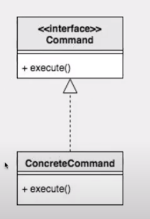
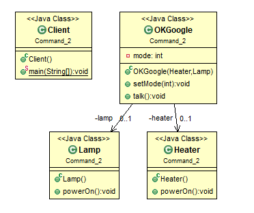
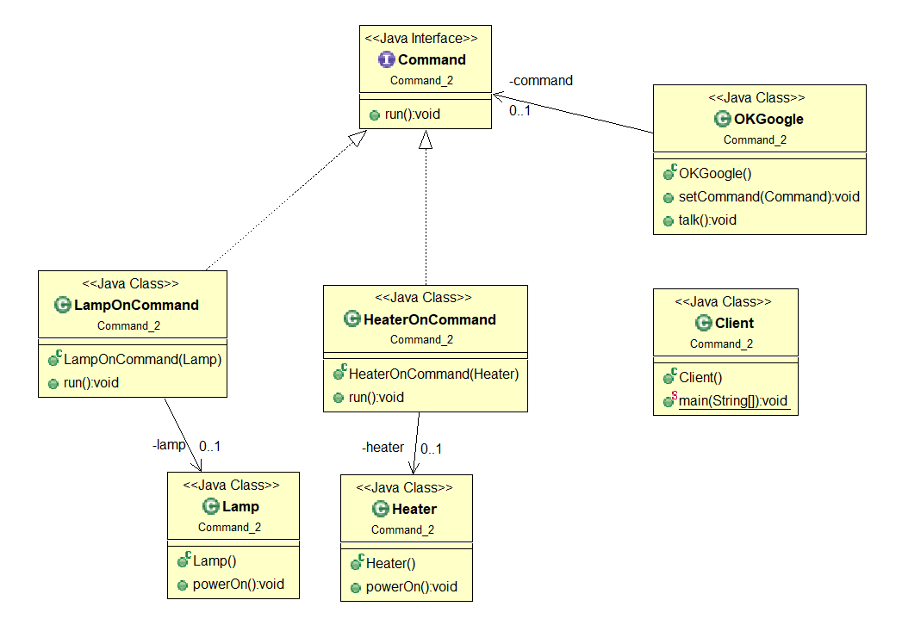

# [2020-06-19 금 TIL]

### Java Design Pattern

### 커맨드 패턴 ( Command Pattern)

- Command : 명령, 명령하다 

- **명령을 객체화한다** 
  - 객체에서 객체를 넘겨줌
  - 순서가 높은 우선순위 부터 명령 실행 
- 객체의 행위(메서드)를 클래스로 만들어 캡슐화 하는 패턴 
  - 어떤 객체(A)에서 다른 객체(B)의 메서드를 실행하려면 그 객체(B)를 참조하고 있어야 하는 의존성이 발생한다. 그러나 커맨드 패턴을 이용하면 의존성을 제거할 수 있다 
  - 또한 기능이 수정되거나 변경이 일어날 때 A 클래스 코드를 수정없이 기능에 대한 클래스를 정의하면 되므로 시스템이 확장성이 있으면서 유연해진다 


<기본 설계>



##### Ex 1.

```java
package Command;

public interface Command {
	void execute();
}


import java.util.LinkedList;
import java.util.List;

public class MainCommand {
	
	public static void main(String[] args) {
		
		List<Command> list = new LinkedList<>();
		
		list.add(new Command() {
			
			@Override
			public void execute() {
				System.out.println("작업1");
			}
			
		});
		
		list.add(new Command() {
					
			@Override
			public void execute() {
				System.out.println("작업2");
			}
			
		});
		
		list.add(new Command() {
			
			@Override
			public void execute() {
				System.out.println("작업3");
			}
			
		});
		
		for(Command c : list) {
			c.execute();
		}
	}
}

```


#####  Ex 2.

```java
package Command;

public interface Command extends Comparable<Command>{
	void execute();
	void action();
	void undo();
}

public class StringPrintCommand implements Command{

	protected String string;
	
	public StringPrintCommand(String string) {
		this.string = string;
	}
	
	@Override
	public int compareTo(Command c) {
		StringPrintCommand other = (StringPrintCommand) c;
		return this.string.length() - other.string.length();
	}

	@Override
	public void execute() {
		System.out.println(this.string);
	}

	@Override
	public void action() {
		
	}

	@Override
	public void undo() {
		
	}
	
}		

import java.util.LinkedList;
import java.util.List;
import java.util.PriorityQueue;

public class MainCommand {
	
	public static void main(String[] args) {
		
		// 우선순위 큐를 갖기위해선 Comparable 상속 
		PriorityQueue<Command> queue = new PriorityQueue<>(); 
		
		queue.add(new StringPrintCommand("ABCD"));
		queue.add(new StringPrintCommand("ABC"));
		queue.add(new StringPrintCommand("AB"));
		queue.add(new StringPrintCommand("A"));
		
		
		for (Command command : queue) {
			command.execute();
		}
	}
}

```


##### Ex 3. 사용자가 구글에게 명령패턴 

< 커맨드 패턴 적용 X >



```java
package Command_2;

public class Heater {
	public void powerOn() {
		System.out.println("히터 가동 ");
	}
}
package Command_2;

public class Lamp {
	public void powerOn() {
		System.out.println("램프 가동");
	}
}
package Command_2;

public class OKGoogle {
	
	private Heater heater;
	private Lamp lamp;
	private int mode;
	
	public OKGoogle(Heater heater, Lamp lamp) {
		this.heater = heater;
		this.lamp = lamp;
	}
	
	public void setMode(int mode) {
		this.mode = mode;
	}
	
	public void talk() {
		
		switch(this.mode) {
		case 0: 
			System.out.println("구글, 히터를 겨줘");
			this.heater.powerOn();
			break;
		case 1:
			System.out.println("구글, 램프를 겨줘");
			this.lamp.powerOn();
			break;
		}
	}
}
package Command_2;

public class Client {
	
	public static void main(String[] args) {
		
		Heater heater = new Heater();
		Lamp lamp = new Lamp();
		OKGoogle google = new OKGoogle(heater, lamp);
		
		
		google.setMode(0);
		google.talk();
		
		google.setMode(1);
		google.talk();
	}
}	

```

- **문제점**

  OKGoogle에게 mode 설정을 통해, 모드가 0이면 히터를 틀고, 1이면 램프를 켜도록 가정했습니다.

  OKGoogle은 히터를 틀고, 램프를 켜기 위해서 Heater, Lamp 객체를 참조해야 하기 때문에,

  OKGoogle의 기능이 많아질수록 객체 프로퍼티는 더욱 늘어날 것이고,

  기존의 talk() 메서드에서 분기가 늘어날 것입니다.

  OCP에도 위배되죠.

***

##### 커맨트 패턴 적용



1. 커맨드 인터페이스 정의
2. 히터, 램프 클래스는 그대로 두고 , 히터/램프를 명령하는 클래스 선언  - OnCommand
3. 구글은 명령 인터페이스를 받아 실행만 함 
   - 구글의 talk() 메소드에서 기능을 직접 호출하지 않고 캡슐화 가능 
4. 사용자는 구글에게 명령을 한다 


Command

```java
// 히터 , 램프 클래스는 위와 동일

public interface Command {
	void run();
}
```


HeaterOnCommand

```java
package Command_2;

public class HeaterOnCommand implements Command{
	
	private Heater heater;
	
	public HeaterOnCommand(Heater heater) {
		this.heater = heater;
	}
	
	@Override
	public void run() {
		System.out.println("히터를 틀어라");
		heater.powerOn();
	}
}

```


LampOnCommand

```java
package Command_2;

public class LampOnCommand implements Command{
	
	private Lamp lamp;
	
	public LampOnCommand(Lamp lamp) {
		this.lamp = lamp;
	}
	
	@Override
	public void run() {
		System.out.println("램프를 틀어라");
		lamp.powerOn();
	}
}

```


OKGoogle

```java
package Command_2;

public class OKGoogle {
	
	private Command command;
	
	public void setCommand(Command command) {
		this.command = command;
	}
	
	public void talk() {
		command.run();
	}
	
}
```


Client

```java
package Command_2;

public class Client {
	
	public static void main(String[] args) {
		
		Heater heater = new Heater();
		Lamp lamp = new Lamp();
		
		Command heater_command = new HeaterOnCommand(heater);
		Command lamp_command = new LampOnCommand(lamp);
		
		OKGoogle google = new OKGoogle();
		
		google.setCommand(heater_command);
		google.talk();
		
		google.setCommand(lamp_command);
		google.talk();
	}
}	

```

