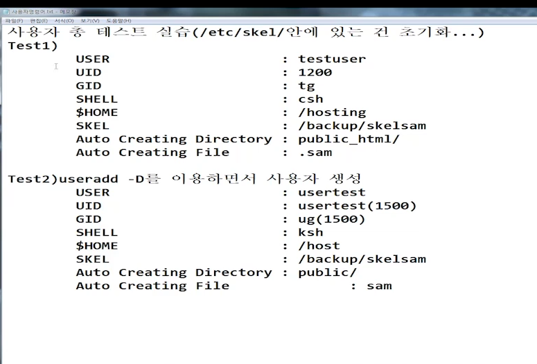

# [2020-06-19 금 TIL]

### Linux

#### usermod (사용자 수정)

```shell
# usermod [옵션1] [값1] [옵션2] [값2] .. 사용자명 

옵션, 값은 useradd와 같음 

$ usermod -s /bin/bash -d /linux/user2 user2
# 주의 : 사용자 집 변경은 /home 위치 까지 확인해줘야함 

# 확인
$ tail -n /etc/passwd


```

#### userdel (사용자 삭제)

```shell
$ userdel [옵션] 사용자명 

옵션없음 : 계정을 제외한 나머지는 존재 
-r     :  모든 계정 정보 삭제 


$ userdel -r user3333
존재하지 않는걸 삭제 해서 나옴 -> 계정삭제는 된 상태 
userdel: user3333 mail spool (/var/spool/mail/user3333) not found
userdel: user3333 home directory (/export/home/user3333) not found


그룹 : /etc/group
UID , GID(그룹)

# 그룹 생성 
$ groupadd 그룹계정명 
```




```shell
Test 1)
# 필요한 디렉토리 생성 
$ mkdir -p /hosting /backup/skelsam
$ groupadd tg

$ useradd -u 1200 -g tg -s /bin/csh -mk /backup/skelsam -d /hosting/testuser testuser
-u : UID
-g : GID
-s : SHELL
-mk : 사용자 지정 스켈 디렉토리
-d : /home


# 결과확인 
$ id testuser
uid=1200(testuser) gid=1003(tg) groups=1003(tg)

$ cat /etc/passwd | grep testuser
testuser:x:1200:1003::/hosting/testuser:/bin/csh


Test 2) # 1번은 옵션이 많이 들어가서 2번이 더 빠름 
$ vi /etc/default/useradd 

HOME, SHELL, SKEL 변경 후 저장 
# -> 파일이 존재하는지 확인!

```

***

### 허가권 / 소유권 

- **허가권**
  - chmod : (Change Modification)
  - `chmod`[args] [파일 / 디렉토리]
    - 인자에는 숫자와 문자가 있다 
    - 숫자방법으로 안바뀔 때가 있어서 문자로 변경하는 방식도 알아야한다 
  - 사용자
    - u : owner 소유자
    - g : group 그룹
    - o : other 그 외 사용자
  - 권한
    - 읽기 : r
    - 쓰기 : w
    - 실행 가능 : x
  - 숫자인자로 권한 부여할 때 홀수이면 실행 권한이 모두 부여된 상태이다 

```shell
1) 숫자 
$ chmod 755 test

$ chmod 644 test

$ chmod 623 test


2) 문자 
$ chmod g+rwx test
test 파일을 그룹에서 읽기,쓰기,실행 권한 다 부여 

```


- 소유권
  - chown : (Change Owner Ship)

  - `chown [UID:GID] [파일/디렉토리 명]`

    - 숫자 
    - 문자 (대부분)

    ```shell
    $ ls -ld /home/samadal/
    
    drwx------. 3 samadal samadal 4096 Jun 19 03:10 /home/samadal/
    			 #  UID     GID 
    
    # 소유자 root -> samadal 변경 
    $ chown samadal grub.cfg
    -rw-r--r--. 1 samadal root 4303 Jun 19 02:42 grub.cfg
    
    # 소유자, 그룹 전부 변경
    $ chown samadal:samadal inittab
    -rw-r--r--. 1 samadal samadal  511 Jun 19 02:42 inittab
    
    # 그룹만 변경 -> .(점) :(콜론) 둘다 가능 
    $ chown :samadal login.defs
    $ chown .samadal login.defs
    
    
    ```

***

### 사용자 계정 복구 - 매우중요 

- 계정 홈 디렉토리에 부여 받은 UID, GID 전부 해당 계정 이름으로 변경
- 주의 : UID, GID 값이 존재하나 확인해야 함 

```shell
# user6 집 살리기 -> 삭제 없이 

$ useradd -D -> 확인
$ useradd -d /export/home/user6 user6

# 복구할때 나오는 메세지 : 정상 
useradd: warning: the home directory already exists.
Not copying any file from skel directory into it.
Creating mailbox file: File exists

$ tail -1 /etc/passwd
user6:x:1002:1004::/export/home/user6:/bin/bash

drwx------. 2 samadal samadal 4096 Jun 19 01:10 samadal
drwx------. 4    1011    1011 4096 Jun 18 23:50 user6

samadal:x:1001:1001::/home/samadal:/bin/bash
user6:x:1002:1002::/export/home/user6:/bin/bash


# 여기서 user6의 소유권을 전부 user6 으로 변경 
drwxr-xr-x. 2  1011  1011 4096 Jun 18 23:26 public
-rw-r--r--. 1  1011  1011    0 Jun 18 04:22 sam

$ chown user6:user6 public sam 
drwxr-xr-x. 2  user6  user6 4096 Jun 18 23:26 public
-rw-r--r--. 1  user6  user6    0 Jun 18 04:22 sam

# 일반 디렉터리 /user1 을 user1이라는 계정으로 user1을 홈 디렉터리가 되게 환경으로 만드세요 

$ useradd -d /user1 user1
$ cd /etc/skel/
$ cp -r .b* .m* /user1/

total 24
drwxr-xr-x.  3 root root 4096 Jun 19 05:00 .
dr-xr-xr-x. 22 root root 4096 Jun 19 04:58 ..
-rw-r--r--.  1 root root   18 Jun 19 05:00 .bash_logout
-rw-r--r--.  1 root root  193 Jun 19 05:00 .bash_profile
-rw-r--r--.  1 root root  231 Jun 19 05:00 .bashrc
drwxr-xr-x.  4 root root 4096 Jun 19 05:00 .mozilla

$ chown user1: ./ .b* .k* .m* 
chown: cannot access ‘.k*’: No such file or directory
$ chown user1: ./ .b* .m* 

$ ls -ld /user1; ls -al /user1/
drwxr-xr-x. 3 user1 user1 4096 Jun 19 05:00 /user1
total 24
drwxr-xr-x.  3 user1 user1 4096 Jun 19 05:00 .
dr-xr-xr-x. 22 root  root  4096 Jun 19 04:58 ..
-rw-r--r--.  1 user1 user1   18 Jun 19 05:00 .bash_logout
-rw-r--r--.  1 user1 user1  193 Jun 19 05:00 .bash_profile
-rw-r--r--.  1 user1 user1  231 Jun 19 05:00 .bashrc
drwxr-xr-x.  4 user1 user1 4096 Jun 19 05:00 .mozilla

$ chmod 770 /user1/
# 마지막 홈 티렉토리 다른사용자들 접근 못하게 허가권 변경 
```

