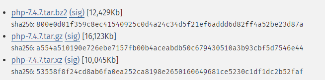

# [2020-06-20 토 TIL]

### `Linux`

### 데이터 압축 명령어

- 압축 (Compress)
  - 용량을 줄이기 위해 여러 파일들을 **하나로** 보관 및 관리 한다 
- Windows ex) 알집, 반디집, WinRAR.. 
- Linux
  - **gzip** (GNU : Gnome is Not Unix)
    - **압축 속도가 빠름**
    - 기본적으로 사용
    - 이름만 써도 압축이 풀림 
  - **bzip2**
    - gzip과 사용 형식동일
    - gzip 보다 **압축률이 좋음** 
  - **xz**
    - 대용량(기가 이상)에서 주로 사용하는 압축 명령어
    - 압축 속도가 느린편 



```shell
# 압축
$ gzip [압축할 파일이름] -> 디렉토리는 안됨

$ bzip2 [압축할 파일이름] -> 디렉토리는 안됨


# 해제
$ gunzip [압축 풀 파일이름.gz]
$ gzip -d [압축 풀 파일이름.gz]
-d : decompress(압축x)

$ bunzip2 [압축 풀 파일이름.gz]
$ bzip2 -d [압축 풀 파일이름.gz]
-d : decompress(압축x)
```

- 압축 후 특징

  - 용량 바뀜

  - mv 특징과 같음 - **원본 파일이 사라짐** 

    

- **파일 여러개를 한번에 압축하려면 tar 명령을 조합해야한다**

  - **tar** (Tape Archive : 저장보관소)

    - 원래는 유닉스 명령어인데 리눅스와 호환 시킴 

    - 시스템 안에 있는 **다수의 데이터를 묶음** 형태로 저장 (보관)

    - 보관만 하는 역할이라서 압축하는 것은 아님 

    - 이 파일을 압축을 할수는 있음 - 윈도우와 똑같은 형식 

    - 보관을 하는 명령이라서 원본 데이터 보다 용량이 커짐 

    - **원본을 없애지 않는다** 

      

    - ```shell
      # 아카이브파일(보관파일)네임.tar <- 확장명 꼭 써줘야함 
      # 소스파일 : 실제 데이터 넣어줌
      # 형식 (주의 : cp/mv 와 달리 원본과 변화줄 데이터 위치가 다름)
      $ tar [options] [(Archiving File Name).tar] [source File(s)] 
      
      # 옵션
      - c(create)       : 아카이브파일을 묶어서 생성 (압축 X)
      - x(extract(푼다)) : 아카이브파일을 풀어줌 
      - #v(visual)       : 파일들이 묶이거나 풀리는과정을 상세히 보여줌(verbose) 
      - #f(file)	 		: 아카이브파일을 지정(정의 - 무조건 써줘야하는 옵션)
      
      # 압축 + 아카이브 동시 진행
      - z				   : tar + gzip
      - j				   : tar + bzip2
      - J(몰라도됨)		 : tar + xz
      
      # 주로이렇게씀
      # 압축 cvf
      # 해제 xvf
      
      $ tar cvf gc.tar grub.cfg 
      $ tar xvf gc.tar 
      
      $ tar cvf gil.tar grub.cfg inittab login.defs
      $ gzip gil.tar 
      -rw-r--r--. 1 root root  2716 Jun 20 12:14 gil.tar.gz
      
      # 압축 + 아카이브 
      $ tar cvfz git2.tar.gz gr* i* l*
      $ tar cvfj git2.tar.bz2 gr* i* l*
      
      # 다른경로에서 압축 풀때는 해당경로로 이동 후 해야한다 -> 풀떄 경로를 지정 못함 
      
      ```

