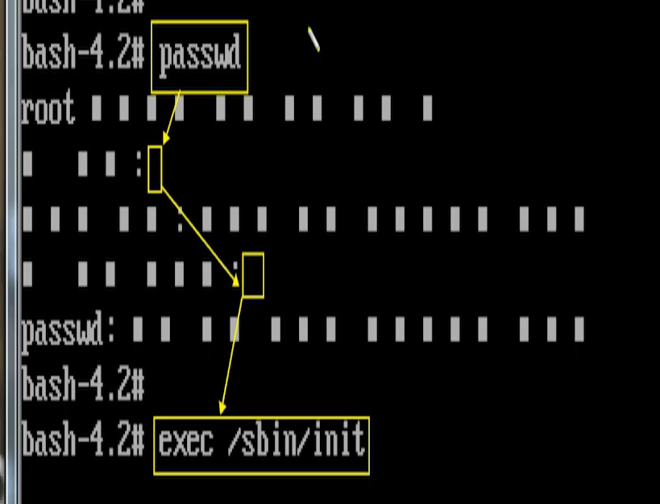
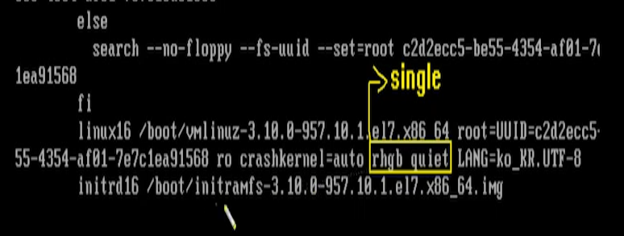
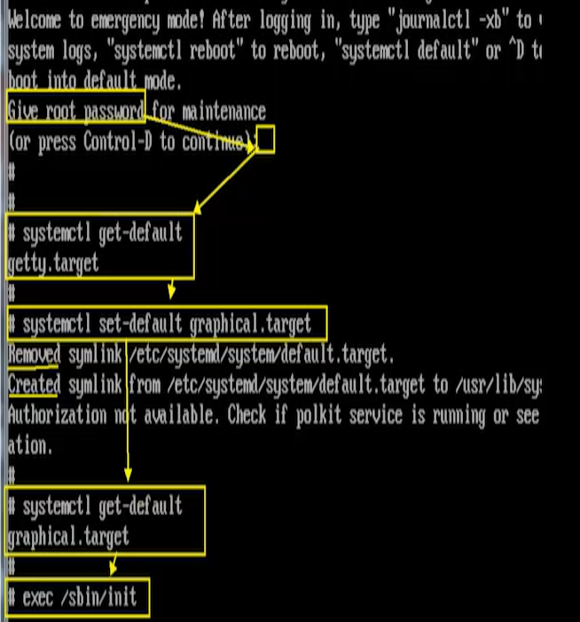

# [2020-06-23 화 TIL]

### `Linux 시스템 응급복구`

1. C:\Users\82105\Downloads\SamVM15_Cent782003Class2\SamVM15_Cent782003Class2_20200615 파일이 부팅이 안되는 상태 

2. `Ctrl + ALt + Insert`  (TUI환경 : 재부팅 ) 누른 후 재빨리 `e`키를 누른다  - **커널 모드 접근**

3. 체크 부분 수정해야함 

   


4. 수정 후 `Ctrl + x`

5. bash 모드 진입 -  **`관리자 비밀번호 분실 했을 때 주로 사용`**

   

6. passwd 암호 임의로 변경 

   - 권한 바꿈 : `mount -o remount.ro /` `mount -o remount,rw /`

7. ```shell
   # 재부팅 
   $ exec /sbin/init <- 
   
   
   # 참고 
$ /usr/bin 과 /bin 은 링크가 되있어서 같음 
   ```
   
   
   
8. 부팅 모드 변경 해줘야함 - 관리자모드 변경 (싱글 모드) - LANG 부분 지우면 영어로 입력




9. 차례로 입력 (systemctl : 시스템 컨트롤)




***

#### /etc/inittab : 시스템 부팅 테이블 

- **부팅을 확인**하거나 **부팅작업을 변경**하는 명령어들이 적힌 문서 파일 

```shell
# inittab is no longer used when using systemd.
#
# ADDING CONFIGURATION HERE WILL HAVE NO EFFECT ON YOUR SYSTEM.
#
# Ctrl-Alt-Delete is handled by /usr/lib/systemd/system/ctrl-alt-del.target
#
# systemd uses 'targets' instead of runlevels. By default, there are two main targets:
#
multi-user.target: analogous to runlevel 3   <- 기억  init 3 : TUI 부팅 
graphical.target: analogous to runlevel 5    <- 기억  init 5 : GUI 부팅
#
# To view current default target, run:
systemctl get-default				       <- 기억 : 부팅이 현재 어떤게 적용되있는지 확인명령
#
# To set a default target, run:
systemctl set-default TARGET.target	   <- 기억 : 부팅작업을 변경하는 명령어 
#
```

***

### 6.X 

- init [번호] : **"일시적"**으로 [번호]로 부팅됨 

| 모드       | 내용                             |
| ---------- | -------------------------------- |
| **init 0** | shut down mode                   |
| **init 1** | single mode (관리자 모드)        |
| init 2     | multi mode (without NFS)         |
| **init 3** | multi mode (TUI 환경)            |
| init 4     | unused mode (사용자가 없는 모드) |
| **init 5** | X11 (GUI 모드)                   |
| **init 6** | reboot mode                      |

### 7.X (약간 바뀜)

- init 명령에서 target 명령으로 바뀜 
- target : **영구적** 

| 모드                    | 내용                                               |
| ----------------------- | -------------------------------------------------- |
| init 0                  | shut down.target (영구적으로 무한부팅 : 사용안함 ) |
| init 1                  | recue.target (영구적 관리자모드)                   |
| **init 3 (2,3,4 통합)** | **multi-user.target (TUI 환경)**                   |
| **init 5**              | **graphical.target (GUI 환경)**                    |
| init 6                  | reboot.target (영구적으로 재부팅)                  |


#### bash 모드

- 일정 명령어 밖에 사용하지 못한다 (기본적인것 일부 사용가능 / 부팅관련 명령 사용 불가)


