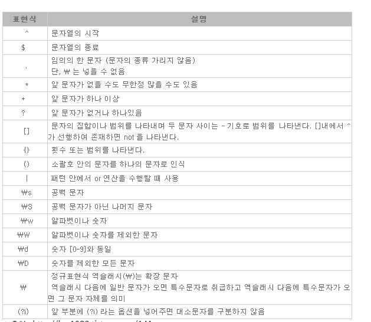

# 2020-06-08 월 TIL

### `Java.lang 패키지 주요 클래스`

- **Object** : 자바 클래스의 **최상위 클래스**
- **System** : 표준 입력장비(키보드) 로부터 데이터를 입력받거나 표준 출력장치(모니터)로 출력하기 위해 사용
- **Class** : 클래스를 메모리에 로딩할 때 사용
- **String** : 문자열을 저장하고 문자열의 여러 가지 정보를 얻을 때 사용
- **StringBuffer, StringBuilder**  : 문자열을 저장하고 내부 문자열을 조작할 때 사용
- **Math** : 수학 함수를 이용할 때 사용
- **Wrapper(Byte, Short, Integer, Long, Float, Double, Boolean, Character)** : 기본 데이터 타입의 객체를 만들때 사용 


#### Object 클래스

- 클래스를 선언할 때 extends 키워드로 다른 클래스를 상속하지 않으면 **묵시적으로 Object 클래스를 상속**하게 된다. 따라서 모든 자바 클래스는 Object 클래스의 자식이거나 자손 클래스이다.
- **모든 클래스가 Object를 상속하기 때문에 Object의 메서드는 모든 클래스에서 사용이 가능** 
- Object 타입을 쓰면 모든 객체를 다 받을수 있음
  - 메서드 호출은 안되고 적재만 가능 (그때그때 형변환 해서 사용)
- import 문 없이 사용 가능 (java.lang)
- 주요메서드
  - **clone**()
    - 자신을 복제하여 새로운 인스턴스를 생성하는 일을 함 
    - Object클래스에서 정의된 clone()은 단순히 인스턴스변수의 값만 복사하기 떄문에 참조 변수 타입의 인스턴스 변수가 정의되어 있는 클래스는 완전한 인스턴스 복제가 이루어지지 않는다 
    - clone()을 사용하려면 복제할 클래스가 Cloneable 인터페이스를 구현해야함 
    - 재정의하면서 접근제어가 변경됨 **(protected -> public)**
    - 형변환을 해줘야함 
    - 재정의할 메소드에서 예외 처리 해줘야함 **CloneNotSupportedException**
  - **equals(obj)**
    - 참조값이 일치하는지 확인 (오버라이딩해서 재사용 가능)
  - **getClass()**
  - **getName()**
  - **toString()**
    - 인스턴스에 대한 정보를 문자열로 제공 
    - 주로 객체의 멤버변수(속성)을 확인하려 재정의해서 사용 

***

#### String 클래스

- **중요**

- 변경 불가능(immutable) 클래스 = final 정의

- 덧셈연산자를 사용해서 결합하는건 다른 공간을 차지하는 변수가 생성되므로 메모리 낭비됨

- 문자열간 결합이나 추출 등 다루는 작업이 많이 필요한 경우 **Stringbuffer** 클래스가 더 적합 

- 같은 문자열 리터럴 비교 시 값도 같고 문자열도 같다 

  - 이유 : **같은 내용의 문자열 리터럴은 한번만 저장된다** 

- 인스턴스 비교 시 값은 같지만 생성한 문자열 인스턴스가 다르다 

- 길이가 0인 배열도 저장가능 

  

- 주요 메서드

  - **String[] split(String regex)** : 문자열을 분리자(regex)로 나누어 문자열 배열에 담아 반환 

  - **String[] split(String regex, int limit)** : 

    ```java
    String animals = "dog,cat,bear";
    System.out.println(animals);
    String[] arr = animals.split(",");
    
    for (String s : arr) {
        System.out.println(s);
    }
    
    ```

    

  - **char charAt(int index)** : 지정된 위치(index)에 있는 문자를 알려준다 : index는 0부터 시작 

  - ```java
    String a = "hello";
    char c = a.charAt(0);
    System.out.println(c);
    System.out.println(a.charAt(1));
    System.out.println(a.charAt(2));
    System.out.println(a.charAt(3));
    System.out.println(a.charAt(4));
    
    ```

    

  - **int compareTo(String str)** : 문자열str과 사전순서로 비교한다 . 같으면 0반환 사전순으로 이전이면 음수를 반환 이후면 양수를 반환

  - ```java
    String a = "hello";
    String b = "hello";
    String c = "helloworld";
    
    if (a.compareTo(b) == 0) {
        System.out.println(a.compareTo(b));
        System.out.println("같다");
    } else {
        System.out.println(a.compareTo(c));
    }
    ```

    

  - **int length()** : 문자열의 길이반환 

  - **String.format()** : 형식화된 문자열 만들기 = printf() 와 사용법이 같다 

  - String.join("구분넣어줄문자", 문자배열)


### 메서드 형변환 매우 중요함

- 래퍼(wrapper) 클래스 : 기본형 타입이 대문자인 클래스 / 기본형 타입을 감싸고 있는 클래스 
- parse 메서드에 공백이나 문자가 포함되어 있는 경우 변환 시 예외 (NumberFormatException) 발생할수 있음

| 기본형 --> 문자열 변환                                       | 문자열 --> 기본형 변환                                       |
| ------------------------------------------------------------ | ------------------------------------------------------------ |
| String String.valueOf(boolean b)<br>String Boolean.toString(boolean b)<br><br>String String.valueOf(char c)<br/>String Character.toString(char c)<br><br>String String.valueOf(int i)<br/>String Integer.toString(int i);<br><br>String String.valueOf(long l)<br/>String Long.toString(long l)<br><br>String String.valueOf(float f)<br/>String Float.toString(float f)<br><br>String String.valueOf(double d)<br/>String Double.toString(double d) | boolean Boolean.parseBoolean(String s)<br><br/><byte Byte.parserByte(String s)<br><br/>short Short.parseShort(String s)<br><br/>int Integer.parseInt(String s)<br><br/>long Long.parseLong(String s)<br><br/>float Float.parseFloat(String s)<br><br/>double Double.parseDouble(String s) |

***

### 정규식 (Regular Expreesion) - java.util.regex

- 텍스트 데이터 중에서 원하는 조건(패턴)과 일치하는 문자열을 찾아내기위해 사용 
- **Pattern p = Pattern.compile("c[a-z]*");**
  
  - 정규식을 매개변수로 패턴클래스의 static 메서드인 Pattern compile(String regex)를 호출하여 패턴 인스턴스를 얻는다 
- **Matcher m = p.matcher(data[i]);**
  
  - 정규식으로 비교할 대상을 매개변수로 패턴클래스의 Matcher matcher (CharSequence input)를 호출해서 Matcher 인스턴스를 얻는다 
- **boolean m.matches()**
  
- Matcher  인스턴스에 boolean matches()를 호출해서 정규식에 부합하는지 확인 한다 
  
- 자주 쓰이는 패턴

  - 출처: https://highcode.tistory.com/6 [HighCode]

  - **^[0-9]*$** 를 분석해보면 

    ^ 으로 우선 패턴의 시작을 알립니다.

    [0-9] 괄호사이에 두 숫자를 넣어 범위를 지정해줄 수 있습니다.

    \* 를 넣으면 글자 수를 상관하지 않고 검사합니다.

    $ 으로 패턴의 종료를 알립니다.



- 숫자만

  - **`^[0-9]*$`**

- 영문자만 

  - **^[a-zA-Z]*$**

- 한글만

  - **^[가-힣]*$**

- 영어 & 숫자만

  - **^[a-zA-Z0-9]*$**

- E-MAIL

  - **^[a-zA-Z0-9]+@[a-zA-Z0-9]+$**

- 휴대폰

  - **^01(?:0|1|[6-9]) - (?:\d{3}|\{4}) - \d{4}$**

- 일반전화

  - **^\d{2,3} - \d{3,4} - \d{4}$**

- 주민등록번호

  - **\d{6} \- [1-4]\d{6}**

- IP 주소

  - **([0-9]{1,3}) \. ([0-9]{1,3}) \. ([0-9]{1,3}) \. ([0-9]{1,3})**

- 날짜

  - `^[0-9][0-9][0-9][0-9]\\-[0-9][0-9]\\-[0-9][0-9]$`
  
  

***

#### System 클래스

- 자바 프로그램은 운영체제상에서 바로 실행되는 것이 아니라 JVM 위에서 실행됩니다. 따라서 운영체제의 모든 기능을 자바 코드로 직접 접근하기는 어렵습니다. 

- 하지만 System 클래스를 이용하면 운영체제의 일부 기능을 이용할 수 있습니다. 프로그램 종료, 키보드로 입력, 모니터로 출력, 메모 리 정리, 현재 시간 읽기 등이 가능합니다. 

- System 클래스의 모든 멤버는 static으로 구성되어 있어 클래스 이름으로 바로 접근이 가능합니다.

  

#### System 클래스 주요 메서드 

1. **exit**(): 현재 실행하고 있는 프로세스를 강제 종료시킵니다. 정상 종료일경우 매개값으로 0을 주고, 비정상 종료인경우 0 이외에 다 른 값을 줍니다.

2. **currentTimeMillis**() : 컴퓨터의 시계로부터 현재 시간을 읽어서 밀리세컨드(1/1000초) 단위와 나노세컨드(1/10^9초)단위의 long값을 리턴합니다. 주로 프 로그램의 실행 소요 시간 측정으로 성능을 테스트할 때 사용합니다.
3. **getProperty**(): JVM이 시작할 때 자동 설정되는 시스템의 속성값을 구합니다.
4. **gc**(): Garbage Collector를 실행시킵니다.


***

### 제네릭 generic

- 제네릭이란 클래스나 인터페이스 선언에 유형 매개변수가 들어있는 클래스를 뜻한다.
- 제네릭 타입은 클래스 또는 인터페이스 이름 뒤에 "<>" 부호가 붙고, 그 사이에 파라미터가 위치한다.
- 자바 5버전부터 제네릭이 도입된 이후에는 제네릭 기능으로 인해 클래스에 원하지 않는 데이터형이 들어가는 것을 방지 할수 있고, 반대로 값을 가져올 때도 형변환을 하지 않게 되었다.
- 제네릭은 형 안정성(type safety)을 위해 사용


### Collection (Python에서는 기본제공)

- 자바 프로그램에서 객체를 객체들의 모음 형식으로 관리할 수 있는 방법을 제공하는 클래스들을 컬렉션이라고 부른다.

- 컬렉션은 배열과 유사하지만 데이터를 저장/조회/수정/삭제 하는 작업을 쉽게 처리할 수 있으며 , 동적인 크기를 갖는다는 장점이 있다.

- 컬렉션 계열은 Set/**List/Map** 등의 인터페이스가 있으며 이를 구현할 클래스를 이용하면 객체들을 모음저장 할 수 있다.

- **List**

  - 순서가 있는 데이터의 집합 / 데이터 중복 허용
  - **ArrayList**, LinkedList, Stack, Vector
  - 배열을 이용한 자료구조는 데이터를 읽어오고 저장하는 데는 효율이 좋다
  - 하지만 용량을 변경해야할 때는 새로운 배열을 생성한 후 기존의 배열로부터 새로 생성된 배열로 데이터를 복사해야하기 때문에 효율이 떨어진다 

- **Set**

  - 순서를 유지하지 않는 데이터의 집합 / 데이터의 중복을 허용하지 않음 
  - HashSet, TreeSet

- **Map**

  - 키와 값의 쌍으로 이루어진 데이터의 집합

  - 순서는 유지되지 않으며 / 키는 중복을 허용하지 않고 / 값은 중복을 허용한다 

  - **HashMap**, TreeMap, Hashtable, Properties

    

#### List 컬렉션

- 객체를 인덱스로 관리하기 때문에 객체를 저장하면 자동으로 인덱스 번호가 부여되고 인덱스를 통해 객체를 검색, 삭제할 수 있는 기능을 제공
- List 는 객체를 순서대로 저장하며 동일한 객체를 중복 저장할 수 있다.

#### List 계열 주요 메서드

- 객체 추가 기능
  - `add(E e)` : 주어진 객체를 List의 맨 끝부분에 추가
  - `add(int index, E e)` : 주어진 인덱스에 객체를 추가  **(밀어내고 넣는방식)**
  - `set(int index, E e)` : 주어진 인덱스에 저장된 객체를 주어진 객체로 바꿈.  **(기존꺼를 바꿈)**

- 객체 검색기능
  - `boolean contains(Object o)` : 주어진 객체가 저장되어 있는지의 여부를 판단.
  - `get(int index)` : 주어진 인덱스에 저장되어 있는 객체를 리턴.
  - `boolean isEmpty()` : 컬렉션이 비어있는지 여부 판단
  - `size()` : 저장되어 있는 전체 객체 갯수를 리턴. (인덱스 X )

- 객체 삭제 기능
  - `clear()` : 저장된 모든 객체를 삭제
  
  - `remove(int index)` : 주어진 인덱스에 저장된 객체를 삭제
  
  - `remove(Object o)` : 주어진 객체를 삭제 
  
    

```java
package Collects;

import java.util.List;
import java.util.ArrayList;

public class ArrayListTest {
	
	public static void main(String[] args) {
		ArrayList list1 = new ArrayList();
		
		list1.add(new Integer(10));
		list1.add(new Integer(20));
		list1.add(new Integer(30));
		list1.add(new Integer(40));
		list1.add(new Integer(50));
		list1.add(new Integer(60));
		list1.add(new Integer(70));
		
		ArrayList list2 = new ArrayList(list1.subList(1,4)); // 1번지부터 3번지까지 잘라담기 
		System.out.println(list1);
		System.out.println(list2);
		
	}
}

```


### List 컬렉션을 활용한 로또 시뮬레이터 

```java
package ListCollectLotto;

import java.util.ArrayList;
import java.util.List;
import java.util.Collections;

public class LottoMain {
	public static int lotto_num = 0;   // 로또 구매수
	public static int total_money = 0; // 총 쏟아부은 금액 (장당 1000원)
	
	public static void main(String[] args) {
		
		List lotto = new ArrayList();  		// 당첨 로또
		List your_lotto = new ArrayList();	// 니가 뽑은 로또
		
		for(int i=0; i<6; i++) {
			int random_num = (int) (Math.random() * 45) + 1;
			
			if(!lotto.contains(random_num)) {
				System.out.println("1등 번호 : " + random_num);
				lotto.add(random_num);
			} else {
				System.out.println("중복");
				i--;
				continue;
			}
		}
		while(lotto.size() < 7) {
			int random_num = (int) (Math.random() * 45) + 1;
			
			if(!lotto.contains(random_num)) {
				System.out.println("2등 번호 : " + random_num);
				lotto.add(random_num);
			} else {
				System.out.println("중복");
			}
		}
		
		// 로또삼 7개 번호 -> 당첨 로또 == 니 로또 비교  -> 맞으면 끝냄 , 틀리면 또함 
		boolean ok_state = false; // 당첨 되면 true
		while(!ok_state) {
			int save = 0; // 비교 맞은 획수 7이면 끝
			total_money += 1000;
			lotto_num++;
			
			for(int i=0; i<5; i++) {
				int your_num = (int) (Math.random()*45) + 1;
				if(!your_lotto.contains(your_num)) {
					your_lotto.add(your_num);
				} else {
					i--;
					continue;
				}
			}
			
			System.out.println("your_lotto : " + your_lotto);
			for(int i=0; i<lotto.size(); i++) {
				for(int j=0; j<your_lotto.size(); j++) {
					if(lotto.get(i) == your_lotto.get(j)) {
						save++;
					}
				}
			}
			
			if(save == 5) {
				ok_state = true;
				Collections.sort(lotto);
				Collections.sort(your_lotto);
				System.out.println("당첨 번호     : " + lotto);
				System.out.println("당신의  번호 : " + your_lotto);
				String buy = String.format("%,d", lotto_num);
				String money = String.format("%,d", total_money);
				
				System.out.println("당신이  산 로또 장수 : " + buy + "장");				
				System.out.println("당신은 로또에 돈을 " + money + "원 쏟아부었습니다.");
				break;
			} else {
				your_lotto.clear();
			}
			
		}
	}
}

```

### Map 계열 컬렉션

- 키(key)와 값(value)으로 구성된 Entry 객체를 저장하는 구조를 가지고있다.
- 키는 중복저장 될 수 없지만 값은 중복저장 될 수 있다.

#### Map 계열 주요 메서드

- 객체 추가기능
  - `put(K key, V value)` : 주어진 키와 값을 추가, 정상적으로 저장되면 그 값을 리턴
- 객체 검색 기능
  - `containsKey(Object key)` : 주어진 키가 있는지의 여부 확인
  - `containsValue(Object value)` : 주어진 값이 있는지의 여부를 확인
  - `get(Object key)` : 주어진 키에 들어있는 값을 리턴
    - `getKey(), getValue()` : 각각 키, 값 리턴  --> Set 이용하여 가능 (순번이용)
  - `isEmpty()` : 컬렉션이 비어 있는지의 여부확인
  - `size()`: 저장된 키의 총 수 리턴
  - `values()` : 저장된 모든 값을 컬렉션에 담아서 리턴
  - `keySet()` : 저장된 모든 키를 Set 객체에 담아서 리턴
- `entrySet()` : 키와 값의 쌍으로 구성된 모든 Entry 객체를 Set에 담아서 리턴 
  
- 객체 삭제기능
  - `clear()` : 모든 Entry를 삭제
  - `remove(Object key)` : 주어진 키와 일치하는 Entry 객체를 삭제


### HashMap

- 키와 값의 타입은 기본 타입으로 사용할 수 없고, 클래스 및 인터페이스 타입만 사용이 가능하다.

```java
package Collects;

import java.util.Date;
import java.util.HashMap;
import java.util.Map;
import java.util.Set;

public class MapMain {
	
	public static void main(String[] args) {
		Map maps = new HashMap();
		
		String s1 = new String("홍길동");
		
		maps.put("name", s1);
		maps.put("hiredate", new Date()); // 1회용 익명객체(저장 하지 않은 상태) - 다시 부를수 없음  
		maps.put("salary", 20000);
		
		System.out.println(maps);
		
		// keySet() 메서드로 map 키를 리턴받고 get(key) 메서드로 조회
		Set<Map.Entry<String, Object>> s = maps.entrySet();
		
		for(Map.Entry<String, Object> me : s) {
			System.out.println(me.getKey() + " : " + me.getValue());
		}
		
		System.out.println();
		Set<String> ss = maps.keySet();
		
		for(String key : ss) {
			System.out.println(key + " :: " + maps.get(key));
		}
	}
}
/*
{name=홍길동, salary=20000, hiredate=Tue Jun 09 09:21:37 KST 2020}
name : 홍길동
salary : 20000
hiredate : Tue Jun 09 09:21:37 KST 2020

name :: 홍길동
salary :: 20000
hiredate :: Tue Jun 09 09:21:37 KST 2020

*/

```

