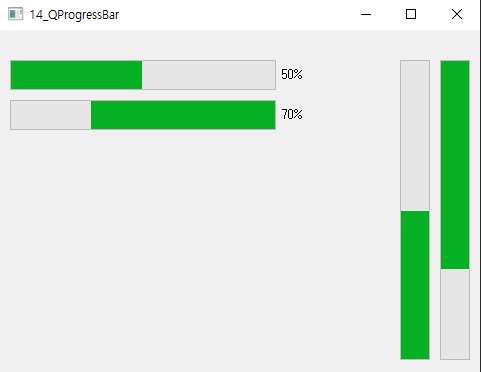

## 이해 안되는 것들, 궁금 한 점

1.  QT Resources 추가

   - 말씀해주신 사이트 링크 참고해서 진행하였는데 이미지를 실행했지만 예제소스랑 경로부분을 똑같이 코드를 쓰면 실행이 안되는 현상입니다. 이유를 잘 모르겠습니다.
   - 했던 작업
     - Add new -> qt resource생성 -> .qrc 파일에서 add Prefix 해서 경로를 지우고 수정했는데 "/" 기호는 그대로 있습니다. 파일을 추가하고 실행시켰더니  "/" 기호 없이는 실행되지 않았습니다. 

   - 참고 링크 : https://wiserloner.tistory.com/346

예제코드 - 11- QLable_QLCDNumber

```c++
 QPixmap pix = QPixmap(":resources/browser.png");
```

제가 짠 코드

```c++
QPixmap pix = QPixmap(":/resources/browser.png");
```

***

참고 이미지 - 프로젝트 디렉토리 


***


2.

QProgressBar 예제 중에 setValue() 설정 하면 상태 표시 값이 표시되는 건 알겠는데 '%'가 이 예제에선 가로 상태에선 표시되고 세로 상태에선 표시가 안되는데 왜 그런걸까요?

- 시도 한 방법
  - [google] "qt progressbar 예제'' 검색 
  - https://flower0.tistory.com/185 
  - 최소값, 최대값을 설정해도 수직인 상태바에서는 퍼센트 수치값이 나오질 않았음

widget.cpp

```c++
#include "widget.h"

Widget::Widget(QWidget *parent)
    : QWidget(parent)
{
    progress[0] = new QProgressBar(this);
    progress[0]->setMinimum(0);
    progress[0]->setMaximum(100);
    progress[0]->setValue(50);
    progress[0]->setOrientation(Qt::Horizontal);

    progress[1] = new QProgressBar(this);
//    progress[1]->setMinimum(0);
//    progress[1]->setMaximum(100);
    progress[1]->setValue(70);
    progress[1]->setOrientation(Qt::Horizontal);
    progress[1]->setInvertedAppearance(true);

    progress[2] = new QProgressBar(this);
    progress[2]->setMinimum(0);
    progress[2]->setMaximum(100);
    progress[2]->setValue(50);
    progress[2]->setOrientation(Qt::Vertical);

    progress[3] = new QProgressBar(this);
    progress[3]->setMinimum(0);
    progress[3]->setMaximum(100);
    progress[3]->setValue(70);
    progress[3]->setOrientation(Qt::Vertical);
    progress[3]->setInvertedAppearance(true);

    progress[0]->setGeometry(10,30,300,30);
    progress[1]->setGeometry(10,70,300,30);

    progress[2]->setGeometry(400,30, 30, 300);
    progress[3]->setGeometry(440,30, 30, 300);
}

Widget::~Widget()
{
}


```

***




***


3.

인터넷 참고 사이트를 이용해서 잘 이해하고 활용하고 싶은데 영어가 진짜 안되다보니 고민이에요.. 좋은 방법 있을까요? 