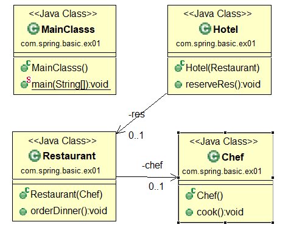

# Spring Container DI (Dependency injection : 의존성 주입) 


#### Spring DI / IoC

- JAVA 의 Class 상속 / Interface 를 이용한 추상화를 기반으로 하는 개발 방법. 

- Spring은 아래 DI/IoC 를 강력하게 지원하는 프레임워크. 

  

- **IoC : Inversion of Control** 

  - 프로그램을 제어하는 패턴 중 하나. 

  - DI 는 IoC패턴의 구현방법 중 하나. 

  - DI에 따라 프로그램의 흐름이 완전히 변경됨. 

  - **컨테이너(박스)안에다가 객체들을 미리 저장 시켜놓고 필요할때 꺼내서 쓰는개념** - 제어의역전

    

- **DI : Dependency Injection** 

  - 객체의 생성과 사용의 관심을 분리하는 것 

  - 디펜던시 인젝션이란 하나의 객체가 다른 객체의 의존성을 제공하는 테크닉 

  - 스프링 Container 에 만들어둔 각종 클래스(bean)들은 서로 의존적이다 A객체가 B객체 없이 동작이 불가능한 상황 

    

#### 스프링은 DI를 기준으로 많은 프레임워크모듈 들이 만들어짐. 

####  Spring 은 DI Framework 혹은 IoC Framework 라고 부름


### DI?

- [참고 : DI Dependency Injection 이란?](https://medium.com/@jang.wangsu/di-dependency-injection-%EC%9D%B4%EB%9E%80-1b12fdefec4f)
- [주니어 개발자도 이해 할 수 있는 의존성 주입(Dependency Injection)](https://www.slideshare.net/hnki0104/ss-42101768)

- **의존성은?**  의존 관계를 가지는 상황에 대한 이해를 하시면 될 것 같습니다.

- **주입은?**  내부가 아니라 **외부에서 객체를 생성해서 넣어주는 것**을 주입한다고 합니다.

- 내부에서 만든 변수를 외부에서 넣어주게 하면 됩니다.

  

- 배터리에 의존해서 장난감을 만들었다. -> 배터리에 의존적이다

  - 배터리 일체형 : 배터리가 떨어지면 장난감을 새로 구입해야한다.

    - 객체 주입 : 생성자

  - 배터리 분리형 : 배터리가 떨어지면 배터리만 교체하면 된다.

    - 객체 주입 : 생성자, setter

      

- 의존관계 UML 예시



### 2가지 의존성 주입 방법

1. 생성자를 통한 의존성 주입

```xml
<constructor-arg ref="빈id" />
```

2. setter를 통한 의존성 주입 

```xml
<property name="변수명" value="값"/>
<property name="변수명" ref="객체"/>
```


#### ex) 호텔, 레스토랑, 쉐프 클래스에 대한 의존성 처리 

`test-config.xml` : 테스트 설정 파일 

```xml
<?xml version="1.0" encoding="UTF-8"?>

<!-- 내용 추가 -->
<beans xmlns="http://www.springframework.org/schema/beans" 
xmlns:xsi="http://www.w3.org/2001/XMLSchema-instance" 
xsi:schemaLocation="http://www.springframework.org/schema/beans 
http://www.springframework.org/schema/beans/spring-beans.xsd">
<!-- 내용 추가 끝-->
    
	<bean id="test" class="com.spring.basic.SpringTest" />
	
	<!-- Hotel 객체와 의존 객체들의 변수 등록 및 의존성 주입설정 -->
	<bean id="chef" class="com.spring.basic.ex01.Chef" />
	
	<bean id="res" class="com.spring.basic.ex01.Restaurant" >
		<constructor-arg ref="chef" />
	</bean>
	
	<bean id="hotel" class="com.spring.basic.ex01.Hotel" >
		<constructor-arg ref="res" />
	</bean>
	
	
</beans>
```


`Main.java`

```java
package com.spring.basic.ex01;

import org.springframework.context.support.GenericXmlApplicationContext;

public class MainClasss {

	public static void main(String[] args) {
		
//		Hotel hotel = new Hotel(new Restaurant(new Chef()));
//		hotel.reserveRes();
		
		GenericXmlApplicationContext ct 
			= new GenericXmlApplicationContext("classpath:test-config.xml");
		
		Hotel hotel = ct.getBean("hotel", Hotel.class);
		hotel.reserveRes();	
	}
}
```

```java
package com.spring.basic.ex01;

public class Hotel {
	
	private Restaurant res;
	
	public Hotel(Restaurant res) {
		System.out.println("호텔 생성");
		this.res = res;
	}
	
	public void reserveRes() {
		System.out.println("레스토랑을 예약한다.");
		res.orderDinner();
	}
}
package com.spring.basic.ex01;

public class Restaurant {
	
	private Chef chef;
	
	public Restaurant(Chef chef) {
		System.out.println("레스토랑 생성");
		this.chef = chef;
	}
	
	public void orderDinner() {
		System.out.println("저녁 식사를 주문한다.");
		chef.cook();
	}
}
package com.spring.basic.ex01;

public class Chef {
	
	public Chef() {
		System.out.println("쉐프 생성");
	}
	
	public void cook() {
		System.out.println("쉐프가 요리를 한다 ");
	}
}

```


#### setter

```xml
<?xml version="1.0" encoding="UTF-8"?>
<beans xmlns="http://www.springframework.org/schema/beans" 
xmlns:xsi="http://www.w3.org/2001/XMLSchema-instance" 
xsi:schemaLocation="http://www.springframework.org/schema/beans 
http://www.springframework.org/schema/beans/spring-beans.xsd">

	<bean id="db1" class="com.spring.basic.ex02.DataBaseInfo">
		<!-- setter 주입-->
		<property name="url" value="jdbc:mysql://localhost:3306/spring" />
		<property name="uid" value="spring1" />
		<property name="upw" value="sss111" />
	</bean>	

	<bean id="db2" class="com.spring.basic.ex02.DataBaseInfo">
		<!-- setter 주입-->
		<property name="url" value="jdbc:mysql://localhost:3306/practice" />
		<property name="uid" value="root" />
		<property name="upw" value="mysql" />
	</bean>	


	<bean id="dao" class="com.spring.basic.ex02.MemberDAO" >
		<property name="dbInfo" ref="db1"></property>
	</bean>
</beans>
```

이와같이 xml 파일변경으로 서버 로직을 변경할 수 있다 

```java
package com.spring.basic.ex02;

import org.springframework.context.support.GenericXmlApplicationContext;

public class MainClasss2 {

	public static void main(String[] args) {
//		DataBaseInfo dbInfo = new DataBaseInfo();
//		dbInfo.setUrl("jdbc:mysql://localhost:3306/spring");
//		dbInfo.setUid("spring");
//		dbInfo.setUpw("sss111");
		
		GenericXmlApplicationContext ct
			= new GenericXmlApplicationContext("classpath:db-config.xml");
		
		DataBaseInfo db1 = ct.getBean("db1", DataBaseInfo.class);
		System.out.println(db1.getUrl());
		System.out.println(db1.getUid());
		System.out.println(db1.getUpw());
		
		DataBaseInfo db2 = ct.getBean("db2", DataBaseInfo.class);
		System.out.println(db2.getUrl());
		System.out.println(db2.getUid());
		System.out.println(db2.getUpw());
		
		MemberDAO dao = ct.getBean("dao", MemberDAO.class);
		dao.showDBInfo();
	}

}

```


### Bean 등록시 패턴은 싱글톤 패턴으로 만들어진다. 

- 객체를 한번 만들어놓으면 다시 만들 가능성이 없기때문에 그렇게 설계한것 

- 메모리상 재활용 용도 
- 디폴트 : 싱글톤 

```xml

	<bean id="Person" class="com.spring.basic.ex03.Person" scope="prototype">
		<property name="name" value="홍길동" />
		<property name="age" value="20" />
	</bean>	
	
```

스코프 부분을 프로토타입으로 지정시 다른 객체가 생성 

```java
package com.spring.basic.ex03;

import org.springframework.context.support.GenericXmlApplicationContext;

public class Main3 {

	public static void main(String[] args) {
		
		GenericXmlApplicationContext ct = new GenericXmlApplicationContext("classpath:prototype-config.xml");
		Person hong = ct.getBean("Person", Person.class);
		Person kim = ct.getBean("Person", Person.class);
		
		kim.setName("김철수");
		kim.setAge(43);
		
		System.out.println(hong.getName());
		System.out.println(hong.getAge());
		System.out.println(kim.getName());
		System.out.println(kim.getAge());
	}
}

홍길동
20
김철수
43
```

