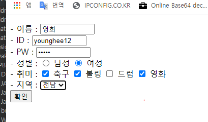
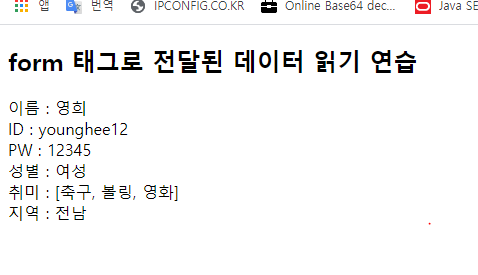

#### include

- include header(상단) / footer(하단) 부분 은 보통 파일자체를 따로 만듬 

- 반복하기 귀찮기 때문에 

- 프레그먼트 파일 이름 : `.jspf`


다른파일에서 참조 하기 - 다른언어의 모듈화 개념 

```jsp
<%@ include file="includeheader.jspf"  %>
```


### JSP 내장객체

\* JSP 내장 객체 

- 개발자가 JSP 파일 내에 객체를 생성하지 않고 바로 사용할 수 있는 객체가 내장 객체입니다. 

- JSP에서 제공되는 내장객체는 JSP 컨테이너에 의해 서블릿으로 변환될 때 자동으로 객체가 생성됩니다. 

- **자바처럼 new 로 생성하지 않아도됨** 

- `javax.servlet.http.*`

  

JSP 내장 객체의 종류 

1. request javax.servlet.http.HttpServletRequest 
2. response javax.servlet.http.HttpServletResponse 
3. out javax.servlet.jsp.JspWriter 
4. session javax.servlet.http.HttpSession 
5. application javax.servlet.ServletContext 
6. pageContext javax.servlet.jsp.PageContext 
7. page javax.servlet.jsp.HttpJspPage 
8. config javax.servlet.ServletConfig 
9. exception java.lang.Throwable


##### request

```jsp
<%@ page language="java" contentType="text/html; charset=UTF-8"
    pageEncoding="UTF-8" trimDirectiveWhitespaces="true"%>
    
<%
	StringBuffer url = request.getRequestURL(); // 서버 URL 주소 리턴
	String uri = request.getRequestURI();
	String protocol = request.getProtocol();
	String conPath = request.getContextPath();
	int serverPort = request.getServerPort();
	String userIP = request.getRemoteAddr();
%>

<!DOCTYPE html>
<html>
<head>
<meta charset="UTF-8">
<title>Insert title here</title>
</head>
<body>
	<p>
		# 요청 URL   : <%= url %> <br>
		# 요청 URI   : <%= uri %> <br>
		# protocol : <%= protocol %> <br>
		# Path     : <%= conPath %> <br>
		# Port     : <%= serverPort %> <br>
		# 사용자 IP  : <%= userIP %> <br>
	</p>
</body>
</html>
```


#### 요청 파라미터

- 클라이언트 측에서 서버로 데이터를 요청할 때 전달되는 값들을 담은 변수
- ex) 
  - 로그인 - 아이디, 비밀번호 (두개는 요청 파라미터로 서버로 넘겨줌 ) 
- 요청 파라미터는 URL주소 뒤에 ?를 붙인 이후 [파라미터변수명=값]의 형식을 통해 서버로 데이터를 전달한다.
- 요청 파라미터를 여러 개 전달할 때는 &기호로 나열하여 전달한다.

```jsp
<%@ page language="java" contentType="text/html; charset=UTF-8"
    pageEncoding="UTF-8"%>

<%
	String breakfast = request.getParameter("bf");  // 클라이언트에서는 요청 파라미터 메소드 안에 문자이름에 값을 넣어서 서버에보냄 
	String lunch = request.getParameter("lunch");
	String dinner = request.getParameter("dinner");
%>    

<!DOCTYPE html>
<html>
<head>
<meta charset="UTF-8">
<title>Insert title here</title>
</head>
<body>
	<h2>요청 파라미터 읽기 연습 </h2>
	<br>
	<p>
		- 아침밥 : <%= breakfast %> <br>
		- 점심밥 : <%= lunch %> <br>
		- 저녁밥 : <%= dinner %> <br>
	</p>
	
</body>
</html>
```

```
요청 파라미터 읽기 연습

- 아침밥 : "빵"
- 점심밥 : "삼겹살"
- 저녁밥 : "김치찌개"
```


#### form 태그

- 사용자의 입력값을 서버로 전송하는 방법
  1. 사용자의 입력 데이터를 서버로 전송하려면 HTML의 form태그를 사용한다.
  2. form 태그의 action 속성에 데이터를 받을 페이지의 URL 주소를 적는다.
  3. input태그의 name 속성으로 요청파라미터의 이름을 지정할 수 있다.
  4. 입력창이나 버튼 체크에 의해 작성된 값이 요청파라미터의 값으로 처리된다.
  5. submit 버튼을 사용하여 서버로 데이터를 전송한다.


`req_userform.jsp`

```jsp
<%@ page language="java" contentType="text/html; charset=UTF-8"
    pageEncoding="UTF-8" trimDirectiveWhitespaces="true"%>

<!DOCTYPE html>
<html>
<head>
<meta charset="UTF-8">
<title>Insert title here</title>
</head>
<body>
	<form action="http://localhost:8080/JSPBasic/JSPobj/req_user_info.jsp"> <!-- 페이지 전환 주소 정해줌 : 절대,상대경로 둘다가능-->
		<p>
			- 이름 : <input type="text" name="user_name" size="10px"><br>
			- ID : <input type="text" name="user_id" size="10px"><br>
			- PW : <input type="password" name="user_pw" size="10px"><br>
			- 성별 : <input type="radio" name="user_sex" value="남성"> 남성 <!-- on 이라고 나오는 속성 바꾸기 : value -->
			<input type="radio" name="user_sex" value="여성"> 여성  <br>
			
			- 취미 : <input type="checkbox" name="hobby" value="축구"> 축구 
			<input type="checkbox" name="hobby" value="볼링"> 볼링  
			<input type="checkbox" name="hobby" value="드럼"> 드럼  
			<input type="checkbox" name="hobby" value="영화"> 영화  <br>
			
			- 지역 : 
			<select name="region">
				<option>서울</option>
				<option>제주</option>
				<option>강원</option>
				<option>전남</option>
			</select><br>
			
			
			
			<input type="submit" value="확인">
		</p>
	
	</form>
	
</body>
</html>
```


`req_user_info.jsp`

```jsp
<%@page import="java.util.Arrays"%>
<%@ page language="java" contentType="text/html; charset=UTF-8"
    pageEncoding="UTF-8"%>
    
<%
	String name = request.getParameter("user_name");
	String id = request.getParameter("user_id"); 
	String pw = request.getParameter("user_pw");
	String sex = request.getParameter("user_sex");
	String[] arr_hobby = request.getParameterValues("hobby"); // 요청값 복수갯수일때
	String region = request.getParameter("region");
%>

<!DOCTYPE html>
<html>
<head>
<meta charset="UTF-8">
<title>Insert title here</title>
</head>
<body>
	<h2>form 태그로 전달된 데이터 읽기 연습</h2>
	<p>
		이름 : <%= name %><br>
		ID : <%= id %><br>
		PW : <%= pw %><br>
		성별 : <%= sex %><br>
		취미 : <%= Arrays.toString(arr_hobby) %><br>
		지역 : <%= region %><br>
	</p>
</body>
</html>
```






앨범 정보 선택하여 불러오기 

`req_album.jsp`

```jsp
<%@ page language="java" contentType="text/html; charset=UTF-8"
    pageEncoding="UTF-8"%>
<!DOCTYPE html>
<html>
<head>
<meta charset="UTF-8">
<title>Insert title here</title>
</head>
<body>
	<form action="req_album_info.jsp">
		<table border="1">
			<th>선택</th>
			<th>앨범 커버</th>
			<th>가수</th>
			<th>앨범 제목</th>
			<th>날짜</th>
			<tr><!-- 첫번째 줄 시작 -->
			    <td><input type="radio" name="user_select" value="loco"></td>
			    <td></td>
			    <td>로꼬</td>
			    <td>잠이 들어야 (Feat. 헤이즈)</td>
			    <td>2020.10.14</td>
			</tr><!-- 첫번째 줄 끝 -->
			
			<tr><!-- 두번째 줄 시작 -->
			 	<td><input type="radio" name="user_select" value="환불원정대"></td>
			    <td></td>
			    <td>환불원정대</td>
			    <td>DON'T TOUCH ME</td>
			    <td>2020.10.10</td>
			</tr><!-- 두번째 줄 끝 -->
	    </table>
    <hr><input type="submit" value="확인"><br>
    </form>
</body>
</html>
```

`req_album_info.jsp`

```jsp
<%@ page language="java" contentType="text/html; charset=UTF-8"
    pageEncoding="UTF-8"%>
    
<%
	String singer = request.getParameter("user_select");
%>
<!DOCTYPE html>
<html>
<head>
<meta charset="UTF-8">
<title>Insert title here</title>
</head>
<body>
	<h2>선택하신 앨범 정보 입니다</h2>
	<p>
		- 가수 : <%= singer %> <br>
		<% if (singer.equals("loco")){ %>
			
			<iframe width="800" height="600" src="https://www.youtube.com/embed/c0gZnxJ5U6c?rel=0;apm;autoplay=1" frameborder="0" allow="accelerometer; autoplay; clipboard-write; encrypted-media; gyroscope; picture-in-picture" allowfullscreen></iframe>
		<% } else if (singer.equals("환불원정대")){ %>
			
			<iframe width="800" height="600" src="https://www.youtube.com/embed/Ydv6XPWqD-A?rel=0;apm;autoplay=1" frameborder="0" allow="accelerometer; autoplay; clipboard-write; encrypted-media; gyroscope; picture-in-picture" allowfullscreen></iframe>
		<% } %>
	</p>
</body>
</html>
```


- 위의 방식대로 하면 URL이 전부 노출됨 - 보안취약 (GET 방식이 적용됨)

- ### **POST 방식**

  - URL이 노출이 되지않는다 
  - 보안상 강점

```jsp
<%@ page language="java" contentType="text/html; charset=UTF-8"
    pageEncoding="UTF-8"%>
<!DOCTYPE html>
<html>
<head>
<meta charset="UTF-8">
<title>Insert title here</title>
</head>
<body>
	<h2>HttpRequest Post form 태그 실습</h2>
	<form action="req_post_take.jsp" method="post"> 
		- ID : <input type="text" name="id" size="10px"><br>
		- PW : <input type="password" name="pw" size="10px"><br>
		- 이름 : <input type="text" name="name" size="10px"><br>
		<input type="submit" value="다음으로 넘어가기">
	</form>
</body>
</html>
```

```jsp
<%@ page language="java" contentType="text/html; charset=UTF-8"
    pageEncoding="UTF-8"%>
<%
	request.setCharacterEncoding("utf-8");

	String id = request.getParameter("id");	
	String pw = request.getParameter("pw");
	String name = request.getParameter("name");
%>

<!DOCTYPE html>
<html>
<head>
<meta charset="UTF-8">
<title>Insert title here</title>
</head>
<body>
	<h2>Post 결과</h2>
	<p>
		- 아이디    : <%= id %> <br>
		- 패스워드 : <%= pw %> <br>
		- 이    름   : <%= name %> <br>
	</p>
</body>
</html>
```


##### 로그인 페이지 구현

- 페이지 리다이렉트 방식으로 구현 
  - 성공 시 성공페이지
  - 실패 시 실패페이지

- `res_login.jsp`

```jsp
<%@ page language="java" contentType="text/html; charset=UTF-8"
    pageEncoding="UTF-8"%>
    

<!DOCTYPE html>
<html>
<head>
<meta charset="UTF-8">
<title>Insert title here</title>
</head>
<body>
	<h2>로그인 페이지</h2>
	
	<div align="center">
		<form action="res_login_ok.jsp" method="post">
			<table border="1">
				<tr>
					<td><input type="text" name="id" placeholder="아이디" size="10px"></td>
					<td rowspan="2"><input type="submit" value="로그인" width="80px" height="60px"></td>
				</tr>
				<tr>
					<td><input type="password" name="pw" placeholder="패스워드" size="10px"></td>
				</tr>
			</table>
		</form>
	</div>
</body>
</html>
```


- `res_login_ok.jsp`

```jsp
<%@ page language="java" contentType="text/html; charset=UTF-8"
    pageEncoding="UTF-8"%>
    


<!DOCTYPE html>
<html>
<head>
<meta charset="UTF-8">
<title>Insert title here</title>
</head>
<body>
	<h2>로그인 성공 페이지</h2>
	<%
		String id = request.getParameter("id");
		String pw = request.getParameter("pw");
		
		if (id.equals("admin")){
			//response.sendRedirect("res_login_ok.jsp"); %>
			<form action="res_login.jsp" method="post">
				<p>
					<%= id %> 님 로그인 성공!<hr>
					<input type="submit" value="처음으로"><br>
				</p>
			</form>
		<% } else {
			response.sendRedirect("res_login_fail.jsp");
		}
	%>
	
	
</body>
</html>
```


- `res_login_fail.jsp`

```jsp
<%@ page language="java" contentType="text/html; charset=UTF-8"
    pageEncoding="UTF-8"%>

<%
	String id = request.getParameter("id");
%>    
    
<!DOCTYPE html>
<html>
<head>
<meta charset="UTF-8">
<title>Insert title here</title>
</head>
<body>
	<h2>로그인 실패 페이지</h2>
	<form action="res_login.jsp" method="post">
		<p>
			<%= id %> 라는 아이디는 존재하지 않습니다!<hr>
			<input type="submit" value="처음으로"><br>
		</p>
	</form>
</body>
</html>
```

