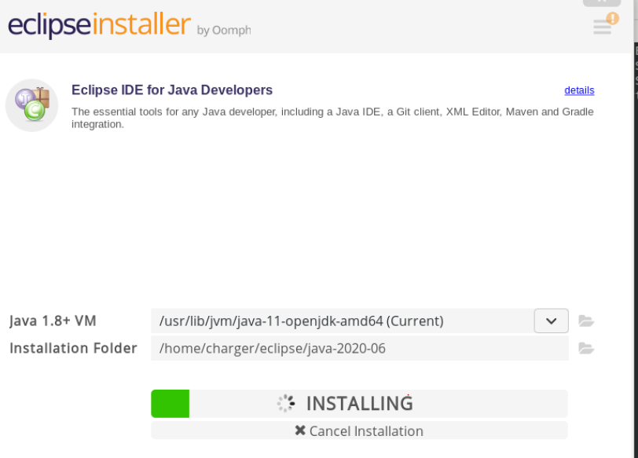

### OpenJFX

- JavaFX 라이브러리 

이 예에서 설치 경로는 다음과 같다.

- OpenJDK 11은 `/usr/lib/jvm/java-11-openjdk-amd64/bin/java`
- OpenJDK 8은 `/usr/lib/jvm/adoptopenjdk-8-hotspot-amd64/bin/java`


- 현재 데비안 10
  - openjdk 8  
    - openjfx 8 버전 패키지를 찾지못함 
  - openjdk 11
    - openjfx 11 버전 패키지를 찾아서 컴파일은 되지만 실행이 안됨 
- **관련 경로 : javafx.properties**


***

#### 1안  : 11버전으로 커맨트라인 시작 - 실패 

JDK 버전 : java-11-openjdk-amd64

JavaFX : openjfx-11

```shell
jdk 경로
$ /usr/lib/jvm/java-11-openjdk-amd64

fx 라이브러리 경로
$ /usr/share/openjfx/lib
```


**모든 다운로드 캐쉬된 deb 패키지 목록** 

`/var/cache/apt/archives`


Complie -  **execute  to project path**

`javac --module-path $JAVA_HOME --add-modules=javafx.fxml,javafx.graphics Main.java`


컴파일 옵션 줘본것 

```
-Djavafx.verbose = true
-Dprism.verbose = true
-D
```


execute

`java --module-path $JAVA_HOME --add-modules=javafx.fxml,javafx.graphics Main`


결과 : 컴파일 후 실행 버그

```
Graphics Device initialization failed for :  es2, sw
Error initializing QuantumRenderer: no suitable pipeline found
java.lang.RuntimeException: java.lang.RuntimeException: Error initializing QuantumRenderer: no suitable pipeline found
	at javafx.graphics/com.sun.javafx.tk.quantum.QuantumRenderer.getInstance(QuantumRenderer.java:280)
	at javafx.graphics/com.sun.javafx.tk.quantum.QuantumToolkit.init(QuantumToolkit.java:222)
	at javafx.graphics/com.sun.javafx.tk.Toolkit.getToolkit(Toolkit.java:260)
	at javafx.graphics/com.sun.javafx.application.PlatformImpl.startup(PlatformImpl.java:267)
	at javafx.graphics/com.sun.javafx.application.PlatformImpl.startup(PlatformImpl.java:158)
	at javafx.graphics/com.sun.javafx.application.LauncherImpl.startToolkit(LauncherImpl.java:658)
	at javafx.graphics/com.sun.javafx.application.LauncherImpl.launchApplicationWithArgs(LauncherImpl.java:409)
	at javafx.graphics/com.sun.javafx.application.LauncherImpl.launchApplication(LauncherImpl.java:363)
	at java.base/jdk.internal.reflect.NativeMethodAccessorImpl.invoke0(Native Method)
	at java.base/jdk.internal.reflect.NativeMethodAccessorImpl.invoke(NativeMethodAccessorImpl.java:62)
	at java.base/jdk.internal.reflect.DelegatingMethodAccessorImpl.invoke(DelegatingMethodAccessorImpl.java:43)
	at java.base/java.lang.reflect.Method.invoke(Method.java:566)
	at java.base/sun.launcher.LauncherHelper$FXHelper.main(LauncherHelper.java:1051)
Caused by: java.lang.RuntimeException: Error initializing QuantumRenderer: no suitable pipeline found
	at javafx.graphics/com.sun.javafx.tk.quantum.QuantumRenderer$PipelineRunnable.init(QuantumRenderer.java:94)
	at javafx.graphics/com.sun.javafx.tk.quantum.QuantumRenderer$PipelineRunnable.run(QuantumRenderer.java:124)
	at java.base/java.lang.Thread.run(Thread.java:834)
Exception in thread "main" java.lang.reflect.InvocationTargetException
	at java.base/jdk.internal.reflect.NativeMethodAccessorImpl.invoke0(Native Method)
	at java.base/jdk.internal.reflect.NativeMethodAccessorImpl.invoke(NativeMethodAccessorImpl.java:62)
	at java.base/jdk.internal.reflect.DelegatingMethodAccessorImpl.invoke(DelegatingMethodAccessorImpl.java:43)
	at java.base/java.lang.reflect.Method.invoke(Method.java:566)
	at java.base/sun.launcher.LauncherHelper$FXHelper.main(LauncherHelper.java:1051)
Caused by: java.lang.RuntimeException: No toolkit found
	at javafx.graphics/com.sun.javafx.tk.Toolkit.getToolkit(Toolkit.java:272)
	at javafx.graphics/com.sun.javafx.application.PlatformImpl.startup(PlatformImpl.java:267)
	at javafx.graphics/com.sun.javafx.application.PlatformImpl.startup(PlatformImpl.java:158)
	at javafx.graphics/com.sun.javafx.application.LauncherImpl.startToolkit(LauncherImpl.java:658)
	at javafx.graphics/com.sun.javafx.application.LauncherImpl.launchApplicationWithArgs(LauncherImpl.java:409)
	at javafx.graphics/com.sun.javafx.application.LauncherImpl.launchApplication(LauncherImpl.java:363)
	... 5 more

```


***

#### 2안  : 8버전으로 커맨트라인 시작 - 실패 

JDK 버전 : adoptopenjdk-8-hotspot-amd64

JavaFX : 별도 설치 하지않고 `jfxrt.jar` 파일 `/usr/lib/jvm/adoptopenjdk-8-hotspot-amd64/jre/lib/ext`에 넣어둠 


환경변수 

```shell
#JAVA_HOME="/usr/lib/jvm/java-11-openjdk-amd64/lib"
JAVA_HOME="/usr/lib/jvm/adoptopenjdk-8-hotspot-amd64"
JAVAFX_HOME="/usr/share/openjfx/lib"
CLASSPATH="/usr/lib/jvm/adoptopenjdk-8-hotspot-amd64/jre/lib/ext"
```


컴파일

`javac -cp . application/Main.java`


실행 

`java -cp . 패키지명.클래스명`

결과 : java 11 과 똑같은 로그 


- jar 파일 내부 리스트 보기 

```shell
$ jar -tf 파일명
```


참고한 사이트 

- https://stackoverflow.com/questions/21185156/javafx-on-linux-is-showing-a-graphics-device-initialization-failed-for-es2-s
- https://c10106.tistory.com/2244 (클래스 파일 추가)
- https://stackoverflow.com/questions/21185156/javafx-on-linux-is-showing-a-graphics-device-initialization-failed-for-es2-s


#### jfxrt.jar

- 윈도우 : `C:\Program Files\Java\jdk1.8.0_191\jre\lib\ext`
- 리눅스 : `/usr/lib/jvm/adoptopenjdk-8-hotspot-amd64/jre/lib/ext`
  - gtk 2 3 깔려있음 

```
Exception in thread "main" java.lang.reflect.InvocationTargetException
	at sun.reflect.NativeMethodAccessorImpl.invoke0(Native Method)
	at sun.reflect.NativeMethodAccessorImpl.invoke(NativeMethodAccessorImpl.java:62)
	at sun.reflect.DelegatingMethodAccessorImpl.invoke(DelegatingMethodAccessorImpl.java:43)
	at java.lang.reflect.Method.invoke(Method.java:498)
	at sun.launcher.LauncherHelper$FXHelper.main(LauncherHelper.java:767)
Caused by: java.lang.RuntimeException: java.lang.UnsatisfiedLinkError: com.sun.glass.ui.gtk.GtkApplication._isDisplayValid()Z
	at com.sun.javafx.tk.quantum.QuantumToolkit.startup(QuantumToolkit.java:267)
	at com.sun.javafx.application.PlatformImpl.startup(PlatformImpl.java:211)
	at com.sun.javafx.application.LauncherImpl.startToolkit(LauncherImpl.java:675)
	at com.sun.javafx.application.LauncherImpl.launchApplicationWithArgs(LauncherImpl.java:337)
	at com.sun.javafx.application.LauncherImpl.launchApplication(LauncherImpl.java:328)
	... 5 more
Caused by: java.lang.UnsatisfiedLinkError: com.sun.glass.ui.gtk.GtkApplication._isDisplayValid()Z
	at com.sun.glass.ui.gtk.GtkApplication._isDisplayValid(Native Method)
	at com.sun.glass.ui.gtk.GtkApplication.isDisplayValid(GtkApplication.java:83)
	at com.sun.glass.ui.gtk.GtkApplication.<init>(GtkApplication.java:67)
	at com.sun.glass.ui.gtk.GtkPlatformFactory.createApplication(GtkPlatformFactory.java:41)
	at com.sun.glass.ui.Application.run(Application.java:146)
	at com.sun.javafx.tk.quantum.QuantumToolkit.startup(QuantumToolkit.java:257)

```


- 참고 사이트 
  - https://stackoverflow.com/questions/53744923/java-lang-unsatisfiedlinkerror-com-sun-glass-ui-gtk-gtkapplication-isdisplayva
    - 8, 11 버전 안 겹치게 확인 
    - libopenjfx-jni 

***


#### **3안. 리눅스에 이클립스 올려서 11버전으로 시작  -  성공** 

[참고 - 어떤 개발자의 리눅스 자바fx 구축이야기](https://m.blog.naver.com/PostView.nhn?blogId=linuxni&logNo=221670596629&categoryNo=2&proxyReferer=https:%2F%2Fwww.google.com%2F)


1. openjdk 11 설치 

   - [참고 - openjdk 11 설치 및 환경변수 설정](https://www.linode.com/docs/development/java/how-to-install-openjdk-on-debian-10/)

2. openjfx 11 설치

3. 이클립스 설치 

   - [참고 - debian 10 ecplise install](https://linuxhint.com/install_eclipse_ide_debian_10/)

   - www.eclipse.org

   - 경로 

     

4. SceneBuilder 설치 
   - 실행경로 : `/opt/SceneBuilder/SceneBuilder`

5. 이클립스 에서 JavaFX 프로젝트 생성 할때 module-info.java 파일 추가해야함 

   ```java
   // 이런 식으로 모듈 추가 
   
   module fxtest {
   	exports application;
   
   	requires javafx.base;
   	requires javafx.graphics;
   	requires javafx.fxml;
   	requires javafx.controls;
   }
   ```

   