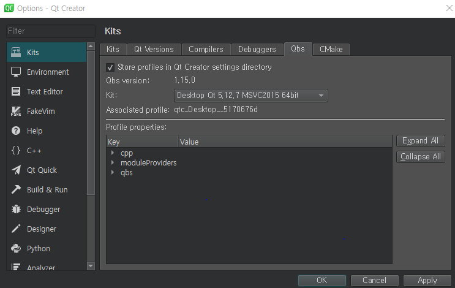

# 새로 알게된것들


### TIL

- 'Today I Learned'의 약자, 오늘 배운 것을 기록하고 리뷰하는 것이다.
- 중요한 것은 '매일' 해야하기 때문에 처리한 업무라던가 기술적 이슈에 대해 작성 하는 습관 기르기
- 출처 : [TIL이란?](https://kignues.tistory.com/7 )

***


### 형상관리 프로그램

- 소프트웨어 구성관리(Software Configuration Management) 또는 형상관리는 소프트웨어의 변경사항을 체계적으로 관리하는 것을 말한다. 
- 파일 서버 기반 관리 방법도 있지만 가장 치명적인 단점은 파일이 손상되면 복구할 수가 없다.
- 형상관리 프로그램의 장점

  - 장애 혹은 기능상 필요할 때 이전 데이터로 복구 할수 있는 것
  - 소스 코드의 변경 이력을 확인하고 관리할수 있다.
  - 하나의 프로젝트를 여러 사람이 협업해서 사용할 수 있다.
- 출처: [형상관리 시스템이란?](https://m.blog.naver.com/qbxlvnf11/221315018479)

***

### 비즈니스 로직

- 컴퓨터 프로그램에서 실세계의 규칙에 따라 데이터를 생성,표시,저장,변경 하는 부분을 말한다.
- 프로그래머는 유저가 원하는 행위를 컴퓨터에 잘 전달하기 위해서 비즈니스 로직을 잘 구성해야한다.
- 비즈니스 로직이 잘 정리되지 않으면 프로그래머는 코드 관리에 어려움을 느끼고, 개발을 어렵게 하는 요인이 될수 있는데 생산성, 품질이 저하된다.
- 유지보수와 확장성을 고려한 코딩을 해야한다. 그러기 위해선 소프트웨어 아키텍쳐도 공부를 해야한다.
  - ex) MVC 모델활용 (model, view, controller)
- 출처 : [비즈니스 로직이란?](https://mommoo.tistory.com/67)

***

### GitHub

- 원격 저장소에 잘못 올라간 파일 삭제 
- $ git rm [File Name]  -->  원격 저장소와 로컬 저장소에 있는 파일을 삭제한다.
- $ git rm --cached [File Name] -->  원격 저장소에 있는 파일을 삭제한다. 로컬 저장소에 있는 파일은 삭제하지 않는다.
  


***


### QT

- 프로젝트 파일 확장자 : .pro  --> 프로젝트의 속성을 정의하기 위한 파일이다.

  - ex) 이 프로젝트가 GUI기반, 콘솔 기반, 다른 어플리케이션을 위한 라이브러리 등 어떤 목적인지를 구분 하기 위한 속성 지정 목적으로 사용된다.

  

- 필요없는 모듈을 사용하지 않는 것이 어플리케이션 개발 후 배포 시 실행 프로그램이 사용하는 모듈(API)의 용량을 줄일 수 있다.


- QCoreApplication 클래스 : Qt라는 이벤트 루프를 통해 프로그램이 종료되지 않고 사용자 또는 이벤트로부터 요청을 처리한다. console 기반


- QApplication 클래스 : GUI 기반 클래스 


- return a.exec() : main 함수 처리가 끝나더라도 프로그램이 종료되지 않는다.


- QDebug() 함수 : c언어에서 사용하는 printf() 함수와 동일, 자바에서 system.out.println()

```QT
#ifndef WIDGET_H
#define WIDGET_H

#include <QWidget>
#include <QPushButton>

class Widget : public QWidget {
    Q_OBJECT

    public:
        Widget(QWidget *parent = nullptr);
        ~Widget();

    private:
        QPushButton *btn;   // 버튼 오브젝트
        QString str;        // Qt에서 제공하는 문자열 처리 클래스 변수

    public slots:
        void slot_btn();    // 이벤트 함수 -> SLOT함수 : 어떤 이벤트가 발생하면 실행되는 함수를 지정할 때 사용한다.
                            // 이 프로젝트에서 Hello World라는 btn을 클릭하면 slot_btn() 함수를 호출한다.
};

#endif // WIDGET_H

```


- QPushButton() 클래스 위젯은 버튼 위젯이다.

- ```
  setFixedSize(300, 200);             // 위젯의 크기를 지정하기 위한 멤버 함수
  ```

- ```
  str = QString("Hello World");       // QString 클래스 변수 -> str = 헬로월드 문자열 저장
  ```

- ```
   connect(btn, &QPushButton::clicked, this, &Widget::slot_btn); 
  // btn 버튼의 클릭 이벤트가 발생하면 slot_btn()함수호출한다.
  //인자 (이벤트를 발생하는 오브젝트, 이벤트의 종류(clicked, mouse over, released..), 이벤트를 받는 클래스,
  // 이벤트의 이벤트를 받는 클래스의 헤더파일에서 SLOT키워드에서 정의 함수를 지정 -> Qt의 이벤트는 Signal과 Slot을 사용한다.
  
  ```


# 이해 안되는 것들, 궁금한 것들

1. C++ 에서 프로젝트 파일 만들 때 헤더파일/cpp파일 안나누고 그냥 통합해서 만들어도 영향없는지 피드백 부탁드립니다 

2.  교재 30페이지에 GUI 기반으로 hello world 프로젝트 만들어서 컴파일 시켜봤더니 이와 같은 오류 현상이 일어났고 컴파일 설정이 잘못된 거 같아서 tools - option - kits - Qbs에서  mingw 64bit로 바꾸고 실행 시켜도 컴파일이 안되는데 피드백 부탁드립니다.

   2-1. 




​	2-2. 


3. git 원격 저장소에서 잘못올라간 파일을 삭제하려고 하는데 이와 같은 내용이 나왔습니다. 

   

   82105@HYUN-JIN MINGW64 ~/New_Learn_a_day (master)
   $ git rm --cached QT 새로알게된 것들.md QT 새로알게된 것들.md.bak cpp 새로알게된 것들.md cpp 새로알게된 것들.md.bak
   fatal: pathspec 'QT' did not match any files

   82105@HYUN-JIN MINGW64 ~/New_Learn_a_day (master)
   $ git rm --cached QT 새로알게된 것들
   fatal: pathspec 'QT' did not match any files

   82105@HYUN-JIN MINGW64 ~/New_Learn_a_day (master)
   $ git rm --cached QT\새로알게된\것들
   fatal: pathspec 'QT새로알게된것들' did not match any files

   

4. 'Typora' 라는 마크다운 툴에서 작업하는데 git에 올리고 나서 봤더니 이미지가 깨져있는? 보이지않는 현상이 나왔는데 저는 캡처 이용해서 갖다 붙이는 식으로 이용했더니 툴에선 잘나왔는데 git에서 보니까 이미지가 깨져 있었습니다.. 

