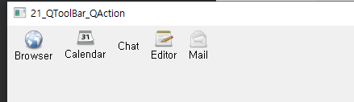

## 2020 04 01 수  / TIL

#### 1.  vi

#### .swp 

- vi 편집기에서 작업을 하는 동안 비정상적인 종료 등을 대비하기 위해 파일을 임시저장한다.

- 현재 작업중인 파일에 .swp을 붙이고 숨김 파일로 만들어 임시 저장하는데, 이것이 (<span style="color:red">스왑파일</span>)이다.

- 정상적인 방법으로 vi 편집기로 하는 작업을 완료하면 스왑 파일은 자동으로 삭제된다.

- 네트워크 끊김이나 강제 종료등의 이유로 작업이 끊기면 스왑 파일은 삭제되지 않고 남아있는다.

  

- 해결방안

  - 숨김 파일이라 모든 파일을 검색
  - 비정상 종료가 아닌 다른 프로세스가 작업중이여서 스왑파일 존재 가능성도 있으니 ```ps -ef | grep <파일이름>``` 검색
  - 다른 프로세스가 사용 중이 아님확인 후 ```vi -r <파일이름>``` 
  - 작업완료 후 파일 스왑파일 삭제 = ```sudo rm -rf <파일이름>```

- 출처 : [VI 에디터 E325: ATTENTION](http://www.orcinus.kr/post/48/)


####  문자열 검색

- :/찾을문자열  --> 현재 커서 위치에서 아래방향으로 탐색
- :? --> 윗방향 탐색 


***

## 이해 안되는 것들, 궁금한 점

1. 21_QToolBar 예제 중에 toolbar->setToolButtonStyle(Qt::ToolButtonTextUnderIcon) 메서드가 있는데 설명이 "아이콘을 텍스트 아래에 표시"라고  교재에 나와있는데 실행시킨건 "아이콘을 텍스트 위에 표시" 가 나왔습니다 그리고 Chat 쪽에는 아이콘이 나오지 않았습니다. 제가 틀린걸 까요?  

참고소스

```c++
#include "widget.h"

Widget::Widget(QWidget *parent)
    : QWidget(parent)
{
    QToolBar *toolbar = new QToolBar(this);
    QAction *act[5];

    act[0] = new QAction(QIcon(":resources/browser.png"), "Browser", this);
    act[1] = new QAction(QIcon(":resources/calendar.png"), "Calendar", this); // 기본값
    act[2] = new QAction(QIcon(":resources/char.png"), "Chat", this);
    act[3] = new QAction(QIcon(":resources/editor.png"), "Editor", this);
    act[4] = new QAction(QIcon(":resources/mail.png"), "Mail", this);

    act[0]->setShortcut(Qt::Key_Control | Qt::Key_E); // ctrl + e
    act[0]->setToolTip("This is a ToolTip."); // 마우스 대면 글자 표시
    act[3]->setToolTip("안녕");

    //toolbar->setToolButtonStyle(Qt::ToolButtonTextBesideIcon); // 툴바 모양 표시
    //toolbar->setToolButtonStyle(Qt::ToolButtonIconOnly);
    toolbar->setToolButtonStyle(Qt::ToolButtonTextUnderIcon);

    for(int i=0; i<5; i++){
        toolbar->addAction(act[i]);
    }

    //toolbar->setGeometry(300, 100, 0, 100);

    connect(act[0], SIGNAL(triggered()), this, SLOT(trigger1()));
    connect(act[1], SIGNAL(triggered()), this, SLOT(trigger2()));
    connect(act[2], SIGNAL(triggered()), this, SLOT(trigger3()));
    connect(act[3], SIGNAL(triggered()), this, SLOT(trigger4()));
    connect(act[4], SIGNAL(triggered()), this, SLOT(trigger5()));
}

void Widget::trigger1(){
    qDebug("Tool Button 1 click.");
}
void Widget::trigger2(){
    qDebug("Tool Button 2 click.");
}
void Widget::trigger3(){
    qDebug("Tool Button 3 click.");
}
void Widget::trigger4(){
    qDebug("Tool Button 4 click.");
}
void Widget::trigger5(){
    qDebug("Tool Button 5 click.");
}

Widget::~Widget()
{
}


```



***

