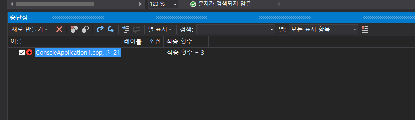
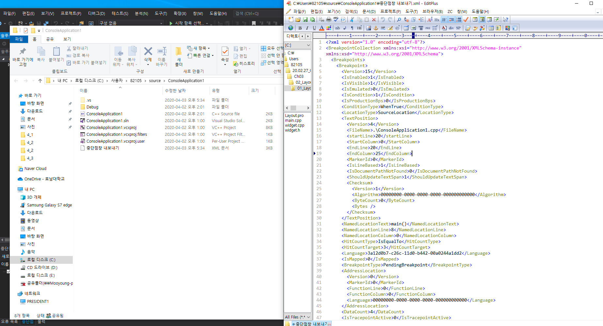
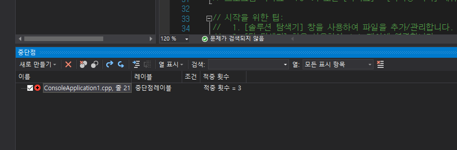
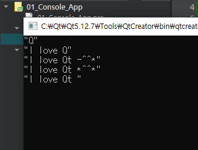

## 2020 04_03_금 / TIL

### 1.  Git

- 주로 한단계 이전으로 돌아가고 내부적으로 새로운 커밋을 발행하는 Revert가 좀더 안전한 방법, 롤백이력남김 

- 반대로 Reset은 최근의 커밋을 작업트리(head)까지 버리고 롤백하는 기능
  - [Git - reset, revert 설명](https://niceman.tistory.com/187)
  - [Git 명령어 총정리]([https://medium.com/@pks2974/%EC%9E%90%EC%A3%BC-%EC%82%AC%EC%9A%A9%ED%95%98%EB%8A%94-%EA%B8%B0%EC%B4%88-git-%EB%AA%85%EB%A0%B9%EC%96%B4-%EC%A0%95%EB%A6%AC%ED%95%98%EA%B8%B0-533b3689db81](https://medium.com/@pks2974/자주-사용하는-기초-git-명령어-정리하기-533b3689db81))

```git
# modified 파일 되돌리기 (수정하다가 원본으로 돌아가고 싶을때)
git checkout -- "파일명"

# 이전 커밋으로 돌아가기
git checkout "커밋 고유 앞6자리 번호"

# git head 변경 이력 확인 
git reflog

# 되돌리기 : git reset --옵션 "커밋ID"
Reset --hard : 복구된 이력 이후의 내용을 모두 삭제 후 초기화 (주의)
Reset --Soft : 복구 된 이력 이후 내용 모두 유지
Reset --mixed : 복구 된 이력 이후 내용 모두 유지, 그러나 인덱스 초기화 즉, 변경 내용 다시 추가해야함 

# git Reset으로 head 복원 (현재부터 6개 이전으로 복원, 숫자변경하면 n단계 전 커밋으로 돌려줌)
git reset HEAD~6

# 마스터 브렌치로 복귀
git checkout master

Revert (이전 이력 보존)
# git revert로 돌아가고 싶은 커밋 복원
git revert "CommitID"


# 현재 작업브렌치 보기
git checkout
```


***


#### 2. 원본/변경 소스 비교 사이트

https://www.diffchecker.com/


***


#### 3. 디버깅 고급 (page23 ~ 33)

- 적중횟수 

  - 주로 반복문에서 사용함 
  - 반복문 안에 코드 중 특정 인덱스로 항상 중단을 할경우 중단됨

  

- 중단점 창 

  - 현업에서 만드는 프로그램은 대부분 규모가 크고 복잡하다. 그래서 디버깅할 때 코드의 많은 부분에 중단점을 설정하게 된다. 중단점이 많아지면 중단점을 관리하는 것도 중요해진다.

  - 메뉴 [디버그] - [창]- [중단점]

    

  - 중단점 비활성화 or 활성화 : Ctrl + F9

  

- 중단점 내보내기 / 가져오기 

  - 당잠 중단점을 사용하지는 않지만 이후 중단점을 사용할 확률이 높을 경우나 같이 작업하는 동료 컴퓨터의 visual c++에 자신이 디버깅에 사용했던 중단점을 설정해야 할 경우 사용한다.
  - 중단점 정보는 xml 파일 포맷으로 내보내거나 가져올 수 있다. 


- 중단점 내보내기.xml 파일과 View




- 레이블
  - 중단점에는 레이블(이름)을 지정할 수 있다. 
  - 레이블을 지정하면 어떤 목적을 가진 중단점인지 알 수 있고 비슷한 목적의 중단점을 그룹별로 관리할 수도 있다.
  - 중단점 우클릭 - 레이블 편집 (Alt + F9, L)
  - 아까 만들었던 중단점에 레이블이 생김을 알수 있다. 만들어진 레이블은 재사용도 가능하다. 
  - 서로 비슷한 목적을 가진 레이블이 있을 경우에는 같은 레이블로 지정하여 그룹별로 관리 할수 있다. 




## 질문

1. 콘솔 기반을 교재에 QByteArray 예제가 있었는데, 소스교재 에는 디버깅 부분이 안나와있어서 제가 구글링해서 디버깅 처리해봤는데 이런식으로 처리해도 되는지 확인해주세요. 문자열 값은 제대로 나왔습니다. 

   

   Source : QByteArray 

   - QByteArray -> QString 변환 후 디버깅 확인하고 싶어서 검색함 
     - [Qbytearray 디버깅 검색](https://stackoverrun.com/ko/q/3270778)


```c++
#include <QCoreApplication>
#include <QDebug>
//#include <QString>
//#include <iostream>
//using namespace std;

int main(int argc, char *argv[])
{
    QCoreApplication a(argc, argv);
    QByteArray x("Q");
    QString str = "";
    str.append(x);
    qDebug() << str;

    x.prepend("I love ");
    str = "";
    str.prepend(x);
    qDebug() << str;

    x.append("t -^^*");
    str = "";
    str.append(x);
    qDebug() << str;

    x.replace(13, 1, "*");
    str.replace(10, 1, "*");
    qDebug() << str;

    QByteArray xx("I love Qt -^^*");
    xx.remove(13, 4);
    str = "";
    str.append(xx);
    str.remove(10, 4);
    qDebug() << str;

    return a.exec();
}
```





***


