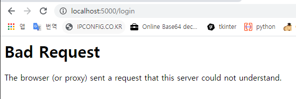

# 2020_04_09 목 / TIL

### 1. 유지보수 하기 어렵게 코딩하는 방법 (page 1 ~10)

#### 일반규칙

- _유지보수 프로그래머_
  - 주로 개발자의 전체 코드를 읽기 힘들기 때문에 가능한 한 빨리 수정할 곳을 찾아내어 수정한다음, 해당 수정으로 인한 부작용이 없는지 확인하고 작업 마무리함
  - 이 사람이 전체적인 그림을 그려낼 수 없게 하는 것이 핵심 

***

#### 이름 짓기

- _태아 작명법의 서적을 구입_
  - 변수명의 고민을 덜어줄 것 
- _단일 문자 변수명_
  - a,b,c 등으로 정하면 그 변수가 무엇에 쓰이는 것인지 추측할 수없게 방지하는 역할
- _창의적 오타_
  - 어쩔수 없이 뭔가를 설명하는 변수명이나 함수명을 사용해야하는 경우 오타를 사용
    - Ex)  grep이나 IDE 검색기술을 무력화
      - SetPintleOpening, SetPintalClosing
      - theatres / theaters (둘다 극장을 의미)
      - tory / tori
- _추상화하라_
  - 변수명, 함수명에 추상적인 단어를 사용(it, everything, data, handle, stuff, do, routine, perform, 숫자)
    - 좋은 예
      - routineX48, PerformDataFunction, DoIt, HandleStuff, do_args_method
- _머.리.글.자_
  - 머리글자로 코드를 간결하게 만든다.
- _진화한 유의어 사전_
  - 많은 단어가 같은동작을 가르키도록 하는 것도 좋은 방법 - display, show, present..
  - "파일기록", "종이에 잉크 칠하기", "화면에 보여주기" --> print라는 한단어로 설명 가능
  - 명확한 어휘 사용 - 정보은닉(information hidding)이라는 구조화된 디자인 원칙을 위반하는 프로답지 못한 행동
- _다른 언어의 복수형을 사용하라_
  - VMS 스크립트 - Vaxen(Vax 컴퓨터의 복수형)
  - statii - status의 복수형
  - Klington - 스타 트렉에 등장하는 전사 종족의 언어
  - Hobbitese - 소설에 등장하는 가상 종족 호빗의 언어

- _새로운 개념의 낙타표기법(CapiTaliSaTion)_

  - 무작위로 단어의 중간 음절 첫 글자를 대문자로 표기하기 

- _이름을 재사용하라_

  - 언어의 규칙이 허용하는 범위 내에서 클래스,생성자,메소드,멤버변수,파라미터,지역변수에 같은 이름을 사용 
  - {} 블록 내에서 이미 사용되고 있는 지역 변수명을 재사용할 수 있는지 고민하라.

- _강세가 있는 단어_

  - Ex) 
    - typedef struct { int i;} int;
    - var_unit_update() / var_unit_setup() : 마지막 부분만 살짝 바꿔줌

- _밑줄은 진정한 친구_

  - _와 __를 식별자로 사용하자.

- _언어를 혼용하라_

  - 사람의 언어나 컴퓨터의 언어를 무작위로 배치 

- _확장 아스키_

  - ß, Ð, n 등과 같은 확장 아스키 문자도 변수명에 사용할 수 있다는 사실을 잊지 말자. 

- _다른 언어의 이름을 활용하자_

  - point 대신 punkt(독일어) 사용

- _수학에서도 이름을 구할수 있다_

  - openParen = (slash + asterix) / equals;

- _정말 멋진이름_

  - 의미상으로 전혀 관계없는 이름을 변수명으로 사용해봐라
  - marypoppins = (superman + starship) / god;
  - 이 글을 읽는 사람은 자신도 모르게 단어의 뜻에 더 집중하게 되고. 실제 로직은 이해하기 어려워짐

- _이름을 변경하고 재사용하라_

  - Ada에서 잘먹힌다.
  - Ada는 많은 표준역컴파일 방지기법을 무력화 시키는 언어
  - 우리만의 이름으로 개정하기

- _i가 필요할 때_

  - 다른 변수는 몰라도 절대로 i를 가장 안쪽의 루프 변수로 사용하지마라.
  - 특히 정수가 아닌 변수에 사용할 때 더욱 효과적
  - 비슷한 방법으로 루프 인덱스로 n을 사용할수 있음

- _규칙에 얽매이지 말지어다_

  - 썬 마이크로시스템즈 스스로도 지키지 않는 썬 자바 코딩 규칙은 가볍게 무시하자
  - 특수한 상황에서만 뜻이 미묘하게 달라지도록 이름을 정해보자
  - inputFilename / inputfileName을 혼용하는 것도 좋은 방법 
  - 창의력을 발휘해서 이름을 복잡하게 지을 수 있는 자신만의 비법을 개발하자.

- _소문자 l과 숫자 1은 닮았다_

  - Long상수 표현 --> 소문자 l
    - 10l --> 101로 착각하기쉬움

- _전역으로 사용한 이름을 지역에 재사용하라_

- _함수의 선언과 구현의 재활용_

  - 변수명을 정반대로 재활용해서 혼란 야기하는 방법도 존재
  - 지역변수 A,B와 지역 함수 foo, bar 선언 가정
    - 일반적으로 A - foo , B - bar 이렇게 연결 된걸 반대로 정의해버리는 경우

- _변수를 재사용하라_

  - 변수 존재 범위 규칙이 허용한다면 아무 관련이 없는 기존의 변수명을 재사용해봐라
  - 변수를 재사용함으로써 스택 슬롯을 절약하는 것처럼 위장할수 있음

- _Cd writn wtht vwls s muc trsr_

  - 변수명이나 메소드명에 약어를 사용할 때에는 이름이 길어질 수 있겠지만, 같은 단어에 다양한 변형을 더해 지루함을 없앨 수 있다.

- _삼천포로 인도하는 이름_

  - 메소드의 이름이 의미하는 것보다 더 많은 혹은 더적은 동작을 수행하도록 프로그래밍하라.

- m_

  - C++에서는 멤버 이름앞에 m_을 붙이는 규약이 있다. 

- o_apple obj_apple

  - 클래스의 인스턴스 명을 "o"나 "obj"로 시작함으로써 우리가 크고 다형성을 갖춘 그림을 염두에 두고 있다는 사실을 보여줌

- _헝가리안 표기법_

  - C++에서 "c"를 const에 사용하라.
  - "c"는 C++ 이외의 언어에서 보통 변수가 상수임을 가르킨다.
  - 

  

***

#### 2. 새로 알게된 것들 (Flask Tutorial 5 page commit)

- 참고링크 : [Cookies & Session](https://soul0.tistory.com/106)
  - 쿠키 : 클라이언트의 PC에 텍스트 파일형태로 저장되는 것, 시간이 지나면 소멸함
    - Ex) 방문했던 사이트를 다시 방문할 때 아이디와 비밀번호 자동 입력되는 현상 
  - 세션
    - 서버측에서 클라이언트측을 유일하게 식별하는 ID일종 
    - 서버에서 관리할 수 있다는 점에서 안전성이 좋아서 보통 로그인 관련으로 사용
      - 공통점
        - 로그인과 같은 사용자 인증할 때 주로사용
      - 차이점 
        - 세션 : 서버 쪽에 정보를 저장
        - 쿠기 : 방문자의 컴퓨터에 정보 저장
  - 쿠키와 다르게 세션과 관련된 데이터는 서버에 저장된다. 서버에서 관리할 수 있다는 점에서 안정성이 좋아서 보통 로그인 관련으로 사용되고 있다. 플라스크에서 세션은 딕셔너리의 형태로 저장되며 키를 통해 해당 값을 불러올 수 있다.


- 렌더링
  - 참고 링크 : [브라우저 랜더링 과정](https://boxfoxs.tistory.com/408)
  - HTML, CSS, JS 등 개발자가 작성한 문서를 브라우저에서 그래픽 형태로 출력하는 과정을 말함
  - 대부분 브라우저는 랜더링을 수행하는 랜더링 엔진을 가지고있다. 다만 모든 브라우저가 같은 렌더링 엔진을 사용하지는 않는다. (브라우저 호환성에 문제가 없는지 테스트 해야함)


- 리다이렉션 

  - 특정 URL로 강제로 이동시키고 싶을 때 사용하는 함수 redirect()

  - 소스에서 보시다시피 redirect(url_for(~))로 처리 할수 있고 

    주의할점은 redirect할 method 명으로 처리 한다는것이다.

    출처: https://fenderist.tistory.com/102


***

### 3. 질문

- **3-1. Flask - Session 예제 코드 실행시켰는데 로그인 페이지에서 버튼 누르면 왜이렇게 나오는지 모르겠습니다**



예제 코드

```python
from flask import Flask, request, session, redirect, url_for

app = Flask(__name__)
app.secret_key = 'any random string'


@app.route('/')
def index():
    if 'username' in session:
        username = session['username']
        return 'Logged in as ' + username + '<br>' + \
               "<b><a href = '/logout'>click here to log out</a></b>"

    return "You are not logged in <br><a href = '/login'></b>" + \
           "click here to log in </b></a>"


@app.route('/login', methods=['GET', 'POST'])
def login():
    if request.method == 'POST':
        session['username'] = request.form['username']
        return redirect(url_for('index'))
    return '''

    <form action = "" method = "post">
        <p><input type = text name = username/></p>
        <p><input type = submit value = Login/></p>
    </form>

    '''


@app.route('/logout')
def logout():
    session.pop('username', None)
    return redirect(url_for('index'))


if __name__ == '__main__':
    app.run()
```

console

```console
FLASK_APP = app.py
FLASK_ENV = development
FLASK_DEBUG = 0
In folder C:/Users/82105/PycharmProjects/Flask_Tutorial
C:\Users\82105\PycharmProjects\Flask_Tutorial\venv\Scripts\python.exe -m flask run
 * Serving Flask app "app.py"
 * Environment: development
 * Debug mode: off
 * Running on http://127.0.0.1:5000/ (Press CTRL+C to quit)
127.0.0.1 - - [09/Apr/2020 14:15:54] "GET / HTTP/1.1" 200 -
127.0.0.1 - - [09/Apr/2020 14:16:01] "GET / HTTP/1.1" 200 -
127.0.0.1 - - [09/Apr/2020 14:16:03] "GET /login HTTP/1.1" 200 -
127.0.0.1 - - [09/Apr/2020 14:16:05] "POST /login HTTP/1.1" 400 -
127.0.0.1 - - [09/Apr/2020 14:16:07] "POST /login HTTP/1.1" 400 -

```

참고 링크 : [플라스크 세션 검색](https://m.blog.naver.com/PostView.nhn?blogId=shino1025&logNo=221355012951&categoryNo=33&proxyReferer=https%3A%2F%2Fwww.google.com%2F)

***

- __3-2. Flask - redirect & error 예제 코드 실행시켜봤는데 로그인 페이지에서 텍스트입력 후 버튼을 누르니 위의 질문과  똑같은 에러로그가 나왔는데 왜 이런지 잘 모르겠습니다__

```
127.0.0.1 - - [09/Apr/2020 15:51:16] "GET / HTTP/1.1" 200 -
127.0.0.1 - - [09/Apr/2020 15:57:10] "POST /login HTTP/1.1" 400 -
127.0.0.1 - - [09/Apr/2020 15:57:16] "POST /login HTTP/1.1" 400 -
```

app.py

```python
from flask import Flask, redirect, url_for, render_template, request, abort

app = Flask(__name__)

@app.route('/')
def index():
    return render_template('log_in.html')


@app.route('/login',methods = ['POST', 'GET'])
def login():
   if request.method == 'POST':
      if request.form['username'] == 'admin' :
         return redirect(url_for('success'))
      else:
         abort(401)
   else:
      return redirect(url_for('index'))


@app.errorhandler(404)
def page_not_found():
    return render_template('page_not_found.html'), 404


@app.route('/success')
def success():
    return 'logged in successfully'


if __name__ == "__main__":
    app.run()

```

log_in.html

```html

<html>
   <body>
      <form action = "/login" method = "POST">
         <p>Enter Name:</p>
         <p><input type = "text" name = "nm" /></p>
         <p><input type = "submit" value = "submit" /></p>
      </form>
   </body>
</html>
```

- 시도해본 내용

  - html 파일
    - form action "http://localhost:5000/login" 고쳐봄
    - method 부분 "post" --> "POST" 고쳐봄 
  - 검색 내용
    - [HTTP 상태 코드 검색](https://developer.mozilla.org/ko/docs/Web/HTTP/Status)
    - [플라스크 리다이렉트](https://m.blog.naver.com/shino1025/221355019723)
    - [Flask Tutorial redirect&Error](https://www.tutorialspoint.com/flask/flask_redirect_and_errors.htm)

  

***


- #### 3-3. 유지보수 어렵게 하는 교재 읽으면서 궁금한게 제가 기존에 생각이 들었던건 다음 들어올 제 부사수나 다른 회사에서 면접을 볼 면접관에게 제 코드를 보게될 사람들을 위해 유지보수하기 쉽게 만드는게 또는 누가봐도 이해 하기 쉽게 만든 코드가 잘 만들었다고 생각하는데 제 생각이 잘못된 건가요?

