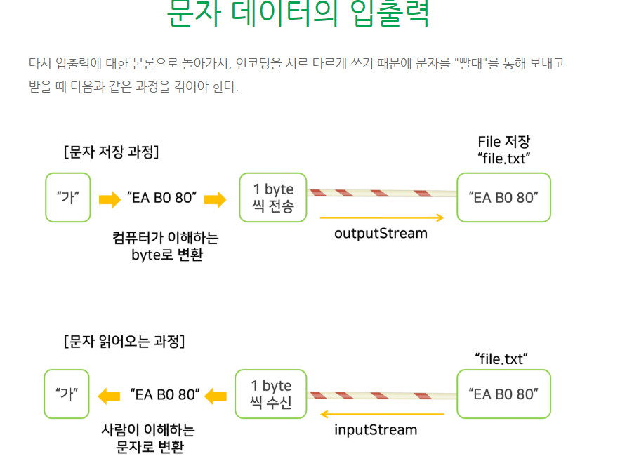

# [2020-07-14 화 TIL]

### String, StringBuffer, StringBuilder 차이 

- 참고
  -  https://novemberde.github.io/2017/04/15/String_0.html
  - https://docs.oracle.com/javase/8/docs/api/
- **String**
  - 직렬화 가능 문자열이고 비교가능한 값 
  - final 클래스라 상속 X
  - 새로운 값을 할당할 때마다 새로 생성됨 (메모리 낭비)
  - 수십번 String 더해지는 경우 각 String 주소값이 스택에 쌓이고 클래스들은 가비지 컬렉터가 호출되기 전까지 heap에 지속적으로 쌓이게 된다 
  - 메모리 관리측면에서 치명적 
  - 멤버변수 `private final char[] value` 
    - 이 값들은 외부에서 접근 X, final 이기때문에 초기값으로 주어진 String의 값은 불변으로 바뀔 수가 없게 되는 것 
- **StringBuffer**
  - memory에 append하는 방식
  - 클래스를 직접생성하지 않는다 
  - 변경가능한 문자열이지만 **synchronization**이 적용 되지 X 
- StringBuilder와 StringBuffer를 테스트 해보자. 아래의 결과를 보면 다른 값이 나온 것을 볼 수 있다. StringBuilder의 값이 더 작은 것을 볼 수 있는데 이는 쓰레드들이 동시에 StringBuilder클래스에 접근할 수 있기 때문에 일어난 결과다. 이와 달리 StringBuffer는 multi thread환경에서 다른 값을 변경하지 못하도록 하므로 web이나 소켓환경과 같이 비동기로 동작하는 경우가 많을 때는 StringBuffer를 사용하는 것이 안전할 것이다.

(일반적인 경우). 가능한 경우, 

이 클래스는 대부분의 구현에서 더 빠를 것이기 때문에 StringBuffer에 우선하여 사용하는 것이 좋습니다.

StringBuilder 인스턴스는 여러 스레드에서 사용하기에 안전하지 않습니다. 이러한 동기화가 필요한 경우 StringBuffer를 사용하는 것이 좋습니다.

***

### Java 입출력 Stream

- 개념
  - 컴퓨터의 핵심 - CPU (머리역할)
  - 컴퓨터 장비들은 CPU와 입력과 출력에 의한 통신을 해야함 
  - 메모리, 디스크(파일), 네트워크 카드, 키보드, 마우스, 스피커, 프린터, 모니터(화면)
  - 입출력장치 : 디스크(파일), 네트워크
  - 대표적
    - 입력장치 : 키보드, 마우스
    - 출력장치 : 모니터(화면) 


- 이렇게 다양한 장비들과 통신을 하는것을 입출력 이라하고 java에서 **java.io 패키지** (input, output) 사용
- 시스템 안쪽으로 읽어들이는 입력데이터 흐름 : input stream
- 시스템 바깥으로 나가는 출력데이터 흐름 : output stream

- java에서 만들어둔 java.io.**InputStream**은 **읽어들이는 빨대**라고 생각하고, java.io.**OutputStream**은 **내보내는 빨대**라고 생각하면 클래스의 용도가 분명해 질 것이다.

 

#### 어떤 데이터가 빨대를 통해 움직이는가?

- 컴퓨터의 데이터는 기본적으로 '01011101' 과 같은 이진수이다. 이것을 비트(bit)라고 하며, 8개의 bit가 모여서 1바이트(byte)가 된다 
- bit도 데이터이고 byte도 데이터이다 
- java세상 그리고 일반적인 컴퓨터세상에서는 **1byte단위로 데이터가 움직인다고 보면된다** 
- 즉 , 빨대를 통해 들락날락하는 데이터들은 byte이다 
- 그래서 byte 단위로 데이터를 내보내는(출력하는)빨대가 **OutputStream**이고 byte 단위로 데이터를 수신하는(읽어오는) 빨대가 **InputStream**이다 

- ""문자",  "이미지","음악", "동영상" 등 어떤 데이터라도 InputStream과 OutputStream 빨대 2개로 데이터를 내보내고 읽어올 수가 있는 것이다.


#### 문자 인코딩

- 이미지, 동영상 등 byte 단위로 주고 받고 하면 되지만, 문자 같은 경우는 조금 더 알아봐야 할 것이 있다 
- 영어의 a, b, c 와 같은 문자 1개 문자는 1 byte로 표현이 되지만, 한국어, 중국어, 일본어 같은 문자는 경우(인코딩방식)에 따라 1byte~4byte 가 있어야 1개의 문자로 인식이 된다 


##### encoding

- 사람이 이해하는 문자 1글자를 컴퓨터에서 어떻게 표현하는 약속한 방식

- 인코딩 방식은 여러가지가 있는데 ASCII(영어), UTF-8, EUC=KR(한글), CP949(MS949, x-windows-949), UTF-16, ISO-8859-1(라틴) 등..
- 왜 이렇게 여러가지 방식이 있는가 하면, "가" 라는 한 글자를 어떻게 표현해야 "효율적"으로 표현될 수 있는가에 따른 고민의 결과로 어느 하나가 아주 우월하지 않아서 여러가지가 생겼다고 보면된다 
- 한글을 인코딩으로 자주 쓰는 것은 UTF-8, EUC-KR, CP949(마이크로소프트에서 쓰는 EUC-KR 확장판), UTF-16 이다 
- ex)
  - "가"라는 1문자의 표현을 UTF-8로 인코딩한 것을 16진수 한 byte씩 표현하면, EA B0 80 으로 3 byte가 되고, EUC-KR로 인코딩하면 B0 A1로 2byte가 된다 


```java
package Streamiio;

import java.io.UnsupportedEncodingException;
import java.nio.charset.Charset;

public class StreamMain {
	
	// 16진수 byte값 출력을 위해  byte값 자체를 String으로 변환
	public static String byteArrayToHex(byte[] a) {
		StringBuffer sb = new StringBuffer();
		for(final byte b : a) {
			sb.append(String.format("%02x ", b&0xff));
		}
		return sb.toString();
	}
	
	public static void main(String[] args) throws UnsupportedEncodingException {
		
		byte[] sourceBytes;
		String strBytes;
		String character;
		
		character = "A";
				
		sourceBytes = character.getBytes("UTF-8");
		strBytes = byteArrayToHex(sourceBytes);
		System.out.println(strBytes);
		
		sourceBytes = character.getBytes("EUC-KR");
		strBytes = byteArrayToHex(sourceBytes);
		System.out.println(strBytes);
		
		sourceBytes = character.getBytes("UTF-16");
		strBytes = byteArrayToHex(sourceBytes);
		System.out.println(strBytes);
		
		sourceBytes = character.getBytes("CP949");
		strBytes = byteArrayToHex(sourceBytes);
		System.out.println(strBytes);
		
		sourceBytes = character.getBytes("ASCII");
		strBytes = byteArrayToHex(sourceBytes);
		System.out.println(strBytes);
		
		System.out.println("*******************************************");
		
		character = "가";
		
		sourceBytes = character.getBytes("UTF-8");
		strBytes = byteArrayToHex(sourceBytes);
		System.out.println(strBytes);
		
		sourceBytes = character.getBytes("EUC-KR");
		strBytes = byteArrayToHex(sourceBytes);
		System.out.println(strBytes);
		
		sourceBytes = character.getBytes("UTF-16");
		strBytes = byteArrayToHex(sourceBytes);
		System.out.println(strBytes);
		
		sourceBytes = character.getBytes("CP949");
		strBytes = byteArrayToHex(sourceBytes);
		System.out.println(strBytes);
		
		sourceBytes = character.getBytes("ASCII");
		strBytes = byteArrayToHex(sourceBytes);
		System.out.println(strBytes);
		
		System.out.println(String.format("file.encoding : %s", System.getProperty("file.encoding")));
		System.out.printf("file.encoding : %s\n", System.getProperty("file.encoding"));
		System.out.println(String.format("defaultCharset: %s", Charset.defaultCharset().name()));
		
	}
}

```


<스트림 과정>



- 즉, "가", "나", "다" 같은 문자는 UTF-8로 인코딩시에 3 byte가 "한 묶음"인 것이다.

- 1 byte단위로 입출력을 해도 전혀 상관이 없지만, 어떤 인코딩으로 byte 변환을 할 것인지 정하고, byte로 변환한 뒤에 OutputStream으로 byte를 보내는 것은 불편한 일이다
- "텍스트파일" 의 경우 바이트단위가 아니라 문자단위로 내보내고, 가져오는 빨대 클래스가 있으면 편리할 것이다  
- 그래서 자바에서 만들어 둔것이 **Reader**와 **Writer** 클래스이다. 이 클래스들은 바이트단위가 아니라 문자단위로 데이터를 입출력 할 때 쓴다 
- 인코딩을 특별히 지정하지 않으면 자바가 돌아가는 컴퓨터 운영체제의 기본인코딩을 사용한다 
- 한글윈도우PC에서는 MS949, 리눅스 장비에서는 UTF-8을 사용하게 될 것이다 .


#### 클래스 구조 

- **Reader**
  - BufferedReader
  - InputStreamReader
    - FileReader
- **Writer**
  - BufferedWriter
  - OutputStreamWriter
    - FileWriter


##### 파일 생성하여 텍스트 입력 후 저장  - Writer 클래스 이용 

```java
package Streamiio;

import java.io.FileWriter;
import java.io.IOException;
import java.io.UnsupportedEncodingException;
import java.io.Writer;


public class StreamMain {
	
	// 16진수 byte값 출력을 위해  byte값 자체를 String으로 변환
	public static String byteArrayToHex(byte[] a) {
		StringBuffer sb = new StringBuffer();
		for(final byte b : a) {
			sb.append(String.format("%02x ", b&0xff));
		}
		return sb.toString();
	}
	
	public static void main(String[] args){
		try {
			Writer writer = new FileWriter("C:\\Users\\82105\\java textfile.txt");
			writer.write("안녕하세요");
			writer.close();
		} catch(IOException e) {
			e.printStackTrace();
		}

	}
}

```


***

### Apache - HttpClient , HttpCore 모듈 추가 

- 참고 : http://blog.naver.com/javaking75/220341248215

1. 홈페이지 바이너리 파일 다운

2. 압축 풀고 jar 파일 찾아서 라이브러리 추가 

   

- 설치 요소 

  | 라이브러리 파일 이름              | 설명                                                         |
  | --------------------------------- | ------------------------------------------------------------ |
  | (*) **commons-logging-x.x.x.jar** | 로깅을 하기 위한 라이브러리. HTTP Components 라이브러리는 기본적으로 Common Logging을 사용한다. |
  | (*) **commons-codec-x.x.x.jar**   | 데이터를 인코딩, 디코딩하기 위해서 필요한 라이브러리. HttpClient에서 데이터를 인코딩하여 서버로 보내거나 서버에서 받은 데이터를 디코딩하기 위해서 필요 |
  | (*) **httpcore-x.x.x.jar**        | HttpCore 모듈 라이브러리                                     |
  | (*) **httpclient-x.x.x.jar**      | HttpClient 모듈 라이브러리                                   |
  | httpmime-x.x.x.jar                | HTTP 프로토콜의 데이터 정보(컨텐츠 타입)를 나타내기 위한 MIME정보를 품고있는 라이브러리 |
  | httpclient-cache-x.x.x.jar        | 캐싱을 사용하기 위해서 필요한 라이브러리                     |
  | fluent-hc-x.x.x.jar               | 추가 기능이 포함된 라이브러리 **[출처]** [[Java\] HTTP 프로토콜을 손쉽게 사용할 수 있도록 도와주는 Apache HTTP 컴포넌트 ( HttpClient )](http://blog.naver.com/javaking75/220341248215)\|**작성자** [자바킹](http://blog.naver.com/javaking75) |

- 아파치 아카이브 파일 : http://archive.apache.org/dist/httpcomponents/


#### 이클립스 - 외부 라이브러리 추가 

- https://mainia.tistory.com/2273