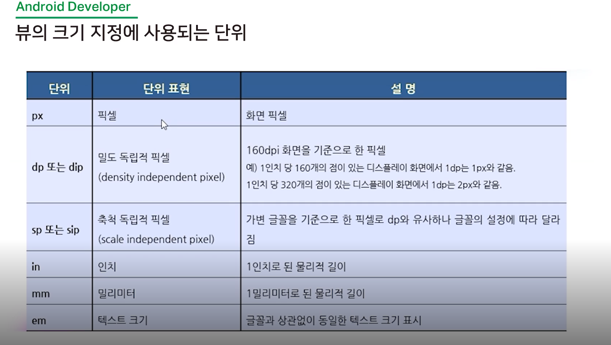

[2020-07-21 화 TIL]

### Android

- [부스트코스 - 안드로이드 프로그래밍](https://www.edwith.org/boostcourse-android/lecture/38723/)

- [안드로이드 강의](https://www.youtube.com/playlist?list=PLC51MBz7PMyyyR2l4gGBMFMMUfYmBkZxm)

- AVD Manager
  - 안드로이드 가상 단말장치 관리

- 애뮬레이터 - 가상 단말 
  - 애뮬레이터 위에서 앱을 실행 


- app
  - **activity_main.xml** 
    - app/res/layout
    - 화면구성 디자인
    - xml 코드
  - **mainActivity.java**
    - java/패키지/
  - 디자인에 대한 기능 설정
    - 메인 파일 
  
- **Gradle Scripts**
  - 소스코드를 컴퓨터가 어떻게 알아먹나 설정하는 파일 
  - 추가 설정 파일이나 변경사항을 반영할경우 
    - **Sync Project with Gradle Files** 버튼 클릭하여 새로고침 
  - 많이 건들임 


- 클래스,메서드 에 커서대고 **Ctrl + Q** : 해당 클래스 , 메서드 설명 

- 파라미터를 보게되는 경우 **Ctrl + P**


- **TextView** : 글자 표시 

- **Button**
  - TextView 상속해서 만들어짐 
  - **Toast**
    - 잠깐 떳다가 사라지는 메시지 


<MainActivity.java>

```java
package com.example.study_1;

import android.content.Intent;
import android.net.Uri;
import android.os.Bundle;
import android.view.View;
import android.widget.Toast;

import androidx.appcompat.app.AppCompatActivity;


public class MainActivity extends AppCompatActivity {


    @Override
    protected void onCreate(Bundle savedInstanceState) { // 화면 만듬 
        super.onCreate(savedInstanceState);
        setContentView(R.layout.activity_main);
    }

    public void onButton1Clicked(View v){
        Toast.makeText(getApplicationContext(), "버튼이 누르셨습니다.", Toast.LENGTH_LONG).show();
        System.out.println("버튼을 클릭하셨습니다.");
    }

    public void onButton2Clicked(View v){
        Intent intent = new Intent(Intent.ACTION_VIEW, Uri.parse("http://m.naver.com"));
        startActivity(intent);
    }

    public void onButton3Clicked(View view){
        Toast.makeText(getApplicationContext(), "제어", Toast.LENGTH_LONG).show();

    }
}
```


#### 실제 폰에 빌드 하기

- [안드로이드 스튜디오 핸드폰 연결방법](https://m.blog.naver.com/PostView.nhn?blogId=beaqon&logNo=221076390196&proxyReferer=https:%2F%2Fwww.google.com%2F)

- [갤럭시 S7 개발자 모드설정](https://nature2public.tistory.com/39)


### 뷰의 속성


- 태그이름 전부 들어간것들 - 외부 라이브러리 
  - android.support.constraint..


- **필수 속성**
  - 가장 기본적이면서 필수 속성으로 뷰의 폭과 높이를 설정함 
  - layout_width : 가로크기
  - layout_height : 세로크기


- **ConstraintLayout** : 제약 레이아웃 - 디폴트 레이아웃이다 (제약되는게 있음)
- **LinearLayout** - 많이씀 
  - **wrap_parent** (ConstraintLayout는 이것만 사용가능 )
    - 뷰에 들어있는 내용물의 크기에 따라 뷰의 크기가 결정됨 
  - **match_parent**
    - 뷰그룹에 남아 있는 여유공간을 채움 
  - **크기 값 지정**
    - 크기를 고정된 값으로 직접 지정하고 싶을 때 사용함 
    - ex) 
      - "100px", "200dp"


- 레이아웃 픽셀 단위

