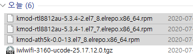
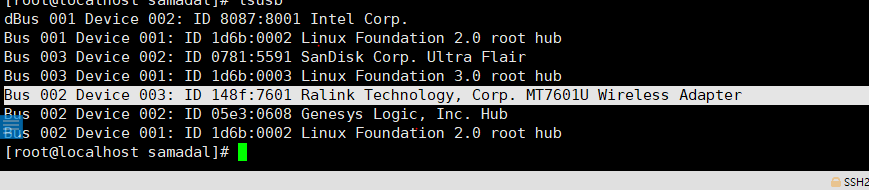
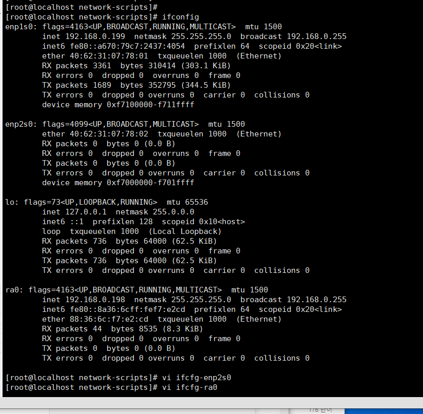

# Android - Server 개발방안


**`1안. App - 서버 - 공유기 - 단말`**

**`2안. App - 구글서버 - 서버 - 공유기 - 단말`**

- 구글 클라우드 플랫폼 (GCP)
  - 30일만 무료지원
  - 유료 플랫폼
  - 원거리 통신만 가능함 


- 한국 울트라 배연창 

  - 홈페이지 : http://www.hkultra.co.kr/

  - http://hkultra.co.kr/gnuboard4/bbs/board.php?bo_table=p1


### 구조 

- **어플 - 서버**
  - 서버 클라이언트간 데이터 송수신 
  - 서버를 하드웨어 제어하는 데에 둬야함 
  - LAN 통신
  - 통신거리 : 원거리 
- **서버 - 하드웨어 (배연창 제어)** 
  - Push 서버 구현 
  - 무선 시리얼통신 (스레드)
  - DB 계속 고쳐주면 데이터시트에서 받아가면 됨
  - 통신거리 : 사무실 범위정도 


#### 무선랜 포팅

- **7/28 화**
- CentOS 6, 7 테스트
  
  - 무선 어댑터 사용 하지 않았을때 
  
    - 무선랜 잡히지 않았음 
  
  - 무선 어댑터 사용 했을때 
  
    - usb 어댑터 인식은 되지만, 무선랜 드라이버가 잡히지 않았음 
  


- **7/29 수**

  - CentOS 7.8

    - [IPTIME A2000UA USB-Wifi](http://airpage.org/xe/network_data/24833)

    - 무선랜 참고 사이트 

      - https://kecmok.tistory.com/25

    - 미러사이트 - kmod 관련 패키지 전부 추가 해봄 - x 

    - 인텔 사이트 파일 찾아서 추가 해봄 - x

      - https://wireless.wiki.kernel.org/en/users/Drivers/iwlwifi

    - https://linux.cc.iitk.ac.in/mirror/centos/elrepo/elrepo/el7/x86_64/RPMS/ 에서 패키지 설치

      - 
      - [USB 인식 과정 - /proc/bus/usb/devices 경로 존재 X](http://forum.falinux.com/zbxe/index.php?mid=network_programming&document_srl=785255) - x

      

    - **iptime n1usb (4500원 : 자체 wifi 수신기 )** - 미니 pc에는 무선랜 카드가 없어서 필요함 

      - https://github.com/terence-deng/mt7601u - 이 드라이버 설치  - O
      - 그대로 따라해야함 
      - 
      - `ra0` 인터페이스가 나오긴 했으나 잡히지 않음 

- nmtui 에서 설정 

  - https://unix.stackexchange.com/questions/370318/how-to-connect-to-wifi-in-centos-7clino-gui

  - 무선도 수동으로 ip 줘야함 - **포팅 성공**

  - `/etc/rc.d/rc.local` - 부팅 스크립트 작성 

    - ```shell
      # systemctl restart network
      chmod u+x /etc/rc.d/rc.local
      ```




- 미니 PC 
  - 사양 파악
  - **무선랜 지원 불가능할 경우 대책**?


