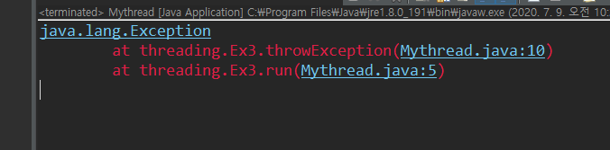
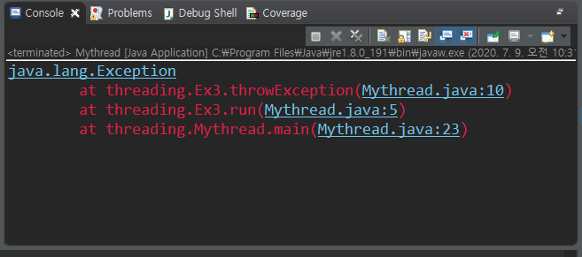
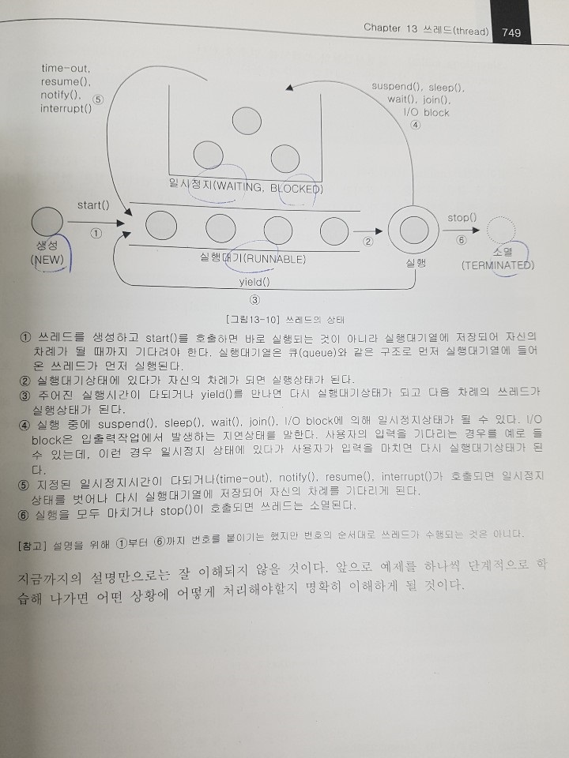

# [2020-07-09 목 TIL]

### Thread

- 프로세스란 "실행 중인 프로그램"
- 프로그램을 실행하면 OS로부터 실행에 필요한 자원(메모리)을 할당받아 프로세스가 된다 
- 프로세스는 프로그램을 수행하는 데 필요한 데이터와 메모리 등의 자원 그리고 스레드로 구성되어 있으며 **프로세스의 자원을 이용해서 실제로 작업을 수행하는 것**이 스레드(thread)이다.

- 모든 프로세스에는 최소한 하나 이상의 스레드가 존재하며, 둘 이상의 스레드를 가진 프로세스를 멀티스레드 프로세스라고한다.
- ex) 프로세스 = 공장 , 스레드 = 일꾼
- 하나의 프로세스가 가질 수 있는 스레드의 개수는 제한되어 있지 않으나 스레드가 작업을 수행하는데 개별적인 메모리 공간(호출스택)을 필요로 하기때문에 프로세스의 메모리 한계에 따라 생성할 수 있는 스레드의 수가 결정된다 
- 멀티 태스킹지원 - 윈도우, 리눅스, 유닉스
- CPU의 코어가 한번에 단 하나의 작업만 수행할 수 있으므로, `실제로 동시에 처리되는 작업의 개수 = 코어갯수`
- 프로세스의 성능이 스레드의 개수에 비례하는 것은 아님
  - 하나의 스레드를 가진 프로세스보다 두개의 스레드를 가진 프로세스가 더 낮은 성능을 보일수도있음

- 스레드 종류
  - user thread (non-daemon thread)
  - daemon thread


#### Java에서 스레드구현

1. **Thread 클래스 상속**

   - ```java
     class MyThread extends Thread {
     	@Override
     	public void run(){}
     }
     ```

   - Thread 클래스를 상속받으면 다른 클래스를 상속 받을 수 없다 

   - 이 때문에 Runnable로 구현하는 방법이 일반적임 

2. **Runnable 인터페이스 구현** 

   - ```java
     class MyThread implements Runnable{
         public void run(){}
     }
     ```

   - 재사용성이 높고 코드의 일관성을 유지할 수 있다 

   - Runnable 인터페이스를 구현한 클래스의 인스턴스를 생성한다음 

   - 이 인스턴스를 Thread 클래스의 생성자의 매개변수로 제공해야한다

   - ```java
     Runnable r = new Mythread();
     Thread thread = new Thread(r);
     
     Thread 스레드객체 = new Thread(new Runnable구현클래스());
thread.start();
     ```
     
   - ```java
     public class Thread{
     	private Runnable r; // Runnable 을 구현한 클래스의 인스턴스를 참조하기 위한 변수
         
         public Thread(Runnable r){
             this.r = r;
         }
         
         public void run(){
             if(r!=null){
                 r.run(); // Runnable인터페이스를 구현한 인스턴스의 run()을 호출한다 
             }
         }
  }
     ```

   - Thread 클래스를 상속받으면 자손 클래스에서 조상인 Thread 클래스의 메서드를 직접 호출 가능 
   
   - Runnable인터페이스를 구현하면 Thread 클래스의 static 메서드인 currentThread()를 호출하여 스레드에 대한 참조를 얻어와야만 호출 가능 

```java
package threading;

class Ex1 extends Thread{
	@Override
	public void run() {
		for(int i=0; i<5; i++) {
			System.out.println("Thread");
			System.out.println(getName() + " , " + i);
            // 스레드의 이름 반환 
		}
	}		
}

class Ex2 implements Runnable{
	@Override
	public void run() {
		for(int i=0; i<5; i++) {
			System.out.println("Runnable");
			System.out.println(Thread.currentThread().getName() + " , " + i);
            // 현재 실행중인 스레드의 참조를 반환 
		}
	}
}

public class threadingMain {
	
	public static void main(String[] args) {
		Thread t = new Ex1(); // Thread 클래스를 상속받은 클래스의 인스턴스 생성 
		
//		Runnable r = new Ex2(); 
//		Thread t2 = new Thread(r);
		
		Thread t2 = new Thread(new Ex2()); // 위 두줄과 같은 의미
		
		t.start();
		t2.start();
	}
}

```


#### **주의 : 한 번 실행이 종료된 스레드는 다시 실행할 수 없다** 

- **하나의 스레드에 대해 start()가 한 번만 호출 가능**  
- 두번 이상 호출 하면 실행 시 IllegalThreadStateException 발생 
  - 다시 생성 후 start() 호출해야한다 


### start() 와 run()

- 스레드를 실행시킬 때 run()이 아닌 start() 호출하는 것에 대해 다소 의문이 들었다 

- Main 메소드에서 **run()**을 호출하는 것은 **생성된 스레드를 실행 시키는 것이 아니라 단순히 클래스에 선언된 메서드를 호출하는 것**일 뿐이다.

- 반면에 **start()**는 **새로운 스레드가 작업을 실행하는데 필요한 호출스택(call stack)을 생성한 다음** run()을 호출해서 , 생성된 호출 스택에 run()이 첫 번째로 올라가게 한다.

  1. `main 메서드에서 스레드의 start() 호출`

  2. `start()는 새로운 스레드를 생성하고 , 스레드가 작업하는데 사용될 호출스택을 생성한다 `

  3. `새로 생성된 호출스택에 run()이 호출되어 스레드가 독립된 공간에서 작업을 수행한다`
  4. `이제는 호출스택이 2개이므로 스케줄러가 정한 순서에 의해서 번갈아 가면서 실행된다`

- 모든 스레드는 독립적인 작업을 수행하기 위해 자신만의 호출스택을 필요로 하기 때문에 , 새로운 스레드를 생성하고 실행시킬 때마다 새로운 호출스택이 생성되고 스레드가 종료되면 작업에 사용된 호출스택은 소멸된다 
- 메인 메서드 작업하는 것도 스레드이며 이를 메인 스레드라고 한다 
- **실행 중인 사용자 스레드가 하나도 없을 때 프로그램은 종료된다**


<그림1. **start()**로 실행 했을때 고의로 예외 발생 당시의 호출 스택>



- 호출스택의 첫번째 메서드 run()
- 그림에 main스레드의 호출스택이 없는 이유는 main스레드가 종료되었기 때문 


<그림2. **run()**로 실행 했을때 고의로 예외 발생 당시의 호출 스택>



- 스레드가 새로 생성되지 않음 
- Ex3 클래스의 run()이 호출되었을 뿐이다 


### single thread / multi thread

- 두 개의 작업
  - 하나의 스레드
    - 싱글 코어에서 단순히 CPU만을 사용하는 계산작업이라면 싱글스레드가 효율적 
  - 두개의 스레드
    - 작업 수행한 시간은 거의 같다
    - 시간이 더걸림 , 스레드간 작업전환 (context switching)에 시간이 걸리기 때문 
    - 다음에 실행해야할 위치 (PC, 프로그램 카운터) 등의 정보를 저장하고 읽어오는 시간이 소요됨
    - 멀티 코어에서는 멀티스레드로 작업하면 자원을 놓고 두 쓰레드가 경쟁하게 됨 
    - 두 스레드가 서로 다른 자원을 사용하는 작업의 경우 멀티스레드 프로세스가 더 효율적 

```java
// 사용자 입력기다리는 구간에 Ex3 스레드 실행 

package threading;

import javax.swing.JOptionPane;

class Ex3 extends Thread{
	public void run() {
		for(int i=10; i>0; i--) {
			System.out.println(i);
			try {
				Thread.sleep(1000);
			} catch(Exception e) {
				e.printStackTrace();
			}
		}
		//throwException();
	}
	
	public void throwException() {
		try {
			throw new Exception();
		} catch(Exception e) {
			e.printStackTrace();
		}
	}
}

public class Mythread{
	
	public static void main(String[] args) {
		Thread Ex3 = new Ex3();
		Ex3.start();
		
		String input = JOptionPane.showInputDialog("아무값이나 입력하세요.");
		System.out.println("입력하신 값은 " + input + "입니다.");
		
	}
	
}

```


### 우선순위(priority)

- 스레드에는 우선순위(priority)라는 속성(멤버변수)을 가지고 있는데, 이 우선순위의 값에 따라 스레드가 얻는 실행시간이 달라진다 
- 스레드가 수행하는 작업의 중요도에 따라 스레드의 우선순위를 서로 다르게 지정하여 특정 스레드가 더 많은 작업시간을 갖도록 할 수 있다 
  - ex)
    - 파일전송기능이 있는 메신저의 경우 , 파일 다운로드를 처리하는 스레드보다 채팅내용을 전송하는 스레드의 우선순위가 더 높아야 사용자가 채팅하는데 불편함이 없을 것이다 
    - 대신 파일다운로드 작업에 걸리는 시간은 더 길어질 것이다 
- 이처럼 시각적인 부분이나 사용자에게 빠르게 반응해야하는 작업을 하는 스레드의 우선순위는 다른 작업을 수행하는 스레드에 비해 높아야 한다 
- 스레드의 우선순위는 스레드를 생성한 스레드로부터 상속받는다 
- main 메서드를 수행하는 스레드 우선순위 : 5
-  **숫자가 높을 수록 우선순위가 높다** 
-  **반드시 스레드를 실행하기 전에만 우선순위를 변경할 수 있다** 

```java
스레드객체.setPriority(정수형 변경할 우선순위지정);
```


### Thread Group

- 폴더를 생성해서 관련된 파일들을 함께 넣어서 관리하는 것처럼 스레드 그룹을 생성해서 스레드를 그룹으로 묶어서 관리할 수 있다 
- 스레드 그룹을 지정하지 않은 스레드는 자동적으로 main 스레드 그룹에 속하게 된다

```java
package threading;

public class ThreadGroupMain {
	
	public static void main(String[] args) throws Exception{
		ThreadGroup main = Thread.currentThread().getThreadGroup();
		ThreadGroup g1 = new ThreadGroup("Group1");
		ThreadGroup g2 = new ThreadGroup("Group2");
		
		ThreadGroup subgroup1 = new ThreadGroup(g1, "SubGroup1");
		
		g1.setMaxPriority(3); // 스레드 그룹 g1의 최대우선순위를 3으로 변경
		
		Runnable r = new Runnable() {
			public void run() {
				try {
					Thread.sleep(1000);
				} catch (InterruptedException e) {}
			}
		};
		
		new Thread(g1, r, "th1").start();
		new Thread(subgroup1, r, "th2").start();
		new Thread(g2, r, "th3").start();
		
		System.out.print(">>List of ThreadGroup : " + main.getName());
		System.out.print(", Active ThreadGroup : " + main.activeGroupCount());
	 	System.out.println(", Active Thread : " + main.activeCount());
		
		main.list();
	}
}
>>List of ThreadGroup : main, Active ThreadGroup : 3, Active Thread : 4
java.lang.ThreadGroup[name=main,maxpri=10]
    Thread[main,5,main]
    java.lang.ThreadGroup[name=Group1,maxpri=3]
        Thread[th1,3,Group1]
        java.lang.ThreadGroup[name=SubGroup1,maxpri=3]
            Thread[th2,3,SubGroup1]
    java.lang.ThreadGroup[name=Group2,maxpri=10]
        Thread[th3,5,Group2]

```


### Daemon Thread

- 다른 일반 스레드(데몬 스레드가 아닌 스레드)의 작업을 돋는 보조적인 역할을 수행하는 스레드
- **일반 스레드가 모두 종료되면** 데몬 스레드는 **강제적으로 자동 종료된다** 
  - 일반 스레드가 종료되고 나면 데몬 스레드의 존재의 의미가 없기 때문 , 이 점을 제외하고는 일반 스레드와 다르지 않다 
- ex)
  - gabage collecter
  - 워드프로세서의 자동저장, 화면 자동갱신
- **무한루프와 조건문을 이용해서 실행 후 대기**하고 있다가 **특정 조건이 만족되면 작업을 수행하고 다시 대기**하도록 작성되있다 
- 일반 스레드의 작성방법과 실행방법이 같으며 다만 스레드를 생성한 다음 실행하기 전에 **`setDaemon(true)`**를 호출하기만 하면된다 
- `setDaemon ` 메서드는 반드시 **start()**를 호출하기 전에 실행되어야 한다
  - 그렇지 않으면 **IllegalThreadsStateException** 발생 
- 데몬 스레드가 생성한 스레드는 자동적으로 데몬 스레드가 된다
- **GUI 프로그램을 실행하는 경우** 이벤트와 그래픽처리를 위해 더 많은 수의 데몬 스레드가 생성

```java
boolean isDaemon() 
 // 스레드가 데몬 스레드인지 확인한다 - 데몬 스레드이면 true 반환
    
void setDaemon(boolean on)
  // 스레드를 데몬 스레드로 또는 사용자 스레드로 변경한다 
  // 매개변수 on의 값을 true로 지정하면 데몬 스레드가 된다 
```

```java
package threading;

public class DaemonThreadMain{
	
	boolean autoSave = false;
	
	
	public void autoSave() {
		System.out.println("자동저장 되었습니다");
	}
	
	public static void main(String[] args) {
		DaemonThreadMain main = new DaemonThreadMain();
		Thread t = new Thread() {
			@Override
			public void run() { // 3초마다 autoSave값 확인 스레드
				while(true) {
					try {
						Thread.sleep(3 * 1000);
					} catch (InterruptedException e) {}
					
					if (main.autoSave) {
						main.autoSave();
					}
				}
			}
		};
		t.setDaemon(true);
		t.start();
		
		for(int i=1; i<=10; i++) {
			try {
				Thread.sleep(1000);
			} catch (InterruptedException e) {}
			System.out.print(i + " ");
			
			if (i==5) {
				main.autoSave = true;
			}
		}
		
		System.out.println("프로그램 종료");
		
		
	}

}

/*
1
2
3
4
5
자동저장 되었습니다
6
7
8
자동저장 되었습니다
9
10
프로그램 종료
*/
```


### Thread 실행 제어

- 스레드 프로그래밍이 어려운 이유

  - 동기화 (synchronization)와 스케줄링(scheduling) 때문

- 효율적인 멀티스레드 프로그램을 만들기 위해서는 보다 정교한 스케쥴링을 통해 프로세스에게 주어진 자원과 시간을 여러 스레드가 낭비없이 잘 사용하도록 프로그래밍 되어야 한다 

  

#### **스레드 스케쥴링과 관련된 메서드**

| method                                                       | 설명                                                         |
| ------------------------------------------------------------ | ------------------------------------------------------------ |
| static void sleep(long mills)<br>static void sleep(long mills, int nanos) | 지정된 시간(천분의 일초 단위)동안 스레드를 일시정지 <br>지정한 시간이 지나고 나면, 자동적으로 다시 실행대기상태가 된다 |
| void join()<br>void join(long mills)<br>void join(long mills, int nanos) | 지정된 시간동안 스레드가 실행되도록 한다.<br>지정된 시간이 지나거나 작업이 종료되면 join()을 호출한 스레드로 다시 돌아와 실행을 계속함 |
| void interrtupt()                                            | sleep()이나 join()에 의해 일시정지상태인 스레드를 꺠워서 실행대기상태로 만든다 <br>해당 스레드에서는 InterruptedException이 발생함으로서 일시정지 상태를 벗어나게 된다 |
| void stop()                                                  | 스레드를 즉시 종료 시킨다                                    |
| void suspend()                                               | 스레드를 일시정지 시킨다 <br>resume()을 호출하면 다시 실행대기 상태가 된다 |
| void resume()                                                | suspend()에 의해 일시정지상태에 있는 스레드를 실행대기상태로 만든다 |
| static void yield()                                          | 실행중에 자신에게 주어진 실행시간을 다른 스레드에게 양보(yield)하고 자신은 실행대기상태가 된다 |

- **resume(). stop(), suspend()** 는 스레드를 교착상태(데드락)로 만들기 쉽기 때문에 **deprecated** 되었다.




```java
package threading;

class ThreadEx1 extends Thread{
	@Override
	public void run() {
		for(int i=0; i<300; i++) {
			System.out.print("*");
			if (i%30==0) System.out.println();
		}
		System.out.println("스레드1 종료");
		
	}
}

class ThreadEx2 extends Thread{
	@Override
	public void run() {
		for(int i=0; i<300; i++) {
			System.out.print("#");
			if (i%30==0) System.out.println();
		}
		System.out.println("스레드2 종료");
		
	}
}

public class ThreadControlTest1 {
	
	public static void main(String[] args) {
		ThreadEx1 t = new ThreadEx1();
		ThreadEx2 t2 = new ThreadEx2();
		
		t.start();
		t2.start();
		
		try {
			t.sleep(2000);
		} catch(InterruptedException e) {}
		
		System.out.println("main 종료");
	}
}

```

- 결과는 스레드1 의 작업이 먼저 종료되었다 

- 하지만 코드를 생각해보면 스레드2 가 먼저 종료되어야 한다

- 그 이유는 sleep()이 항상 현재 실행중인 스레드에 대해 작동하기 때문에 t.sleep(2000); 과 같이 호출하였어도 실제로 영향을 받는 것은 메인 메서드를 실행하는 메인 스레드이다 

  #### 그래서 sleep()은 static 으로 선언되어 있으며 참조 변수를 이용해서 호출하기 보다는 **`Thread.sleep()`** 과 같이 해야 한다 

- yield()가 static 으로 선언되어 있는 것도 sleep(과 같은 이유이다


#### interrupt() / interrupted() - 스레드의 작업을 취소한다 

- 인터럽트는 스레드에게 작업을 멈추라고 요청한다 
- 단지 멈추라고 요청만 하는 것일뿐 스레드를 강제로 종료시키지는 못한다 
- 그저 상태(인스턴스 변수)를 바꾸는 것일 뿐이다 
- 진행 중인 스레드의 작업이 끝나기 전에 취소시켜야할 때가 있다 
- ex) 
  - 큰 파일을 다운로드 받을 때 시간이 너무 오래걸리면 중간에 다운로드를 포기하고 취소할 수 있어야함


```java
package threading;

import javax.swing.JOptionPane;

class ThreadEx extends Thread {
	@Override
	public void run() {
		int i = 20;
		while(i!=0 && !isInterrupted()) {
			System.out.println(i--);
			for(long x=0; x<2500000000L; x++); // 시간 지연코드 
		}
		
		System.out.println("카운트가 종료되었습니다");
	}
}


public class ThreadInterruptTest {
	public static void main(String[] args) {
		ThreadEx thread = new ThreadEx();
		thread.start();
		System.out.println("isInterrupted() : " + thread.isInterrupted());
		String input = JOptionPane.showInputDialog("아무 값을 입력하여 주세요");
		System.out.println("입력하신 값은 " + input + " 입니다");
		
		
		thread.interrupt(); // 인터럽트 상태 true
		System.out.println("isInterrupted() : " + thread.isInterrupted());
	}
}

```

- 사용자의 입력이 끝나자 interrupt()에 의해 카운트다운이 중간에 멈추었다 


#### yield() - 다른 스레드에게 양보한다 

- yield()는 스레드 자신에게 주어진 실행시간을 다음 차례의 스레드에게 양보하도록 한다 
- ex) 
  - 스케쥴러에 의해 1초의 실행시간을 할당받은 스레드가 0.5초의 시간동안 작업한 상태에서 yield()가 호출되면, 나머지 0.5초는 포기하고 다시 실행대기상태가 된다 
- yleid()와 interrupt()를 적절히 사용하면 , 프로그램의 응답성을 높이고 보다 효율적인 실행이 가능하게 할 수 있다. 

```java
package threading;

class YieldThread implements Runnable{
	
	boolean suspended = false;
	boolean stopped = false;
	
	Thread th;
	
	YieldThread (String name) {
		th = new Thread(this, name); // Thread(Runnable r, String name)
	}
	
	@Override
	public void run() {
		String name = th.getName();
		
		while(!stopped) {
			if(!suspended) {
				System.out.println(name);
				
				try {
					Thread.sleep(1000);
				} catch (InterruptedException e) {
					System.out.println(name + " - interrupted");
				}
			} else {
				Thread.yield();
			}
		}
		
		System.out.println(name + " - stopped");
	}
	
	public void suspend() {
		suspended = true;
		th.interrupt();
		System.out.println(th.getName() + " - interrupt() by suspend()");
	}
	
	public void resume() {
		suspended = false;
	}
	
	public void stop() {
		stopped = true;
		th.interrupt();
		System.out.println(th.getName() + " - interrupt() by stop()");
	}
	
	public void start() {
		th.start();
	}
}

public class ThreadYieldMain {
	
	public static void main(String[] args) {
		
		YieldThread t1 = new YieldThread("*");
		YieldThread t2 = new YieldThread("**");
		YieldThread t3 = new YieldThread("***");
		
		t1.start();
		t2.start();
		t3.start();
		
		try {
			Thread.sleep(2000);
			t1.suspend();
			Thread.sleep(2000);
			t2.suspend();
			Thread.sleep(3000);
			t1.resume();
			Thread.sleep(3000);
			t1.stop();
			t2.stop();
			Thread.sleep(2000);
			t3.stop();
		} catch (InterruptedException e) {}
		
	}
}

```

- 만일 suspended의 값이 true라면 , 즉 잠시 실행을 멈추게 한 상태라면 스레드는 주어진 실행 시간을 그저 while문을 의미없이 돌면서 낭비하게 된다 = **바쁜 대기상태 (busy-waiting)**
- yield()를 호출해서 남은 시간을 다른 스레드에게 양보한다 
- 응답성 차이 향상 


#### join() - 다른 스레드의 작업을 기다린다 

- 스레드 자신이 하던 작업을 잠시 멈추고 다른 스레드가 지정된 시간동안 작업을 수행하도록 할 때 사용
- 시간을 지정하지 않으면 해당 스레드가 작업을 모두 마칠 때까지 기다리게 한다 
- **작업 중에 다른 스레드의 작업이 먼저 수행되어야 할 필요가 있을때 사용**
- sleep()처럼  interrupt()에 의해 대기상태에서 벗어날 수 있으며 join()이 호출되는 부분을 try-catch 문으로 감싸야한다 
- static 메서드가 아님 

```java
package threading;

class Garbage extends Thread {
	final static int MAX_MEMORY = 1000; 
	int used_memory = 0;
	
	@Override
	public void run() {
		while(true) {
			try {
				Thread.sleep(10 * 1000); // 10초 기다림 
			} catch(InterruptedException e) {
				System.out.println("Awaken by interrupt().");
			}
			
			gc();
			System.out.println("Garbage Collected. Free Memory : " + freeMemory());
		}
	}
	
	public int totalMemory() { return MAX_MEMORY; } 
	public int freeMemory() { return MAX_MEMORY - used_memory; }
	
	public void gc() {
		used_memory -= 300;
		if(used_memory < 0) used_memory = 0;
	}
}

public class GabageCollecterTest {
	
	public static void main(String[] args) {
		Garbage g = new Garbage();
		g.setDaemon(true);
		g.start();
		
		int required_memory = 0;
		
		for(int i=0; i<20; i++) {
			required_memory = (int) (Math.random() * 10) * 20; // 필요한 메모리
			
			// 필요한 메모리가 사용할 수 있는 양보다 크거나 전체 메모리의 60%이상을 
			// 사용했을 경우 gc를 깨운다 
			if(g.freeMemory() < required_memory || g.freeMemory() < g.totalMemory() * 0.4) {
				System.out.println("깨우기");
				g.interrupt(); // 잠자고 있는 스레드 g를 깨운다 
				
				// 최대 메모리 넘어갔을떄 : gc()가 수행되기 이전  메인스레드의 작업이 수행되어 메모리 사용 방지 
				try {
					g.join(100);
				} catch(InterruptedException e) {}
			}
			
			g.used_memory += required_memory;
			System.out.println("used_memory : " + g.used_memory);
		}
		System.out.println("main thread exited");
	}
}

```

- 10초마다 한 번씩 가비지 컬렉션을 수행하는 스레드를 만든 다음 , 스레드를 생성해서 데몬스레드로 설정


