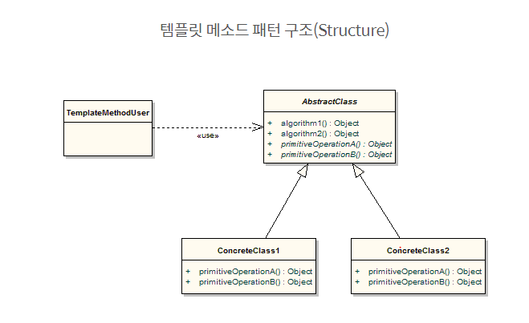
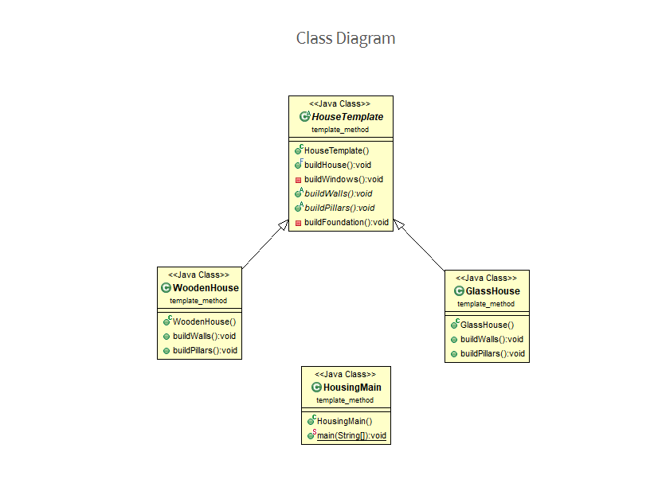

# [2020-06-11 목 ] TIL

### Java throw  throws

#### 강제로 오류를 발생시키는 `throw`

#### throw는 오류를 떠넘기는 throws와 보통 같이 사용됩니다.

```java
    public class ExceptionExam3 {   
        public static void main(String[] args) {
            int i = 10;
            int j = 0;
            int k = divide(i, j);
            System.out.println(k);

        }       
        public static int divide(int i, int j){
            int k = i / j;
            return k;
        }   
    }
```

- divide메소드는 2번째 파라미터의 값이 0일 경우 나누기를 할 때 Exception이 발생한다.

#### 위의 코드를 에러가 발생하지 않게 수정

```java
    public class ExceptionExam3 {
        public static void main(String[] args) {
            int i = 10;
            int j = 0;
            int k = divide(i, j);
            System.out.println(k);      
        }

        public static int divide(int i, int j){
            if(j == 0){
                System.out.println("2번째 매개변수는 0이면 안됩니다.");
                return 0;
            }
            int k = i / j;
            return k;
        }
    }
```

- j가 0일 경우 안된다는 메시지가 출력되도록 수정하고 0을 리턴.
- 이렇게 할 경우 main메소드의 k변수는 0값을 가지게 되고 0을 출력하게 된다.
- 0으로 나눈 결과는 0이 아니다. 0으로 반환하면 더 큰 문제가 발생할수도 있다.

#### 에러도 발생하지 않고, 올바르지 않은 결과를 리턴하지 않도록 수정

```java
    public class ExceptionExam3 {
        public static void main(String[] args) {
            int i = 10;
            int j = 0;
            int k = divide(i, j);
            System.out.println(k);

        }       
        public static int divide(int i, int j) throws IllegalArgumentException{
            if(j == 0){
                throw new IllegalArgumentException("0으로 나눌 수 없어요.");
            }
            int k = i / j;
            return k;
        }   
    }
```

- j가 0일 경우에 new연산자를 통하여 IllegalArgumentException 객체가 만들어 진다.
- new 앞에 throw 는 해당 라인에서 익셉션이 발생한다는 의미이다.
- 즉 그 줄에서 오류가 발생했다는 것이다. 0으로 나눌수 없습니다. 라는 오류가 발생한것이다.
- Exception클래스 이름을 보면 아규먼트가 잘못되었기 때문에 발생한 오류라는 것을 알 수 있다.

#### divide 메소드를 호출 한 쪽에서의 오류 처리

- divide 메소드 뒤에 throws IllegalArgumentException 은 해당 오류는 divide를 호출한 쪽에서 처리를 해야한다는 것을 의미한다.

```java
    public class ExceptionExam3 {   
        public static void main(String[] args) {
            int i = 10;
            int j = 0;
            try{
                int k = divide(i, j);
                System.out.println(k);
            }catch(IllegalArgumentException e){
                System.out.println("0으로 나누면 안됩니다.");
            }           
        }

        public static int divide(int i, int j) throws IllegalArgumentException{
            if(j == 0){
                throw new IllegalArgumentException("0으로 나눌 수 없어요.");
            }
            int k = i / j;
            return k;
        }   
    }
```

***

### `Java Design Pattern`

#### Template Method Pattern (템플릿 메소드 패턴)

- 공통적인 프로세스를 묶어 주기 
- 일정한 프로세스를 가진 요구사항을 템플릿 메소드 패턴으로 구현 
- `template 사전적 의미`
  - 모양자 = 템플릿 
    - 모양은 정해져 있고 어떤 펜으로 그리는지에 따라 색깔이 바뀐다 
- **알고리즘의 구조를 메소드에 정의**하고 하위 클래스에서 알고리즘 구조의 변경없이 알고리즘을 **재정의** 하는 패턴 

- 특징

  - 구현하려는 알고리즘이 **일정한 프로세스 (여러단계로 나눌수 있음)**가 있다
  - 구현하려는 알고리즘이 **변경 가능성**이 있다
  - 어떤 소스코드상의 알고리즘에서 특정 환경 또는 상황에 맞게 확장 또는 변경을 해야할 경우 매우 유용
  - 추상클래스와 구현 클래스로 작성 
  - **메인이 되는 로직 부분(템플릿 메소드)은 추상클래스의 일반 메소드로 선언해서 사용한다**
  - 코드 중복감소 , 하위 클래스의 역할을 감소시킴 
  - 추상메소드가 너무 많아지면 클래스 관리가 복잡 

- 단계

  1. 알고리즘을 **여러 단계로** 나눈다

  2. 나눠진 알고리즘의 단계를 **메소드로 선언**한다

  3. 알고리즘을 수행할 **템플릿 메소드**를 만든다

  4. 하위 클래스에서 **나눠진 메소드들을 구현**한다

#### 예제 1.

``` 
--- 요구 사항
- 신작 게임의 접속을 구현
requestConnection(String str):String

- 유저가 게임 접속시 다음을 고려해야함
-- 보안과정 : 보안관련부분 처리한다
deSecurity(String string):String

-- 인증과정 : username과 password가 일치하는지 확인힌다
authentication(String id, String password):boolean

-- 권한과정 : 접속자가 유료회원인지 무료회원인지 게임 마스터인지 확인한다.
authorization(String userName):int

-- 접속과정 : 접속자에게 커넥션을 정보를 넘겨준다
connection(String info):String
```

- 내가설계한것 
  - 게임 : 유저 정보 가져오는 데에서 NullPointerError 발생
    - 보안과정
    - 인증과정
    - 권한과정
    - 접속과정
  - 유저  	
    - id
    - password
    - 권한

***

- AbstGameConnectHelper 추상클래스 선언 
  - 관련 메서드들은 외부에선 호출하면 안되는데 하위클래스에서 호출해야함 -> protected
  - requestConnection : 템플릿 메소드 
    - 추상 메서드 4개를 전부 호출 

- 하위 게임클래스에서 추상 메서드 구현 
- 메인에서 추상클래스 객체에 하위 인스턴스 선언 

```
보안 부분이 정부 정책에 의해서 강화되었다
강화된 방식으로 코드를 변경해야한다
여가부에서 밤 10시 이후에에 접속이 제한되도록 한다
```

```java
public abstract class AbstGameConnectHelper {
	
	// 관련 메서드들은 외부에선 호출하면 안되는데 하위클래스에서 호출해야함 -> protected
	protected abstract String deSecurity(String string);
	
	protected abstract boolean authentication(String id, String password);
	
	protected abstract int authorization(String userName);
	
	protected abstract String connection(String info);
	
	// 템플릿 메소드
	public String requestConnection(String encodedInfo) {
		
		// 보안과정 -> 암호화 된 문자열을 복호화 
		String decodedInfo = deSecurity(encodedInfo);
		
		// 인증과정 : 반환된 것을 가지고 아이디, 암호를 할당한다
		String id = "aaa";
		String password = "bbb";
		
		if(!authentication(id, password)) {
			throw new Error("아이디 암호 불일치");
		} 
		
		// 권한과정
		String user_name = "userName";
		int i = authorization(user_name);
		
		switch(i) {
		case -1:
			throw new Error("나이 미만 셧다운");
		case 0:
			System.out.println("게임 매니저");
			break;
		case 1:
			System.out.println("유료 회원");
			break;
		case 2:
			System.out.println("무료 회원");
			break;
		case 3:
			System.out.println("권한 없음");
			break;
		default: // 확장성 
			System.out.println("기타사항");
			break;
		}
		
		// 접속과정
		return connection(decodedInfo);
	}
}

public class Game extends AbstGameConnectHelper{

	@Override
	protected String deSecurity(String string) {
		System.out.println("강화된 방식의 디코드");
		return string;
	}

	@Override
	protected boolean authentication(String id, String password) {
		System.out.println("아이디/암호 확인 과정");
		return true;
	}

	@Override
	protected int authorization(String userName) {
		System.out.println("권한 확인");
		// 서버에서 유저이름 유저의 나이를 알 수 있다
		// 나이를 확인하고 시간을 확인하고 성인이 아니고 10시가 지났다면 
		// 권한이 없는 것으로 한다 
		return 0;
	}

	@Override
	protected String connection(String info) {
		System.out.println("마지막 접속단계");
		return info;
	}

}

public class MainTemplateMethod {
	
	public static void main(String[] args) {
		AbstGameConnectHelper helper = new Game();
		
		helper.requestConnection("아이디 암호 등 접속정보");
	}
}

```

***

### 예제 2.





```java
public abstract class HouseTemplate {
	
	protected abstract void buildWails();
	protected abstract void buildPillars();
	
	private void buildWindows() {
		System.out.println("창문을 세운다");
	}
	
	private void buildFoundation() {
		System.out.println("뿌리를 짓다");
	}
 
	public void buildHouse() {
		System.out.println("\n템플릿 메소드 실행");
		buildFoundation(); // A : 추상 메서드 
		buildWindows();
		buildWails(); // 빨간색 : private
		buildPillars();
	}
}

public class WoodenHouse extends HouseTemplate{

	@Override
	protected void buildWails() {
		System.out.println("나무로 된 집의 벽을 짓다");
	}

	@Override
	protected void buildPillars() {
		System.out.println("나무로 된 집의 기둥을 세우다 ");
	}
	
}

public class GlassHouse extends HouseTemplate{

	@Override
	protected void buildWails() {
		System.out.println("유리로 된 집의 벽을 짓다");
	}

	@Override
	protected void buildPillars() {
		System.out.println("유리로 된 집의 기둥을 세우다 ");
	}
	
}

public class HousingMain {
	
	public static void main(String[] args) {
		
		HouseTemplate wooden = new WoodenHouse();
		HouseTemplate glass = new GlassHouse();
		
		wooden.buildHouse();
		glass.buildHouse();
	}
}


```

