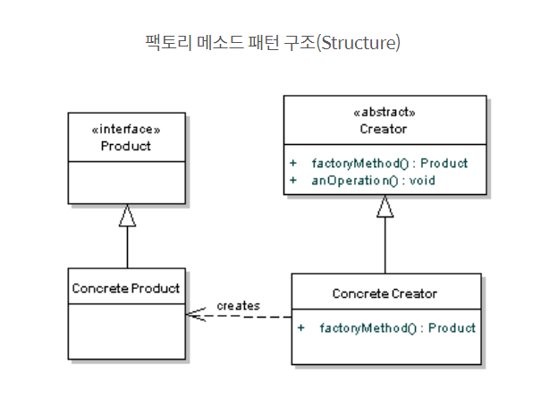
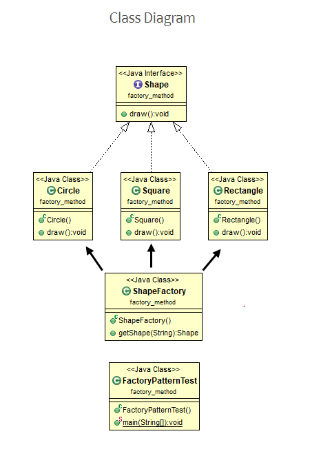

# [2020-06-12 금] TIL

### Java Casting

- 참고 : https://coding-factory.tistory.com/130{: target="_blank"}

1. `String to Int`

   ```java
   String str = "10";
   int i_num = Integer.parseInt(str);
   int i_num2 = Integer.valueof(str);
   ```

   

2. `String to Double, Float`

   ```java
   String str = "10";
   double d_num = Double.valueOf(str);
   float f_num = Float.valueOf(str);
   // parseDouble, parseFloat
   ```

3. `String to Long, Short`

   ```java
   String str = "10";
   long l_num = Long.parseLong(l_num);
   short sh_num = Short.parseShort(sh_num);
   ```

4. `Int to String`  

   ```java
   int i_num = 10;
   String s_num;
   
   // 둘다가능 
   s_num = String.valueOf(i_num);
   s_num = String.toString(i_num);
   s_num = "" + i_num;
   ```

5. `Double Float to String`

   ```java
   float = f_num = 10.10;
   double d_num = 10,10;
String s_num;
   
   s_num = String.valueOf(f_num);
   s_num = Float.toString(f_num);
   
   s_num = String.valueOf(d_num);
   s_num = Double.toString(s_num);
   ```

***

### Java Design Pattern

### Factory Method Pattern 팩토리 메소드 패턴

- `"객체 생성을 대신 수행해주는 공장" / "객체 생성을 담당 및 처리 하는 팩토리 클래스"`

- 객체는 직접 생성하는 경우가 있고 팩토리 메소드 패턴의 역할처럼 간접적으로 객체 생성 후 반환해주는 방식

- 장단점
  - 생성할 클래스를 미리 알지 못해도 팩토리 클래스가 객체 생성담당
  - 객체의 자료형이 하위클래스에 의해서 결정 -> 확장 용이성
  - 동일한 형태로 프로그래밍 가능
  - 확장성 있는 전체 프로젝트 구성 가능
  - 객체가 늘어날때마다 하위클래스 재정의로 인한 불필요한 많은 클래스 생성 가능성



### 예제 1. 도형 그리기



```java
public interface Shape {
	public abstract void draw(); // 인터페이스에서는  접근 지정자 디폴트값 -> public	
}	

public class Circle implements Shape{
	@Override
	public void draw() {
		System.out.println("원을 그리다");
	}	
}

public class Square implements Shape{
	@Override
	public void draw() {
		System.out.println("정사각형을 그리다 ");
	}
}

public class Rectangle implements Shape{
	@Override
	public void draw() {
		System.out.println("직사각형을 그리다 ");
	}
}

public class ShapeFactory {
	
	// 팩토리 메소드 
	public Shape getShape(String str) throws Exception{
		if (str == null) {
			System.out.println("도형을 그릴수 없습니다.");
			return null;
		} 
		if (str.equals("원")) {
			return new Circle();
		} else if (str.equals("정사각형")) {
			return new Square();
		} else if (str.equals("직사각형")) {
			return new Rectangle();
		}
		
		return null;
//		Shape s = null;
//		
//		if (str.equals("원")) {
//			s = new Circle();
//			s.draw();
//		} else if (str.equals("정사각형")) {
//			s = new Square();
//			s.draw();
//		} else if (str.equals("직사각형")) {
//			s = new Rectangle();
//			s.draw();
//		} else {
//			System.out.println("도형을 그릴수 없습니다.");
//		}
//		
//		return s;
	}
}

public class FactoryPatternTest {
	
	public static void main(String[] args) {
		
//		ShapeFactory fac = new ShapeFactory();
//		fac.getShape("원");
//		fac.getShape("정사각형");
//		fac.getShape("직사각형");
		
		ShapeFactory fac = new ShapeFactory();
		
		try {
			Shape circle = fac.getShape("원");
			circle.draw();
			Shape sq = fac.getShape("정사각형");
			sq.draw();
			Shape rect = fac.getShape("직사각형");
			rect .draw();
			Shape job = fac.getShape("조정효");
			job .draw();
		} catch(Exception e) {
			System.out.println("그리기 실패");
			e.printStackTrace();
		} finally {
			System.out.println("메인문 종료");
		}
	}
}

```


### 예제 2. 게임 아이템 사용하기

```
--- 요구사항 ---

게임 아이템과 아이템 생성을 구현
- 아이템을 생성하기 전에 데이터 베이스에서 아이템 정보를 요청
- 아이템을 생성 후 아이템 복제 등의 불법을 방지하기 위해 데이터 베이스에 아이템 생성 정보를 남김

아이템을 생성하는 주체를 ItemCreator로 이름을 짓
아이템은 item이라는 interface 
item은 use 함수를 기본 함수로 갖고 있다 
현재 아이템의 종류는 체력회복물약, 마력회복물약이 있다 
```


```java
public interface Item {
	public abstract void use();
}

public class HpItem implements Item{
	@Override
	public void use() {
		System.out.println("Hp가 회복됩니다");
	}
}

public class MpItem implements Item{
	@Override
	public void use() {
		System.out.println("Mp가 회복됩니다");
	}
}

import java.text.SimpleDateFormat;
import java.util.Date;

public class ItemCreator { // 아이템 생성자(주체)
	
	private void itemInfo() {
		System.out.println("데이터 베이스에서 아이템 정보 요청을 합니다");
	}
	
	private void itemLog(String item) {
        // 현재시간 출력
		SimpleDateFormat simple = new SimpleDateFormat("yyyy-MM-dd HH:mm:ss");
		Date date = new Date();
		String time = simple.format(date);
		System.out.println(item + " 아이템 생성 정보 남김니다 (생성시간 : " + time + ")");
	}
	
	// 아이템 생성
	private Item createItem(String item) {
		if(item == null) {
			return null;
		}
		if (item.equals("hp")) {
			System.out.println("hp 아이템 생성");
			return new HpItem();
		} else if (item.equals("mp")) {
			System.out.println("mp 아이템 생성");
			return new MpItem();
		}
		
		return null;
	}
	
	// 팩토리 메소드 - 템플릿 메소드와 유사  
	public void create() {
		itemInfo();
		Item hp = createItem("hp");
		hp.use();
		itemLog("hp");
		System.out.println();
		
		itemInfo();
		Item mp = createItem("mp");
		mp.use();
		itemLog("mp");
	}
}

package FactoryMethod_2;

public class MainGame {
	
	public static void main(String[] args) {
		ItemCreator creator = new ItemCreator();
		creator.create();
		
	}
}
/*
데이터 베이스에서 아이템 정보 요청을 합니다
hp 아이템 생성
Hp가 회복됩니다
hp 아이템 생성 정보 남김니다 (생성시간 : 2020-06-12 11:02:05)

데이터 베이스에서 아이템 정보 요청을 합니다
mp 아이템 생성
Mp가 회복됩니다
mp 아이템 생성 정보 남김니다 (생성시간 : 2020-06-12 11:02:05)

*/
```


## Factory Method pattern VS Template Method pattern 

- [Factory Method pattern VS Template Method pattern](https://hojak99.tistory.com/347){: target:"_blank"}

- Template Method 
  - 슈퍼 클래스에 기본적인 메소드가 정의되어 있고 세부적인 메소드는 추상 메소드로 두어 서브 클래스에서 구현해 사용하는 방법 
- Factory Method 
  - 서브 클래스에서 구체적인 오브젝트 생성 방법을 결정하게 하는 방법

***

- 추상클래스 : 미완성 클래스, 단일 상속
- 인터페이스 : 밑그림만 스케치 , 다중상속 가능, 클래스가 아님