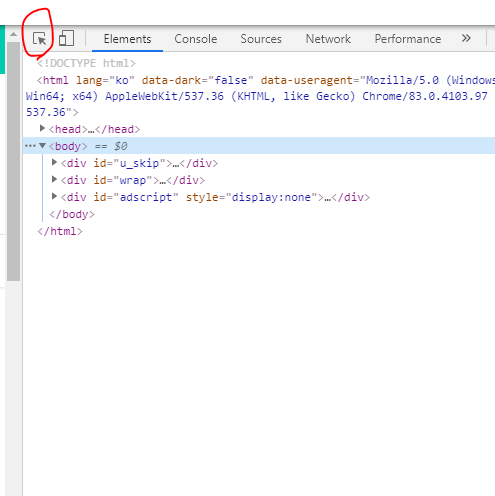

# [2020-06-13 토] TIL

### `Python Web crawling `


### Selenium 셀레니움이란? 

- 웹 테스트를 목적으로 사용되는 라이브러리
- 물리 드라이버를 활용하기 때문에 실제로 사용자가 사이트를 방문하는 것처럼 구현 가능
- 크롬, 파이어폭스 등의 물리 드라이버가 존재하며 본 교안에서는 크롬 드라이버를 사용함

### 셀레니움 기본 문법 

```python
# 가장 기본이 되는 명령어 , 물리 드라이버 가동명령
driver = webdriver.Chrome(크롬드라이버경로/chromedriver.exe)

# 물리 드라이버를 사이트로 이동시킴
driver.get("사이트명")

# xpath를 이용해서 요소를 특징짓기 
# 특정 요소를 찾아서 그 요소 클릭하기 (홑따옴표 작성 (''))
driver.find_element_by_xpath('//*[@id="account"]/a/i').click()

# 로그인 창 등 입력창에 문자열 입력하기
변수 = driver.find_elemeny_by_xpath("xpath")
변수.send_keys("입력할 문자열")

# 현재 페이지의 소스코드를 전부 긁어옴 
source = driver.page_source

# 브라우저 종료
driver.close()
```


### Xpath 추출하는 방법

- 크롬 드라이버에서 F12를 누르면 요소분석 창이 나타남
- 요소분석창 왼쪽 위버튼 을 눌러 사용할 구역을 찾아낸 다음
- 클릭하면 요소 분석창에서 그 부분의 소스가 선택됨
- 선택된 부분 우클릭 -> copy -> copy xpath를 클릭해 복사가능 




#### `셀레니움은 수집용 - 원하는 부분만 수집하기는 제약이 있다`

### Beautiful soup

- 뷰티플수프는 데이터를 수집해오는 기능과는 전혀 상관없는 라이브러리
- 하지만 수집해온 텍스트 데이터를 처리하는데 있어서 강력한 기능을 제공하기 때문에 데이터 가공에 많이 활용된다
- 특히 본 교안에서는 웹에서 자료를 가져올때는 `html.parser`기능을 이용해 HTML 구조로 작성된 문서를 처리하는 기능을 활용하게 된다.

```python
# 가져온 소스코드를 html로 파싱하는 것 
# "여기있는 소스를 html 형식으로 이해해라" 명령
Beautifulsoup(소스코드, "html.parser") 

파싱한자료.find_all("태그명", id="아이디명", class_="클래스명")
# 파싱한 자료 내부에서 원하는 태그명 및 아이디, 클래스에 해당하는 자료만 선별하는 코드 
# 이 코드를 활용해 원하는 텍스트자료가 있는 부분을 선택적으로 수집할 수 있게 된다

# 만약 두 개 이상의 요소를 동일하게 수집하고 싶다면 리스트 처리해 find_all(["태그명1", "태그명2"...]) 과 같이 처리한다 

.test 명령어 
# 가져온 코드에서 태그(<태그명> </태그명>)를 제외하고 외부에 있는 자료만 보여주는 명령어
# 이 기능을 이용하면 손쉽게 텍스트 부분만 뗴어낼수 있다

# 다만 a태그 내부의 링크(<a href="링크명">)이 같이 소거되므로 링크를 가져올때는 문자열 슬라이싱을 활용해야함 
```

- **파싱** 이란 비유하자면 두꺼운 책을 가지고만 있느냐 / 읽어서 이해하느냐 의 차이이다
- **파싱을 해야만 컴퓨터가 코드의 구조를 파악할 수 있다.**
- **태그** 란 html 의 한 단 이다 **ex) <> </>**  


### 교보문고 사이트 크롤링

- 베스트 -- 책제목, 저자, 가격 정보 가져오기 

```python
from selenium import webdriver
import time
from bs4 import BeautifulSoup


driver = webdriver.Chrome('C:/Users/82105/온라인강의 자료/chromedriver.exe')
# TODO : 교보문고 페이지 - 베스트 클릭 url 바로 접속
driver.get("http://www.kyobobook.co.kr/bestSellerNew/bestseller.laf?orderClick=d79")

# 현재 페이지 사이트 소스 전부긁어옴
source = driver.page_source

list_title = []
list_author = []
list_price = []

# "여기있는 소스를 html 형식으로 이해해라" 명령
total_data = BeautifulSoup(source, "html.parser")     # 전체 데이터

# div 태그에서 class 가 title 인 데이터 파싱
title = total_data.find_all("div", class_="title")    # title
for data in title[4:]:
    list_title.append(data.text.strip())

author = total_data.find_all("div", class_="author")
for data in author:
    list_author.append(data.text.strip().replace('\t', "").replace('\n', ""))

price = total_data.find_all("div", class_="price")
for data in price:
    list_price.append(data.text.strip().replace('\t', "").replace('\n', ""))

print("--- Best Seller ---")
for index in range(len(list_title)):
    print(str(index+1) + "위 도서정보")
    print(list_title[index])
    print(list_author[index])
    print(list_price[index])
    print("-"*50)


# TODO : Naver - 교보문고 접속
# driver.get("https://www.naver.com")
# 검색어 입력 - "교보문고" - 사이트 접속
# select_keyword = driver.find_element_by_xpath('//*[@id="query"]')
# select_keyword.send_keys("교보문고\n")  # 개행문자 넣으면 검색 클릭 xpath가 필요없음
# # 검색클릭
# driver.find_element_by_xpath('//*[@id="search_btn"]/span[2]').click()
# 교보문고 url 클릭
# driver.find_element_by_xpath('//*[@id="main_pack"]/div[1]/ul/li/dl/dt/a/b').click()

# TODO : 네이버 로그인 Test
# driver = webdriver.Chrome('C:/Users/82105/온라인강의 자료/chromedriver.exe')
#
# # 물리 드라이버를 사이트로 이동시킴
# driver.get("https://www.naver.com")

# # 특정 요소를 찾아서 그 요소 클릭하기
# driver.find_element_by_xpath('//*[@id="account"]/a/i').click()
#
# # 로그인 창 등 입력창에 문자열 입력하기
# # 네이버 로그인 --> 아이디, 패스워드 입력
# user_id = driver.find_element_by_xpath('//*[@id="id"]')
# user_id.send_keys("abc1234")
#
# user_pw = driver.find_element_by_xpath('//*[@id="pw"]')
# user_pw.send_keys("abc1234")
#
# driver.find_element_by_xpath('//*[@id="log.login"]').click()
# # driver.page_source
#
# # X초동안 실행후 브라우저를 꺼라
time.sleep(3)
driver.close()
# # 가장 기본이 되는 명령어 , 물리 드라이버 가동명령

```

```
C:\Users\82105\PycharmProjects\PracticePython\venv\Scripts\python.exe C:\Users\82105\PycharmProjects\PracticePython\HTMLCrawling.py
--- Best Seller ---
1위 도서정보
더 해빙(The Having)(양장본 HardCover)
이서윤저자 더보기홍주연| 수오서재| 2020년 03월 01일
도서14,400원[10%↓ + 5% 적립]| eBook 12,500원
--------------------------------------------------
2위 도서정보
기억. 1(양장본 HardCover)
베르나르 베르베르| 열린책들| 2020년 05월 30일
도서13,320원[10%↓ + 5% 적립]| eBook 9,900원
--------------------------------------------------
3위 도서정보
코로나 투자 전쟁
정채진저자 더보기박석중이광수김한진김일구| 페이지2북스| 2020년 05월 25일
도서15,120원[10%↓ + 5% 적립]| eBook 11,000원
--------------------------------------------------
4위 도서정보
애쓰지 않고 편안하게
김수현| 놀| 2020년 05월 14일
도서13,500원[10%↓ + 5% 적립]| eBook 10,500원
--------------------------------------------------
5위 도서정보
코로나 이후의 세계
제이슨 솅커| 미디어숲| 2020년 05월 30일
도서13,320원[10%↓ + 5% 적립]| eBook 10,360원
--------------------------------------------------
6위 도서정보
보통의 언어들(나를 숨 쉬게 하는)(양장본 HardCover)
김이나| 위즈덤하우스| 2020년 05월 27일
도서13,050원[10%↓ + 5% 적립]| eBook 10,150원
--------------------------------------------------
7위 도서정보
룬샷
사피 바칼| 흐름출판| 2020년 04월 27일
도서16,200원[10%↓ + 5% 적립]| eBook 14,400원
--------------------------------------------------
8위 도서정보
언컨택트
김용섭| 퍼블리온| 2020년 04월 20일
도서16,200원[10%↓ + 5% 적립]| eBook 14,400원
--------------------------------------------------
9위 도서정보
제11회 젊은작가상 수상작품집(2020)
강화길저자 더보기최은영김봉곤이현석김초엽| 문학동네| 2020년 04월 08일
도서4,950원[10%↓ + 5% 적립]| eBook 3,900원
--------------------------------------------------
10위 도서정보
시선으로부터,(양장본 HardCover)
정세랑| 문학동네| 2020년 06월 05일
도서12,600원[10%↓ + 5% 적립]
--------------------------------------------------
11위 도서정보
지리의 힘
팀 마샬| 사이| 2016년 08월 10일
도서15,300원[10%↓ + 5% 적립]| eBook 11,900원
--------------------------------------------------
12위 도서정보
돈의 속성
김승호| 스노우폭스북스| 2020년 06월 15일
도서15,120원[10%↓ + 5% 적립]| eBook 11,760원
--------------------------------------------------
13위 도서정보
1cm 다이빙
태수저자 더보기문정| 피카(FIKA)| 2020년 01월 21일
도서12,150원[10%↓ + 5% 적립]| eBook 9,450원
--------------------------------------------------
14위 도서정보
소년이 온다(특별한정판)(양장본 HardCover)
한강| 창비| 2020년 04월 24일
도서11,700원[10%↓ + 5% 적립]
--------------------------------------------------
15위 도서정보
내가 원하는 것을 나도 모를 때
전승환| 다산초당| 2020년 01월 08일
도서14,400원[10%↓ + 5% 적립]| eBook 11,200원
--------------------------------------------------
16위 도서정보
오래 준비해온 대답
김영하| 복복서가| 2020년 04월 29일
도서14,850원[10%↓ + 5% 적립]
--------------------------------------------------
17위 도서정보
흔한남매 안 흔한 일기. 2(양장본 HardCover)
흔한남매 (원작)저자 더보기강효미| 아이세움| 2020년 05월 26일
도서10,800원[10%↓ + 5% 적립]
--------------------------------------------------
18위 도서정보
녹나무의 파수꾼(양장본 HardCover)
히가시노 게이고| 소미미디어| 2020년 03월 17일
도서16,020원[10%↓ + 5% 적립]| eBook 12,500원
--------------------------------------------------
19위 도서정보
아몬드(양장본 HardCover)
손원평| 창비| 2017년 03월 31일
도서10,800원[10%↓ + 5% 적립]
--------------------------------------------------
20위 도서정보
하버드 상위 1퍼센트의 비밀(하드커버 리커버 에디션)
정주영| 한국경제신문| 2018년 10월 17일
도서14,400원[10%↓ + 5% 적립]| eBook 12,800원
--------------------------------------------------

Process finished with exit code 0

```

