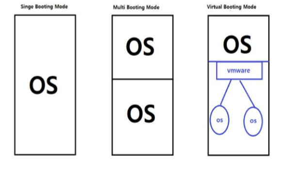
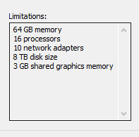

# [2020-06-15 월 TIL]

### Linux 구조 / 배우는이유

- Client
  - request 요청
  - 고객들
  - window 
- Server
  - response 응답 
  - 기업들
  - linux, window server, unix (주로 대기업사용, IBM, oracle, HP : 비용이 비쌈 최소 5000만원)

- IBM
  - Redhat Enterprise (약 34조 인수)
    - 하이브리드 클라우드 도입 (인수이유)

- Cloud 클라우드
  - 네트워크 가능기계 (인터넷)
    - pc를 가상으로 들고다니는 개념 (기본 시스템은 Linux 구조)

***

### 권장사양

- CPU : intelCore i5-5500 이상권장
- RAM : 16GB 이상
- OS (operation system : 시스템을 구동함) : 64bit
  - 네트워크 : 망 
    - 각각 인터넷 서버가 존재함 
  - 32 bit VS 64 bit 
    - cpu의 처리능력 - control
    - ex)
      - cpu가 1초에 데이터를 한꺼번에 처리할수 있는 능력 
      - 프로그램 호환성 고려

***

### Window VS Linux

- 윈도우
  - Graphical User Interface
  - 인터페이스
    - 서로다른 장치가 대화, 통신 
  - 메모리 사용량이 많다 - 무거움
- 리눅스
  - Text User Interface
  - 메모리 사용량이 적다 - 가벼움

***

### 시스템 부팅 모드

- single booting mode
  - 1개의 PC에 OS 1개부팅
- multi booting mode
  - 1개의 PC에 OS 2개 부팅
  - 비싼 가격적인 면에서 멀티부팅모드가 탄생함 
  - 단점
    - 구동은 독립적이지만 W/L/M 중에 한대라도 망가지면 나머지도 전부 망가진다 
    - 전문지식이 없으면 사용하지 않는걸 권장 
- virtual booting mode
  - 1개의 PC에 가상머신을 사용하는 상태 
  - 실질적으로는 한개의 시스템으로 동작하지만 가상 프로그램을 사용하여 여러개의 OS 띠움

***

- i386      - 32 bit
- x86_64 - 64 bit

- iso - 전세계 사용 (속도느림)
- torrent 사용법 확인 (속도빠름)

- ram, cpu, 공유기, 하드디스크 

- host OS : 내가쓰는 Windows
- guest OS : 가상머신에 설치할 Linux

vmx 파일 열기 경로 : `C:\Users\82105\Documents\Virtual Machines\CentOS 7.8 2003 64bit0`

***

#### centos ISO image DownLoad

- https://www.centos.org/download/mirrors/

### vmware - guest OS에서 마우스 빼기 -- "Ctrl + ALT"

- suspend Guest 는 사용 권장 X -- 네트워크 장치가 없어지는 이슈 있음 

- 파티션
  - 하드디스크를 활성화 시킴 

- 파티션 나누기
  - 표준 파티션 
    - add  mount 
      - /(루트) 용량은 비워둠 
        - File System
          - ext4 선택 
      - swap 2048 (리눅스의 가상메모리 : 사용자가 잡아줘야함 , 시스템이 잡지못함 )

***

#### 디렉토리 구조

- **/bin , /usr** : 기본명령어가 들어가는 디렉토리
- **/sbin** : s 붙이는 이유 - 슈퍼유저(관리자만 사용가능) - 시스템 관련 명령어 디렉토리 
- **/etc** : 시스템 서비스와 관련된 디렉토리 

- **/home** : 사용자의 기본 홈 디렉토리 경로 