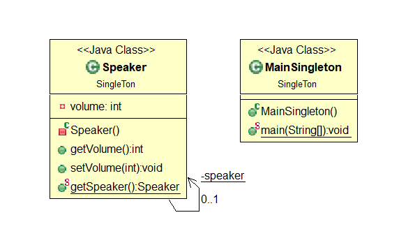
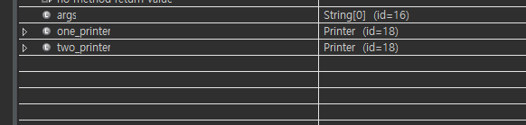
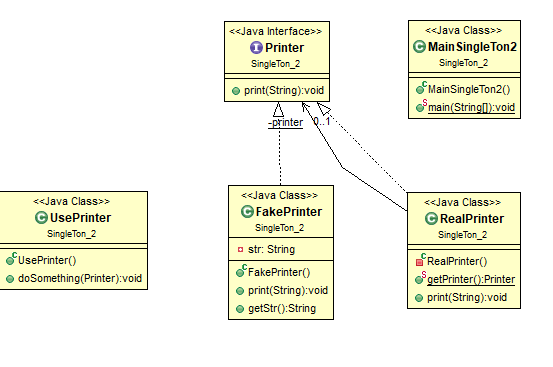

# [2020-06-16 화 TIL]

### 이클립스 UML 플러그인 활용

- 참고 : https://niceman.tistory.com/134

### `Java Design Pattern`

### Singleton

- 참고 사이트 
  - https://commin.tistory.com/121
  - https://velog.io/@kyle/%EC%9E%90%EB%B0%94-%EC%8B%B1%EA%B8%80%ED%86%A4-%ED%8C%A8%ED%84%B4-Singleton-Pattern

- 객체 : 속성과 기능 갖춘것
- 클래스 : 속성과 기능을 정의한것
- 인스턴스 : 속성과 기능을 가진 것 중 실제 하는것 

ex) 공장에서 자동차 생산해서 나온상태 : 인스턴스

- 사전적의미
  - 외동이 , 한개의 것 , (카드)(달리 낼패가없는) 한장
- **"인스턴스 하나만 생성해야할 객체를 위한 패턴"**

```
-- 요구사항 --

개발 중이 시스템에서 스피커에 접근할 수 있는 클래스를 만들어 주세요 
```



```java
package SingleTon;

public class Speaker {
	
	private static Speaker speaker = null;
	
	private int volume = 5; 
	
	private Speaker() {
		this.volume = volume;
	}
	
	public int getVolume() {
		return volume;
	}

	public void setVolume(int volume) {
		this.volume = volume;
	}

	public static Speaker getSpeaker(){
		
		if (speaker == null) {
			speaker = new Speaker();
			System.out.println("새로생성");
		} else {
			System.out.println("이미생성");
		}
		return speaker;
	}
}
package SingleTon;

public class MainSingleton {
	
	public static void main(String[] args) {
		
		// 주소값 같음 - 동일한 인스턴스  
		Speaker speaker1 = Speaker.getSpeaker();
		Speaker speaker2 = Speaker.getSpeaker();
		
		// 5, 5
		System.out.println(speaker1.getVolume());
		System.out.println(speaker2.getVolume());
		
		// 11이 나와야함 
		speaker1.setVolume(11);
		System.out.println(speaker1.getVolume());
		System.out.println(speaker2.getVolume());
		
		// 21이 나와야함 
		speaker1.setVolume(21);
		System.out.println(speaker1.getVolume());
		System.out.println(speaker2.getVolume());
	}
}
/*
새로생성
이미생성
5
5
11
11
21
21

*/

```


```
-- 요구 사항 --
하나의 프린터기를 여러명의 사원이 공유하며 사용하는 경우 어떤식으로 코딩하면 좋을까요? 이 경우 싱글턴패턴이 유용하게 사용될 수 있는데요 아래의 예제를 보겠습니다.
```

```java
package SingleTon_2;

public class Printer {
	
	// 정적변수애 인스턴스를 만들어 바로 초기화 하는 방법이 멀티스레드 환경에서 효과적이다 
	private static Printer printer = new Printer();
	
	private int count = 0;
	
	private Printer() {}
	
	public static Printer getPrinter() {
		if(printer == null) {
			printer = new Printer();
			System.out.println("새로 생성");
		} else { 
			System.out.println("이미 생성");
		}
		
		return printer; 
	}
	/*
	 count 값은 각기 다르게 접근하기 때문에 스레드마다 값이 달라진다
	 이를 해결하기위해서 synchronized 라는 키워드를 통해 여러 스레드에서 
	 동시에 접근하는 것을 막는 방법  
	*/
	public synchronized void print(String input) {
		count++;
		System.out.println(input + "count : " + count);
	}
}
package SingleTon_2;

public class MainSingleTon2 {
	
	public static void main(String[] args) {
		Printer one_printer = Printer.getPrinter();
		
		// 두개 생성시 이미생성한 인스턴스랑 주소값 동일 
		Printer two_printer = Printer.getPrinter();
		System.out.println("");
	}
}

```



**결과 : 인스턴스가 동일하다** 

```
하지만 정적 클래스를 사용할 수 없는 경우 또한 존재하는데 , 인터페이스를 구현하는 경우이다
인터페이스가 정적 메서드를 가질 수 없기 때문에 이런 경우 정적 클래스를 사용할 수 없다
예를 들어 모의 객체를 사용하는 경우가 있을수 있다
```



```java
// 인터페이스 에선 정적 메서드를 사용할 수 없다 
public interface Printer {
	public abstract void print(String input);
}

public class RealPrinter implements Printer{

	private static Printer printer = null;
	
	private RealPrinter() {}
	
	public synchronized static Printer getPrinter() {
		if (printer == null) {
			System.out.println("새로생성");
			printer = new RealPrinter();
		} else {
			System.out.println("이미생성");
		}
		return printer;
	}
	
	@Override
	public void print(String input) {
		System.out.println(input);
	}	
}

public class UsePrinter{
    
	public void doSomething(Printer printer) {
		System.out.println("UsePrinter.doSomething : " + printer);
		printer.print("fakeGet");
	}
}


public class FakePrinter implements Printer{

	private String str;
	
	@Override
	public void print(String str) {
		this.str = str;
	}
	
	public String getStr() {
		System.out.println("FakePrinter.getStr : " + str);
		return str;
	}
}


public class MainSingleTon2 {
	
	public static void main(String[] args) {
		FakePrinter fake = new FakePrinter();
		UsePrinter use = new UsePrinter();
		use.doSomething(fake);
		fake.getStr();
		
		Printer r = RealPrinter.getPrinter();	
	}
}
/*
UsePrinter.doSomething : SingleTon_2.FakePrinter@15db9742
FakePrinter.getStr : fakeGet
새로생성
*/
```


### 싱글톤의 문제

- **싱글톤은 프로그램 전체에서 하나의 객체만을 공통으로 사용하고 있기 때문에 각 객체간의 결합도가 높아지고 변경에 유연하게 대처할 수 없다. 싱글톤 객체가 변경되면 이를 참조하고 있는 모든 값들이 변경되어야 하기 때문에**
- **멀티쓰레드 환경에서 대처가 어느정도 가능하지만 고려해야 할 요소가 많아 사용이 어렵고, 프로그램 전반에 걸쳐서 필요한 부분에만 사용한다면 장점이 있다. 하지만 그 포인트를 잡기가 어렵다**


### 결론

적절한 형태로 싱글톤을 활용하면 좋지만 남용하게 될 여지가 많다. 이 부분에 대해서 어떠한 경우 싱글톤을 사용하면 좋은지는 추가적으로 공부하여 업로드 하도록 하겠습니다. 현재까지의 내용을 기반으로 싱글톤을 사용하면

- 멀티 쓰레드 환경에서의 싱글톤
  - Synchronized를 통해 관리하면 되며 다양한 변화에 대응하기 위해 인터페이스의 형태로 관리하면 좋다.
- 단일쓰레드환경에서 싱글톤
  - 정적 클래스의 형태로 사용하면 된다. (클래스 로딩단계에서 바로 초기화 되도록)
  - 물론 이 경우에서도 테스트를 위한 모의객체를 만들고 혹은 다른 목적으로 사용한다면 멀티쓰레드 환경에서 싱글톤을 사용하듯이 사용하면 된다.

***

#### 멀티스레드 개념

- 참고 
  - https://post.naver.com/viewer/postView.nhn?volumeNo=7852076&memberNo=30800755

```
손오공이 1명은 악당2명과 싸운다고 했을 때, 손오공 1명이 2명을 번갈아 가면서 대응하려면 손
오공이 너무 바뻐서 맞대응을 못할 수도 있다.

이때, 자신과 동일한 분신은 1명 더 만들어서 다른 2명이 싸우면, 여유있게 싸움을 이길 수 있다.
Java에 일을 시킬 때에도 동시에 여러 일을 처리해야할 때에는 
분신 프로그램을 만들어서 일을 시켜야하는 데, 
이러한 분신 프로그램을 Java에서는 스레드(Thread)라고 한다.

멀티스레드(Multi-Thread)라는 것은 스레드를 1개 이상 여러 개 만들어서 돌린다는 것이다.

컴퓨터의 CPU자원을 활용해서 각각의 스레드가 동시에 업무를 수행한다고 보면 되겠다.

각각의 스레드는 개별 실행하는 프로그램이지만, 각각의 스레드는 서로 생성한 클래스(인스턴스)를 공유해서 
사용할 수 있다는 점이 별도의 프로그램을 돌리는 것과는 차이가 있다.

```


***

### 멀티스레드 동기화 예제

- 자바에서 보통 싱글 스레드인 경우는 프로세스 내에서 단 한개의 스레드가 실행된다
- 멀티 스레드 환경은 각 프로세스 내에서 자원을 공유한다
- 즉 , 멀티 스레드환경에서는 원래 의도와는 다른 예측 범위 밖의 실행결과가 도출될 수 있다
- 이처럼 멀티 스레드환경에서 동기화는 중요한 문제이다 

```java

public class PrintDemo {
	
	public void printCount() {
		try {
			for(int i=0; i<5; i++) {
				System.out.println("Counter   ---  " + i);
			}
		} catch(Exception e) {
			System.out.println("Thread  interrupted");
		}
	}
}

public class ThreadDemo extends Thread{
	
	private Thread thread;
	private String threadName;
	PrintDemo PD;
	
	public ThreadDemo(String name, PrintDemo pd){
		this.threadName = name;
		this.PD = pd;
	}
	
	@Override
	public void run() {
		//synchronized(PD) {
			PD.printCount();
		//}
		System.out.println("Thread " + threadName + " Exiting");
	}
	
	@Override
	public void start() {
		System.out.println("Starting " + threadName);
		if (thread == null) {
			thread = new Thread(this, threadName);
			thread.start();
		}
	}
}	
package MultiThread;

public class TestThread {
	
	public static void main(String[] args) {
		PrintDemo PD = new PrintDemo();
		
		ThreadDemo T1 = new ThreadDemo("Thread - 1", PD);
		ThreadDemo T2 = new ThreadDemo("Thread - 2", PD);
		
		T1.start();
		T2.start();
		
		//스레드 종료 대기
		try {
			T1.join();
			T2.join();
		} catch(Exception e) {
			System.out.println("Interrupted");
		}
	}
}

```