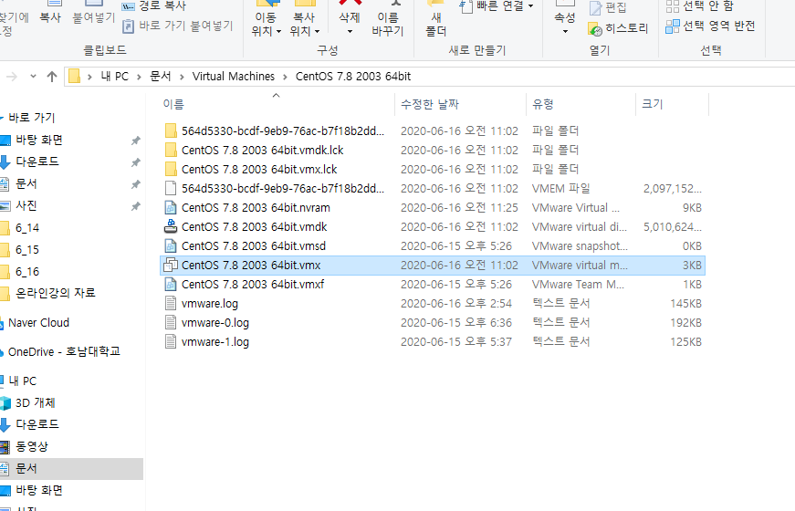
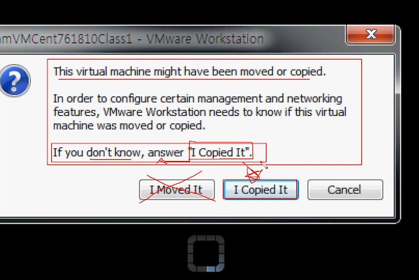
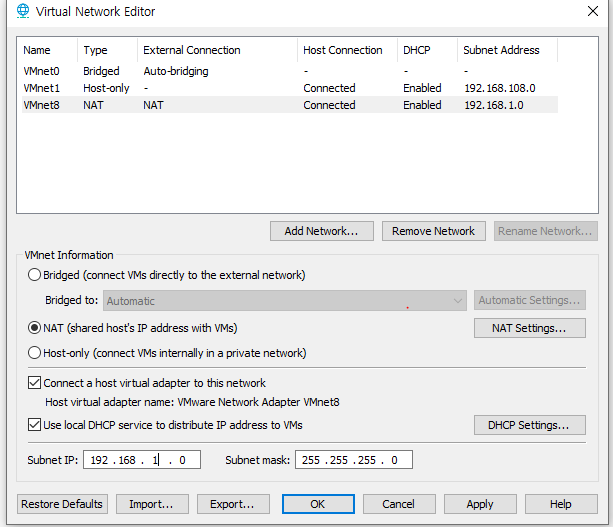
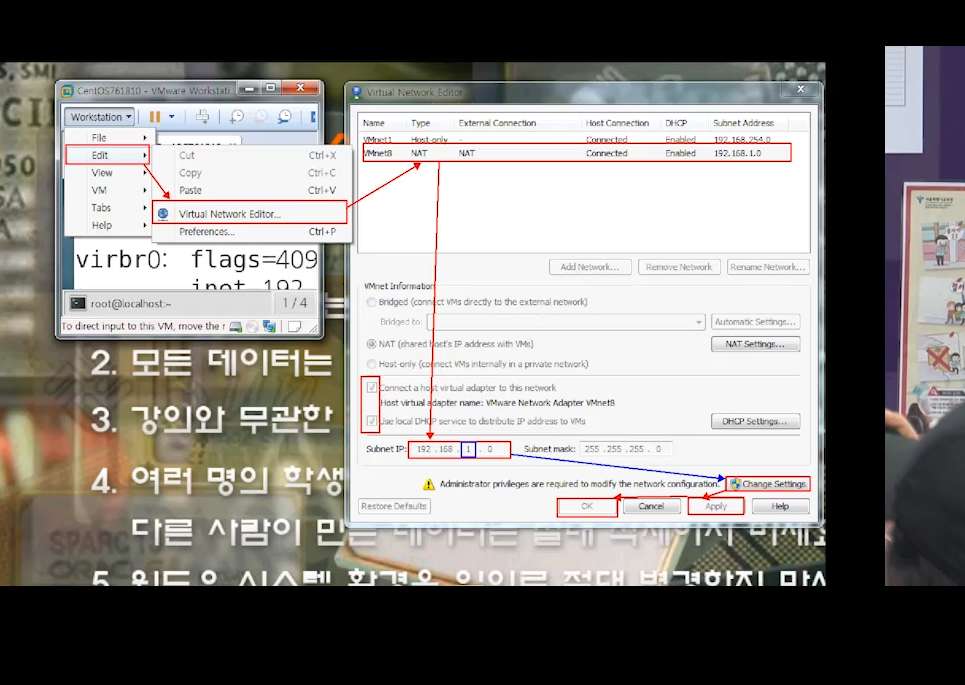

# [2020-06-16 화 TIL]

#### *.vmx 파일 -> vmware 에서 가상 OS 로 돌아가게 해주는 파일 

- 이 파일을 **압축**해서 다른 컴퓨터 가상머신에서 돌려볼수 있음 -> **한마디로 OS 를 들고다님** 

  

  


#### <그림 2>  압축된 vmx 파일 불러오기  (시작버튼 누른화면 )



- I Moved It -> Mac 어드레스까지 전부 복사  -> mac 어드레스는 컴퓨터 한대당 하나이기때문


***

### Network

- vmware - Edit - Virtual Network Editor 실행 

- change settings / subnet IP : 192.168.1.0 수정 
- DHCP : IP 자동할당 역할 







### CentOS 7.8

#### 수동 IP할당 

- ip : 192.168.1.xxx / netmask : 255.255.255.0 / gateway : 192.168.1.2 / nameserver : 192.168.1.2 
- 게이트웨이 2번잡은 이유
  - NAT Settings에 게이트웨이 주소 2번 설정 되있기 때문 

```shell
$ vi /etc/sysconfig/network-scripts/ifcfg-이더넷명
```

```shell
# 디폴트값 
TYPE=Ethernet
PROXY_METHOD=none
BROWSER_ONLY=no
BOOTPROTO=static
DEFROUTE=yes
IPV4_FAILURE_FATAL=no
IPV6INIT=yes
IPV6_AUTOCONF=yes
IPV6_DEFROUTE=yes
IPV6_FAILURE_FATAL=no
IPV6_ADDR_GEN_MODE=stable-privacy
NAME=ens32
UUID=37598759-b486-4239-b43d-ce8d0b14ae42
DEVICE=ens32
ONBOOT=yes

# 고정 IP변경
BOOTPROTO=static
IPADDR="192.168.1.128"
NETMASK="255.255.255.0"
GATEWAY="192.168.1.2"
DNS1="192.168.1.2"
ONBOOT=yes
```

```shell
$ systemctl restart network // 네트워크 재시작 
```

#### Remote Shell connect

```shell
$ ssh 계정명@호스트명(IP주소)
```

- 프롬프트 내 기호 
  - **# : 관리자**
  - **$ : 일반사용자**
  - 실무에선 디렉토리와 파일 글자색이 똑같기때문에 허가권 옆에있는 d / - 기호 확인해서 판별해야함 

### 리눅스 기본명령어 

``` shell
# 현재 디렉토리 위치확인 
$ pwd

# Change Directory : 디렉토리 경로 변경
$ cd [경로]
ex)
    $ cd /home/ : home의 경로로 이동 
    $ pwd
    /home
	
	현재위치에서 
	$ cd ./ : 현재위치로 이동
	$ cd ../ : 상위 디렉토리로 이동
	
1) 절대경로 : /(최상위)에서 시작 (1가지)
2) 상대경로 : 현재위치에서부터 시작 (셀수 X)

# 하위 디렉토리로 3번 이동 
$ cd ../../../ 

# 현재 디렉토리 목록 확인 
$ ls [옵션] [경로]
현재 디렉토리 목록 출력 

# 옵션
$ ls -l : 현재 디렉토리 정보 자세히 출력 
drwxr-xr-x. 3 root root 4096 Jun 15 23:34 a
디 허가권 링크연결갯수 소유권 용량	    날짜 

$ ls -a : 숨김 파일까지 모두 출력 
$ ls -al : 숨김 파일까지 모두 현재 디렉토리 정보 자세히 출력 (.으로 시작하는 것들이 숨김)

# 이 명령은 다중 출력도 가능하다 
$ ls -l /home/user ../test [단일목록] [다중목록]
/home/user:
total 36
drwxr-xr-x. 3 root root 4096 Jun 15 23:34 a
drwxr-xr-x. 2 user user 4096 Jun 15 14:31 Desktop
drwxr-xr-x. 2 user user 4096 Jun 15 14:31 Documents
drwxr-xr-x. 2 user user 4096 Jun 15 14:31 Downloads
drwxr-xr-x. 2 user user 4096 Jun 15 14:31 Music
drwxr-xr-x. 2 user user 4096 Jun 15 14:31 Pictures
drwxr-xr-x. 2 user user 4096 Jun 15 14:31 Public
drwxr-xr-x. 2 user user 4096 Jun 15 14:31 Templates
drwxr-xr-x. 2 user user 4096 Jun 15 14:31 Videos

../test:
total 4
drwxr-xr-x. 3 root root 4096 Jun 15 23:35 c

$ ls -ld 
# 디렉토리 자체의 속성확인 

$ ls -R
# 디렉토리 하위 안에있는 모든 것들의 목록을 출력


# 파일 또는 디렉토리 복사 (기본:파일)
$ cp [옵션] [원본][목적지]
특징(3가지) : 단일 복사 (1개씩 복사)

1) 원본이름을 그대로 써서 복사
2) 원본이름을 생략해서 복사 -> 1), 2) 결과 동일 
3) 원본이름을 바꿔서 복사 


# 하위 2번이동해서 backup 디렉토리의 inittab 파일을 /home/user 디렉에 복사 
$ cp ../../backup/inittab /home/user/
 
$ cp -r : 디렉토리 복사 
# 와일드카드 (*,?)
# * : 모든것
# ? : 한 자리 (문자하나)

# -p : 기존 파일/디렉토리의 소유권 저장해서 복사 
$ cp -p 파일/디렉토리

# 파일 또는 디렉토리를 이동시키는 명령어 : 사용법은 cp와 동일 
$ mv [옵션] [원본][목적지]

# 두 파일 옴기기 
$ mv /backup/inittab /backup/login.defs /home/test

# test디렉토리의 g, i, l로 시작되는 파일을 backup으로 옴기기 
$ mv ../test/g* ../test/i* ../test/l* /backup/


# 디렉토리 생성 
$ mkdir [옵션] [새로만들 디렉토리명]

# e 디렉토리 생성
$ mkdir /home/user/a/b/e

# 필요한 경우 부모 디렉토리 생성 
$ mkdir -p (parent) [경로]

# 빈 디렉토리 삭제
$ rmdir [옵션] [디렉토리 삭제명]

# f를 삭제하려했더니 a,b가 비어있지않아서 삭제 X --> e, f는 삭제된 상태 
[root@localhost user]$ rmdir -p ./a/b/e/f/
rmdir: failed to remove directory ‘./a/b’: Directory not empty

# 파일 또는 디렉터리 삭제 -> rmdir 대신하여 자주사용 
$ rm [옵션] [파일명 또는 디렉토리명]

# 강제 삭제 
$ rm -f 

# 디렉토리 삭제 
$ rm -r 

# 디렉토리 강제 삭제 (주의 : 실행 후 반드시 확인)
$ rm -rf

$ rm -rf /* --> 시스템 망함!!

# test 안에 있는 내용 모두 삭제
$ rm -r /home/test/*


# 도움말 키 메뉴얼
$ man [command:명령어] (j,k 키이동)
$ [command:명령어] --help 

# 복잡한 '문자열'을 짧은 문자열로 바꿔줌 --> 별칭
ex) 
$ alias c='clear'
-> 일시적이라 , 재부팅하면 초기화

# 별칭
최강 == 햄돌이

# 별명(닉네임)
최강 != 햄돌이

# 빈문서 파일생성, (파일 날짜갱신)
$ touch testfile
-rw-r--r--. 1 root root    0 Jun 16 02:44 testfile -> 용량 0

# 캘린더 
$ cal
$ cal 2020

$ date

# 현재 시간으로 동기화하기  (인터넷이 되야함)
$ rdate -s time.bora.net


# 파일에 들어있는 내용을 모두 출력 -> 다 나오지만 일부가 끊길수가 있음 
$ cat [옵션] [경로 파일]

# cat 기능이랑 동일하지만 라인번호를 부여하면서 출력 
$ nl

# 파일 내용을 일부 출력 
$ head [옵션] [경로 파일] -> 파일의 내용중 처음부터 아래로 10줄 출력
$ tail [옵션] [경로 파일] -> 파일의 내용중 밑부터 위로 10줄 출력

# n출 만큼 
$ head/tail [-n] [경로파일]

# 내용이 많은 파일로 인해 화면에 다 출력안되면 모니터 화면단위로 끊어서 출력 (cat, head, tail 단점보안)
$ more [경로파일]
# Enter : 다음 한줄 이동
# Space Bar : 화면 단위
# b : 이전 화면 이동 종료
# q : 종료

# more 단점 : 끝까지 내려가면 종료가 되버림 / 디렉토리는 확인 X

# more 기능으로 etc 디렉토리 확인 가능 
# more을 하면 more은 보조 역할로 사용
$ ls -l /etc/ | more


# more와 비슷하지만 단점 보안 , 파일/디렉토리의 내용을 페이지 단위로 출력 
$ less [경로 파일/디렉토리] -> 제일 유용함 
# more 단축기와 동일기능 , j/k 로 한줄씩 이동가능 
# G -> 맨끝 이동 , g -> 처음이동 


# | : 파이프 라인 -> 명령어 병합해서 사용 
# ip 주소부분까지만 2줄출력 
$ ifconfig | head -2

# more의 기능이 없어짐 -> 문법적 잘못됨
# 응용 : 페이지 번호 보면서 more/less 기능 탑재한 파일/디렉토리 목록 보기 
$ ls -l /etc/ | more | nl -> X # nl은 모든 페이지를 다 출력했기때문에 more기능을 상실함 
$ ls -l /etc/ | nl | more -> 올바른 예
$ ls -l /etc/ | nl | less
$ nl /etc/passwd | less

# cat 추가 기능 (옵션)
# 연산자 (>, <, >>) (리다이렉션)

1) 내용 보기 : < (생략가능)

2) 생성 후 저장 : >
$ cat /etc/passwd > /filetest
# 왼쪽에 파일의 내용을 입력후 오른쪽 파일생성 (왼쪽파일 내용복사와 동일)


3) 출력 후 생성 (새파일 입력해서 생성 후 출력) : >
# a라는 파일을 생성하는데 내용을 입력하고 생성 (윈도우 - 메모장 켜서 입력받기 기다리는 상태)
# 입력 완료 후 [Ctrl + d] -> 저장하기 
$ cat > /home/user/a
$ cat > ./a
# 주의 : 기존에 내용이 있을 때 다시 명령입력해서 수정하면 내용이 바뀜, 위험하다 


4) 내용 추가 : >>
$ cat >> a
# 입력 후 추가내용 저장 (컨트롤 d) 
# 내용은 마지막에 추가됨 

$ cat c >> e # e파일에 c내용을 그대로 복사 (=cat c > e)

5) 파일 병합 : >
# a : 1 2 3 4 5 / b : 6 7 8 9 10

$ cat a b > c # a와 b의 내용을 c라는 파일에 저장 후 생성 
$ cat b a > d # b와 a의 내용을 d라는 파일에 저장 후 생성 (단 위의 명령과 내용순서는 다르다)


# 주어진 조건을 검색하여 이름을 찾는 명령어, 경로를 찾을때 많이쓰임 
# ex) 보안점검 : 아침에 항상 모니터링 함
$ find [경로] -[옵션] ["찾을 이름"]


# 1) 지정한 경로에서 찾을이름 검색을 한 이후, 수정되거나 생성된 것을 검색 
$ find [경로] -newer [찾을이름]
$ find /home -newer test
/home/user/inittab -> test 파일에 뭔가 변화가 일어남 확인표시 (보안 관련확인가능)


# 2) 지정한 경로에서 찾을 이름 검색 --> 중요 
$ find [경로] -name [찾을 이름]
$ find / -name user # 최상위에서 user 이름 검색 (문자열 이름 * 조합 가능)
# 추가 옵션 -type d/f
$ find / -name testfile -type d # 찾고자하는 파일이 디렉토리이니?
$ find / -name testfile -type f # 찾고자하는 파일이 파일이니?


# 참고) 유닉스 != 리눅스 (유닉스 파생) 
# 3) 찾을 이름을 검색하고 , 명령어를 수행한 후 종료
$ find [경로] -name [찾을 이름] -exec 명령어 {} \;
$ (find /home/ -name user) -exec ls -l{} \;  # ()수행 결과가 {}로 들어감 
# /home/user/ 을 검색 후, ls -l /home/user 수행 


# 실행파일의 위치를 찾을때 쓰임 
$ which passwd
/usr/bin/passwd
```

