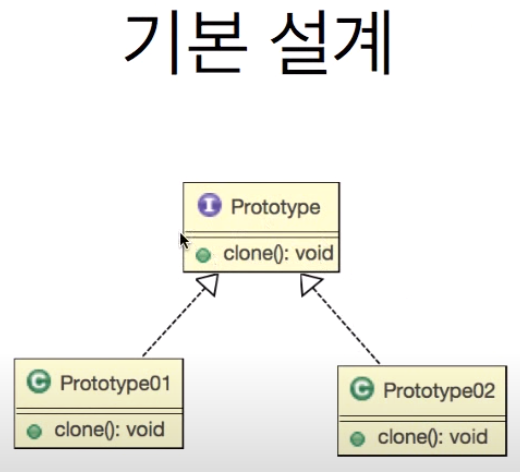
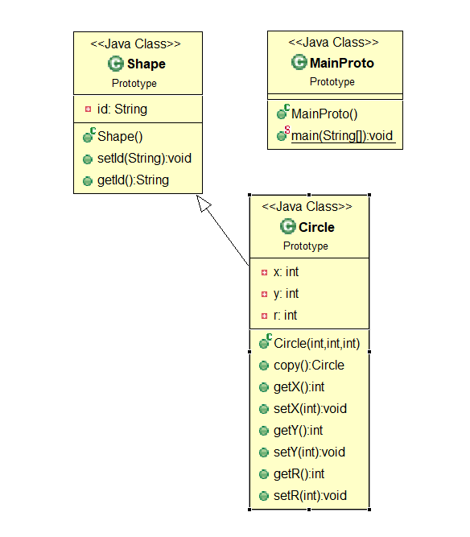
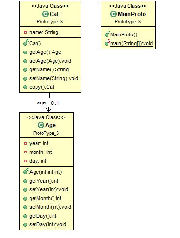

# [2020-06-17 수 TIL]

### `Java Design Pattern`

### Prototype Pattern (프로토타입 패턴)

- **프로토타입?** 
  - [**What Is a Prototype]**(http://imagestory.net/?p=804){: target="_blank"}
  - "론칭 전에 테스트하기 위해 사용되는 **최종 제품의 시뮬레이션** 또는 **샘플 버전**"
- 목표?
  - `최종 제품에 많은 돈과 시간을 쏟아붓기 전에 제품(과 같은 아이디어)을 테스트하는 것 `

***

- **생산비용이 높은 인스턴스를** 복사를 통해서 쉽게 생성 할 수 있도록 하는 패턴 
- 보통은 **new** 키워드를 사용하여 인스턴스를 생성한다 
- 하지만 인스턴스를 다시 생성해야 하는 것이 아니라 **기존 생성되어 있는 인스턴스를 복사**하여 새로운 것을 만들어야 하는 경우가 있는데, 아래와 같다 (인스턴스 생산 비용이 높은 경우 )
- ex) 
  - 우리가 db로 부터 데이터를 가져온 경우를 생각해보자. 프로그램 내에서 여러번 데이터 수정이 이루어진다고 할 때, 똑같은 데이터를 매번 db에서 가져오는 것은 좋은 생각은 아니다
- **종류가 너무 많아서** 클래스로 정리되지 않는 경우 
  - 취급하는 오브젝트의 종류가 너무 많아, 각각을 별도의 클래스로 만들어 다수의 소스 파일을 작성해야함
- 클래스로부터 인스턴스 **생성이 어려운 경우**
  - 생성하고 싶은 인스턴스가 복잡한 작업을 거쳐 만들어지기 때문에, 클래스로부터 만들기가 매우 어려운 경우 
- 프레임워크와 생성할 인스턴스를 분리하고 싶은경우
  - 프레임워크를 특정 클래스에 의존하지 않고 만들고 싶은경우, 클래스 이름을 지정하여 인스턴스를 만드는 것이 아니라 , 이미 모형이 되는 인스턴스를 등록해 두고, 그 인스턴스를 복사하여 생성한다 

```
-- 요구사항 --
1. 
일러스트레이터와 같은 그림 그리기 툴을 개발 중이다
어떤 모양 그릴수 있도록 하고 복사 붙여넣기 기능을 구현

2. 
복사 후 붙여넣기를 하면 두 도형이 겹치는데 안겹치도록 살짝 옆으로 이동
```



#### 예제 1. 원 복사 하기 

```java
package Prototype;

public class MainProto {
	
	public static void main(String[] args) throws CloneNotSupportedException {
		Circle circle1 = new Circle(1, 1, 3);
		Circle circle2 = circle1.copy();
		
		System.out.println(circle1.getX() + "," + circle1.getY() + "," +circle1.getR());
		
		System.out.println(circle1.getX() + "," + circle1.getY() + "," +circle1.getR());
	}
}
package Prototype;

public class Shape implements Cloneable{
	
	private String id;
	
	public void setId(String id) {
		this.id = id;
	}
	
	public String getId() {
		return id;
	}
	
	
}
package Prototype;

public class Circle extends Shape{
	
	private int x;
	private int y;
	private int r;
	
	
	public Circle(int x, int y, int r) {
		super();
		this.x = x;
		this.y = y;
		this.r = r;
	}

	public Circle copy() throws CloneNotSupportedException {
		Circle circle = (Circle) clone();
        // clone() 메서드는 Object클래스안에 protected로 정의되어있는데 
        // Cloneable 인터페이스를 명시적으로 구현해줘야 사용가능
        
		circle.x += 1;
		circle.y += 1;
		
		return circle;
	}
	
	public int getX() {
		return x;
	}
	public void setX(int x) {
		this.x = x;
	}
	public int getY() {
		return y;
	}
	public void setY(int y) {
		this.y = y;
	}
	public int getR() {
		return r;
	}
	public void setR(int r) {
		this.r = r;
	}
	
	
}

```

***

#### 얕은 복사 / 깊은 복사

- 얇은 복사 : 주소까지 복사 
- 깊은 복사 : 인스턴스만 복사 

<클래스 설계>



```java
public class MainProto {
	
	public static void main(String[] args) throws CloneNotSupportedException {
		
		Cat navi = new Cat();
		navi.setName("navi");
		navi.setAge(new Age(2013,2,13));
		
//		Cat yo = navi;        // 주소까지 복사 --> 얕은 복사 (결과 : 전부 바뀜)
		Cat yo = navi.copy(); // 주소가 다르다 --> 깉은 복사 (하나씩 올바르게 바뀜)
		yo.setName("yo"); //
		yo.getAge().setYear(2020);
		yo.getAge().setMonth(12);
		yo.getAge().setDay(30);
		
		System.out.println(navi.getName()); 
		System.out.println(navi.getAge().getYear());
		System.out.println(navi.getAge().getMonth());
		System.out.println(navi.getAge().getDay());
		
		System.out.println();
		System.out.println(yo.getName());   
		System.out.println(yo.getAge().getYear());
		System.out.println(yo.getAge().getMonth());
		System.out.println(yo.getAge().getDay());		
	}
}

public class Cat implements Cloneable{
	
	private String name;
	private Age age;
	

	public Age getAge() {
		return age;
	}

	public void setAge(Age age) {
		this.age = age;
	}

	public String getName() {
		return name;
	}

	public void setName(String name) {
		this.name = name;
	}
	
	public Cat copy() throws CloneNotSupportedException {
		// 명시적 복사 해줘야 깊은 복사가 된다 = this
		Cat cat = (Cat)this.clone();
		cat.setAge(new Age(this.age.getYear(), this.age.getMonth(), this.age.getDay()));
		return cat;
	}
}

public class Age {
	
	private int year;
	private int month;
	private int day;
	
	public Age(int year, int month, int day) {
		 super();
		 this.year = year;
		 this.month = month;
		 this.day = day;
	}
	
	public int getYear() {
		return year;
	}
	public void setYear(int year) {
		this.year = year;
	}
	public int getMonth() {
		return month;
	}
	public void setMonth(int month) {
		this.month = month;
	}
	public int getDay() {
		return day;
	}
	public void setDay(int day) {
		this.day = day;
	}
	
	
	
}

```

#### **Clone**()

**자바에서 Clone은 Cloneable 클래스를 상속한 클래스에서 clone() 메서드를 호출하여 구현할 수 있습니다.**

**clone이 호출되면 해당 클래스의 인스턴스를 복사해서 반환하게 됩니다. 몇 가지 주의할 점이 있습니다.**

1. Cloneable 인터페이스를 상속하지 않은 경우
   - CloneNotSupportedException이 발생하게 됩니다.
2. 클래스 명이 같다.
   - 클래스를 복사하였기 때문에 클래스 명이 같습니다.
3. hashCode() 의 리턴값이 다르다.
   - 아예 다른 객체가 리턴되기 때문에, hashCode()의 리턴값이 다릅니다.
4. 얕은 복사가 이루어진다.
   - 만약에 복사할 객체가 다른 객체를 가지고 있다면, 객체에 대한 참조가 복사되는 것이지 객체 자체가 따로 복사되는 것은 아닙니다. 만약에 객체를 깊은 복사로 완전히 복사할 필요가 있다면, clone 메서드를 오버라이드 하여 재정의해야 할 것입니다.
5. 객체가 생성되는 것이 아니다.
   - 복사만 하는 것이고, 생성자를 따로 호출하는 것은 아닙니다.

### **정리 - (ProtoType Clone을 사용해야 할 때)**

- 클래스가 런타임에 인스턴스화 될 때
- 객체 생성 비용이 비싸거나 복잡한 경우.
- 응용 프로그램의 클래스 수를 최소로 유지하려는 경우
- 클라이언트 응용 프로그램이 객체 생성 및 표현을 인식하지 못하는 경우

**프로토 타입 패턴의 장점**

- 서브 클래 싱의 필요성을 줄입니다.
- 객체 생성의 복잡성을 숨 깁니다.
- 클라이언트는 어떤 유형의 객체인지 모른 채 새로운 객체를 얻을 수 있습니다.
- 런타임에 객체를 추가하거나 제거 할 수 있습니다.

## 마무리

프로토타입 패턴은 실제로 다양하게 사용하는 부분을 만나기는 쉽지 않았습니다. 아무래도 클래스를 new 로 생성하지 않고 복사해서 생성하는 경우는 내부 데이터까지 완전히 동일한 인스턴스가 따로 필요한 경우일 거 같은데, 그림판에서 도형을 복사 - 붙여넣기 하는 것과 비슷한 코드를 많이 작성할 기회가 많지 않았던 거 같습니다.

 