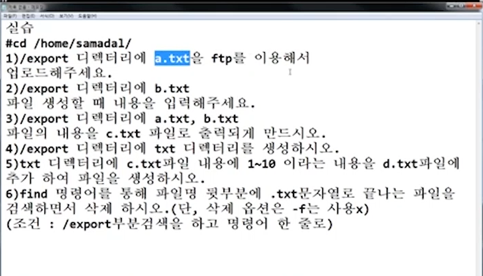
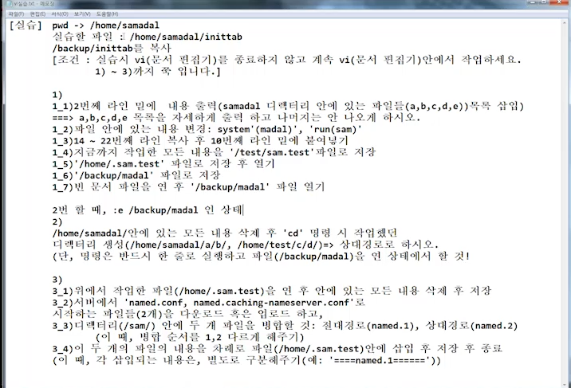

# [2020-06-17 수 TIL] 

### `Linux`

- 18,19,25 차시  다시 풀기 

### FTP service (File Transfer Protocol)

- 서로 다른 시스템 끼리 파일을 공유함 (다운로드 , 업로드)

```shell
# 윈도우 cmd 접속 
$ ftp 호스트명(ip)

# 현재위치 이동후 진행 
ftp> put "파일명"  # 업로드

ftp> get "파일명"  # 다운로드
```

<그림 실습>



***

### Vi and Vim text Editor 

- 윈도우 메모장 (텍스트 편집기)와 동일한 기능 

- ```shell
  $ vi [파일이름]
  # 방향키, 백스페이스 사용금지권장 -> 서버 구축할때 알수없는 이슈 발생 가능성 있음 
  ```

- 모드

  - #### 명령모드

    - vi 기본모드이다 
    - **"ESC" 키** 누른경우 이동

    - **소문자**  :  **단어, 공백, 특수문자를** 기준으로 이동
    - **대문자**  :  **공백을** 기준으로 단어 이동 

    

    - <표> 입력 모드로 전환

      | Key   | 동작                                                         |
      | ----- | ------------------------------------------------------------ |
      | **i** | 현재 위치에서 입력 모드로 변경                               |
      | **a** | 현재 위치에서 우측으로 한 칸 이동 후 입력모드로 변경         |
      | **o** | 커서 아래에 새로운 행을 추가하고 입력모드로 변경 (대문자 O : 커서 위 추가 ) |

      

    

    - 복사 / 붙여넣기 / 삭제 

      | Key       | 동작                                            |
      | --------- | ----------------------------------------------- |
      | x         | 커서가 있는 문자 삭제 (delete)                  |
      | X         | 커서가 있는 앞 문자 삭제 (backspace)            |
      | dd        | 현재 커서의 행 삭제                             |
      | 숫자 + dd | 현재 커서부터 숫자만큼 행 삭제  (연속입력)      |
      | yy        | 현재 커서가 있는 라인을 복사                    |
      | 숫자 + yy | 현재 커서부터 숫자만큼의 행을 복사 (연속입력)   |
      | p         | 복사한 내용을 현재 라인 이후에 붙여넣기  (아래) |
      | P         | 복사한 내용을 현재 라인 이전에 붙여넣기  (위에) |

      dw : w가 이동한만큼 삭제 

      

    - 커서 이동 (단락(한페이지에 해당) 단위)
  
      | Key      | 동작                      |
      | -------- | ------------------------- |
      | H        | 단락의 맨 처음으로 이동   |
    | M        | 단락의 중간으로 이동      |
      | L        | 단락의 맨 마지막으로 이동 |
    | u        | 이전 작업으로 돌아가기    |
      | Ctrl + r | 다음 작업으로 돌아가기    |

      
  
    - 커서이동 (문자 단위)
  
      | Key  | 동작                   |
      | ---- | ---------------------- |
    | h    | 커서를 왼쪽으로 이동   |
      | j    | 커서를 아래로 이동     |
    | k    | 커서를 위로 이동       |
      | l    | 커서를 오른쪽으로 이동 |

      
  
    - 커서이동 (단어 단위)
  
      | key  | 동작                      |
    | ---- | ------------------------- |
      | W, w | 다음 단어의 처음으로 이동 |
    | E, e | 단어의 끝으로 이동        |
      | B, b | 단어의 처음으로 이동      |

      
  
    - 커서이동 (행 단위)
  
    | Key      | 동작                 |
    | -------- | -------------------- |
    | 0 (Zero) | 행의 처음으로 이동   |
    | $        | 행의 마지막으로 이동 |

      
  
    - 커서이동 (문서 단위)
  
    | Key  | 동작                   |
    | ---- | ---------------------- |
    | G    | 문서의 마지막으로 이동 |
    | gg   | 문서의 처음으로 이동   |

    

  - #### **실행(Ex) 모드** 
  
    - 검색기능 ( / 와 ? 는 같은기능 )
  
      | Key      | 동작                                        |
      | -------- | ------------------------------------------- |
    | /Pattern | Pattern을 검색 (아래서부터 순차적으로 검색) |
      | ?Pattern | Pattern을 검색 ()                           |
    | n        | 검색 후 위로 찾기                           |
      | N        | 검색 후 아래로 찾기                         |

      
  
    - **치환 (중요함)**

      | Key                                    | 동작                           |
    | -------------------------------------- | ------------------------------ |
      | :[범위]s/[기존내용)]/[바꿀내용]/[옵션] | 기존내용을  바꿀내용 으로 치환 |

      - 범위를 생략하면 기준은 커서 기준인데 **커서가 있는 줄** 이다 

      - 범위는 n 혹은 n,n 혹은 % (범위문서전체 : ALL) 을 넣을 수 있다

      - g 옵션을 주면 적용되는 라인의 모든 부분 변경
  
      - g 옵션을 주지 않으면 처음 찾은 부분만 변경 
  
      - ```shell
        # 하나씩 대상 
        
        $ :s/linux/ck
        # 현재 커서가 있는 줄 중에서 왼쪽 -> 오른쪽 기준으로 :'하나'만 치환
        
        $ :5s/linux/ck
        # 5번째 줄에서 왼쪽으로 가까운 문자열을 하나만 치환 
        
        $ :9,13s/linux/ck
        # 9번째 줄부터 13줄 까지 문자열을 치환 
        
        
        # 전체 대상
        
        $ %s/linux/ck
        # 문서 전체에서 라인에 한개만 바꿈
        
        $ %s/linux/ck/g
        # 문서 전체 모든 것을 치환 (한개만 있는게 아니라 여러개 있으면 전부 다바꿈)
      
        $ 9,13s/linux/ck/g
        # 9번째~13번째 라인에서 모두 치환 
        ```

      

      -  (콜론명령) -> 문서전체   
  
      - Shell (**명령어 해석기**) 명령어 --> (기계어로 번역, 인터페이스 역할 )
  
        | Key           | 동작                                                         |
      | ------------- | ------------------------------------------------------------ |
        | :set nu       | 라인 번호 매기기                                             |
      | :! [command]  | vi 를 잠시 중단하고 명령어 수행 **(파일경로 햇갈릴 때 자주 사용 , cd X)** |
        | :.! [command] | 수행한 명령의 결과를 vi 편집기로 출력한다                    |

        
  
      - #### **파일관련**
  
        | Key                | 동작                                                         |
        | ------------------ | ------------------------------------------------------------ |
        | :e [filename]      | 현재 작업중인 파일을 닫고 filename 이름인 파일을 열기        |
        | :enew              | 현재 창을 닫고 빈 문서를 연다                                |
      | :q                 | 종료 (변경된 내용이 없는경우)                                |
        | :q!                | 강제 종료 (변경된 내용이 있어도 무시)                        |
      | :w                 | 파일 저장                                                    |
        | :wq                | 파일 저장 후 종료                                            |
      | :w [새로운 파일명] | 다른 이름으로 파일을 저장한다 (윈도우 - 다른이름으로 저장)   |
        | :w >> [파일명]     | 파일명에 내용추가                                            |
        | :f                 | 파일의 이름이 뭔지 햇갈릴 때 파일 이름 출력                  |
        | :[n]r [파일명]     | 파일명 파일의 내용을 현재 편집중인 파일의 n 라인 밑에서부터 삽입 |
        | :[n]r! [command]   | Command 실행결과를 파일의 n 라인 밑에서부터 삽입             |
        
        
        
      - ETC
      
        | Key       | 동작                |
        | --------- | ------------------- |
        | :set ts=4 | Tab 사이즈 조절     |
        | :set nonu | 라인 번호 비활성화  |
        | :nohi     | High light 비활성화 |
      
        
  
  ```shell
  # 저장 안했을 떄 
  E37: No write since last change (add ! to override)
  ```
  
  - #### 입력모드
  
    - 명령모드에서 **a / i / o / O 키**를 누르면 진입 

***

<문제>



```shell
(정답)

1-1) :2r! ls -l ? # 2번째 라인 밑에서 부터 명령 실행삽입
1-2) :%s/system/madal/g  ,  :%s/run/sam/g # 모든 문자 치환 
1-3) 9yy 이후 10라인 커서 위치후 p
1-4) :w /test/sam.test
# E212 : Can`t open file for writing (변경할 수 있는 상태인지 확인해야함)
:! ls -l /test # 파일확인 
:! mkdir /test # 없다면 생성
:! ls -l /test/sam.test # 파일확인

1-5) :w /home/.sam.test
:! ls -al /home # 확인


2) vi 나가지 않고 rm 과 mkdir을 같이 한줄로 사용하라 (상대경로로)
# 시도
$ mkdir ./a/b /a/b
# 정답 (세미콜론은 다중 명령이 있을때 붙여서 쓰기 가능)
$ :! rm -rf *; mkdir -p a/b/ ../test/c/d/

3) 

```


```shell
# 시스템 종료 
$ init 0 
```

