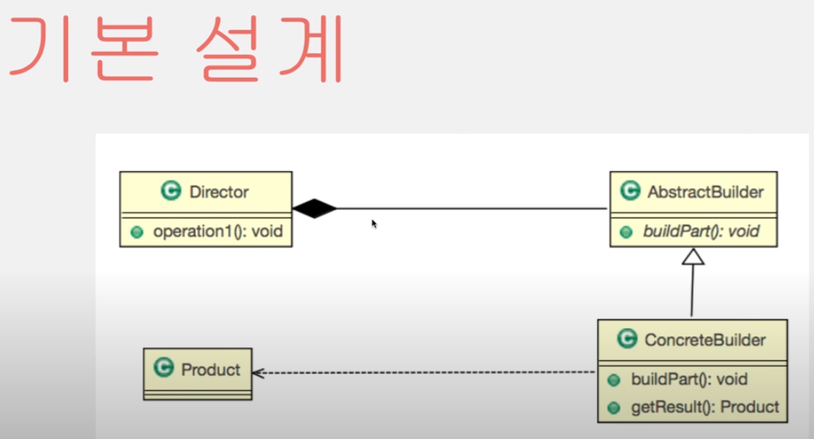
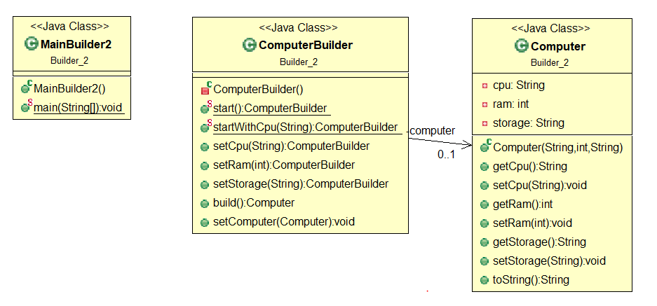

# [2020-06-18 목 TIL]

### `Java Design Pattern`  - Builder Pattern

- Builer
  - 건축업자, 시공자, 건조자
  - (새 국가 등) 건설자
- 특징
  - **"복잡한 단계를 거쳐야 생성되는 객체의 구현을 서브 클래스에게 넘겨주는 패턴"** -  < Ex 1 >
  - **"많은 인자를 가진 객체를 생성을 다른 객체의 도움으로 생성하는 패턴 "** \-  < Ex 2 >
- 인스턴스를 생성할 때, 생성자(Constructor)만을 통해서 생성하는 데는 어려움이 있다. 빌더 패턴은 이 문제를 기반으로 고안된 패턴 중 하나이다.
- 예를 들면, **생성자 인자로 너무 많은 인자가 넘겨지는 경우** 어떠한 인자가 어떠한 값을 나타내는지 확인하기 힘들다.
- 또 어떠한 인스턴스의 경우에는 특정 인자만으로 생성해야 하는 경우가 발생한다
- 이럴 경우, 특정 인자에 해당하는 값을 null로 전달해줘야 하는데, 
- 이는 코드의 가독성 측면에서 매우 좋지 않다는 것을 직감적으로 알 수 있다.




#### < Ex 1. 컴퓨터 생산 >


```
-- 설계 -- 

1. 컴퓨터 클래스 정의(cpu, 메인보드, 스토리지, 메모리 등..)
2. 컴퓨터를 만들수 있는 설계도 추상클래스 정의 (blueprint) 
 - 설계도의 각 서브클래스들은 컴퓨터를 가지고 있다 
   
3. 설계도를 보고 만들수 있는 컴퓨터공장 클래스 정의 
 - 공장은 설계도를 가지고 있다 , 컴퓨터를 만들수 있다, 설계도를 작성한다 

4. 메인 클래스 정의
 - 컴퓨터 공장생성
 - 공장에서 LG gram의 설계도를 생성한다 
 - 설계도를 보고 만든다 
 - 공장에서 다 만든 컴퓨터를 가져온다 
 - 컴퓨터의 정보를 출력해준다 

* LG gram 설계도 (서브클래스)에 복잡한 컴퓨터의 생성과 구현을 떠넘겨줬다 - 빌더패턴
```

```java
package Builder;

// Product
public class Computer {
	
	private String cpu;
	private int ram;
	private String storage;
	
	public Computer(String cpu, int ram, String storage) {
		//super();
		this.cpu = cpu;
		this.ram = ram;
		this.storage = storage;
	}
	
	public String getCpu() {
		return cpu;
	}
	public void setCpu(String cpu) {
		this.cpu = cpu;
	}
	public int getRam() {
		return ram;
	}
	public void setRam(int ram) {
		this.ram = ram;
	}
	public String getStorage() {
		return storage;
	}
	public void setStorage(String storage) {
		this.storage = storage;
	}
	
	// 객체 속성보려면 toString 오버라이드 해야함 
	@Override
	public String toString() {
		return "Computer[cpu=" + cpu + ", ram=" + ram + ", storage=" + storage + "]";
	}
	
}

// AbstractBuilder
public abstract class BluePrint { // 아키텍처 또는 공학 설계를 문서화한 기술 도면을 인화로 복사하거나 복사한 도면을 말한다. 
	
	/* 기본적으로 설계도의 모양은 이런 부분이 필요하다 정의해줌 - BuildPart */
	public abstract void setCpu();
    public abstract void setRam();
    public abstract void setStorage();
    
    public abstract Computer getComputer();
}

package Builder;

// ConcreateBuilder
public class LgGramBluePrint extends BluePrint{

	private Computer computer;
	
	public LgGramBluePrint() {
		computer = new Computer("default",0,"default");
	}
	
	
	/* ConcreteBuilder - 구체적으로 구현하는 부분이다 */
	@Override
	public void setCpu() {
		computer.setCpu("i7");
	}

	@Override
	public void setRam() {
		computer.setRam(16);
	}

	@Override
	public void setStorage() {
		computer.setStorage("500G SSD");
	}
	
	public Computer getComputer() {
		return computer;
//		return new Computer("i7", 16, "500G SSD");
	}

}

// director 관리자 -> 컴퓨터를 만들어줌 
public class ComputerFactory {
	
	private BluePrint blueprint;
	
	/* 컴퓨터를 만들어 주기 위한 메서드 , 다양한 설계도 가지고있어야함 : 인수 blueprint */
	public void setBluePrint(BluePrint bluePrint) {
		this.blueprint = bluePrint;
	}
	
	public void make() {
		blueprint.setCpu();
		blueprint.setRam();
		blueprint.setStorage();
	}
	
	public Computer getComputer() {
		return blueprint.getComputer();
	}
}

public class MainBuilder {
	
	public static void main(String[] args) {
		
		ComputerFactory factory = new ComputerFactory(); // 컴퓨터 공장
		
		// 공장에서 LG gram의 설계도를 생성 후 만든다 
		factory.setBluePrint(new LgGramBluePrint());  
		factory.make(); 
		
		Computer computer = factory.getComputer(); // 공장에서 컴퓨터를 가져온다 
		
//		Computer computer = new Computer("i7", "16G", "256G ssd");
		
		System.out.println(computer.toString());
	}
}

/* 
Computer[cpu=i7, ram=16, storage=500G SSD]
*/
```


#### < Ex 2.  컴퓨터가 여러개 있을때  >



```java
package Builder_2;

// Product
public class Computer {
	
	private String cpu;
	private int ram;
	private String storage;
	
	
	/* 도큐먼트 
	 * @param 
	 * @param
	 * @param
	 */
	
	public Computer(String cpu, int ram, String storage) {
		//super();
		this.cpu = cpu;
		this.ram = ram;
		this.storage = storage;
	}
	
	public String getCpu() {
		return cpu;
	}
	public void setCpu(String cpu) {
		this.cpu = cpu;
	}
	public int getRam() {
		return ram;
	}
	public void setRam(int ram) {
		this.ram = ram;
	}
	public String getStorage() {
		return storage;
	}
	public void setStorage(String storage) {
		this.storage = storage;
	}
	
	// 객체 속성보려면 toString 오버라이드 해야함 
	@Override
	public String toString() {
		return "Computer[cpu=" + cpu + ", ram=" + ram + ", storage=" + storage + "]";
	}
	
}
package Builder_2;

public class ComputerBuilder {
	
	private Computer computer;
	
	private ComputerBuilder() {
		computer = new Computer("defalut",0,"defalut");
	}
	
	public static ComputerBuilder start() {
		return new ComputerBuilder();
	}
	
	//가독성 좋게 만들기 - static 사용
	public static ComputerBuilder startWithCpu(String cpu) {
		ComputerBuilder builder = new ComputerBuilder();
		builder.computer.setCpu(cpu);
		return builder;
	}
	
	public ComputerBuilder setCpu(String cpu) {
		computer.setCpu(cpu);
		return this;
	}
	
	public ComputerBuilder setRam(int ram) {
		computer.setRam(ram);
		return this;
	}

	public ComputerBuilder setStorage(String storage) {
		computer.setStorage(storage);
		return this;
	}
	
	public Computer build() {
		return this.computer;
	}
	
	public void setComputer(Computer computer) {
		this.computer = computer;
	}
}
package Builder_2;

public class MainBuilder2 {
	
	public static void main(String[] args) {
		
		Computer computer = ComputerBuilder
            .start()
            .startWithCpu("i7")
            .setRam(8)
            .setStorage("256g SSD")
            .build(); 
				
		System.out.println(computer.toString());
	}
}

```

***

### Error : Cannot make a static reference to the non-static method startWithCpu(String) from the type ComputerBuilder

- 참고 : http://blog.naver.com/PostView.nhn?blogId=reeeh&logNo=220430580978&parentCategoryNo=&categoryNo=&viewDate=&isShowPopularPosts=false&from=postView
- non-static에 대한 접근을 제한한다 
- 해결방법
  - 메소드를 static으로 선언
  - 메소드 사용시 객체를 만들어서 메소드 사용하는 방법
- **메모리 사용면에서** 보면 static은 프로그램 종료 시 까지 계속 남아있기 때문에 안쓰는게 좋음 
- **가독성에서** 보면 필요할 때 써주는게 좋음 

***

### UML 다이어그램 그리기

- https://gmlwjd9405.github.io/2018/07/04/class-diagram.html
- https://blog.naver.com/1ilsang/221104669002