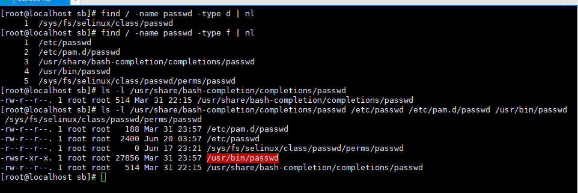

# [2020-06-20 토 TIL]

### `Linux`

### 특수 권한 (Sticky Bit, SetUID, Umask) : 보안성 강화

- **Sticky Bit** : `rwx-rwx-rwt`

  - 777 권한보다 보안성이 좋음 
  - chmod **1***** 파일명/디렉토리명 
  - 공유 디렉토리 사용하는데 w의 권한에서 `수정과 삭제` 만큼은 소유자(본인)만 가능한 특수권한 

- **SetUID** : `rws-rwx-rwx` (위험함)

  

  - chmod **4***** 파일명/디렉토리명 
  - 사용자 계정에서 `passwd 사용자명 ` 비밀번호를 변경하는 행위는 관리자(root) 만 가능 
  - `passwd` 만 사용하면 자기 자신을 변경하기 때문에 가능 
  - `chmod 4755 passwd`
    - passwd라는 명령어를 실행하여 **실행하는 동안만** 'w' 가 없을 경우 owner에 권한 값이 SetUID 일경우 `실행한는 동안만` 임시로 권한값을 (없는 것만)잠시 빌려준 후, 명령이 실행이 끝나면 초기화 됨 

- **SetGID** : `rwx-rws-rwx`

  - SetUID 와 기능 동일 
  - 실무에선 잘쓰지 않음
  - chmod **2***** 파일명/디렉토리명 

- **Umask**

  - umask [mode] 
  - 모드는 권한값 - 파일이나 디렉터리 생성 시 자동으로 기본 허가권(Permission)을 지정하는 지시자 역할
  - 즉, 자기가 원하는 허가권값으로 적용 시켜서 파일 또는 디렉터리 생성할 때 쓰는 명령어이다
  - 디렉터리에 최대 허가권은 rwxrwxrwx:777 
  - 파일에 최대 허가권은    rw-rw-rw-:666
  - **단, 재부팅 시 umask 값을 원래 값으로 돌아온다 = 022**

```shell
# /tmp : 임시 공용 저장소 (초기 시스템 설정이 초기화 되서 돌아옴 )

$ umask 033

# 계산법

	rw-rw-rw-
-   ----wx-wx
==============
	rw-r--r--

462        rw-rw-rw
실습        -
1. 	473  r--rwx-wx 권한부여 
$ umask 304
# 디렉토리는 473 , 파일은 462 (x값이 없기때문에 동일하다 )
```

***

### 재부팅 명령어

```shell
$ reboot
$ init 6
$ shutdown -r now
$ shutdown -h now # 종료
```

