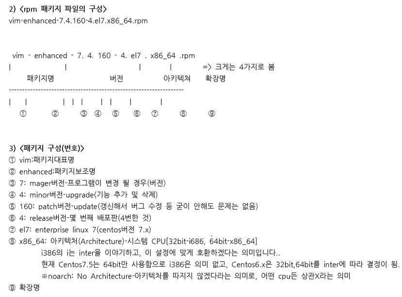

# [2020-06-21 일 TIL]

### `Linux`

### rpm 패키지

- **rpm** (**r**edhat **p**ackages **m**anagement) - **수동방법**
  - 클라이언트 시장 - 윈도우 점유이후 나옴 
  - 리눅스에 프로그램 설치 시 사용

```shell
# rpm 작업 (외우기)

option 
-i(install) : Redhat계열 리눅스에 설치되어 있지않은 패키지를 설치 
-v(verbose) : 상세하게 과정을 출력 
-h(hash) : 패키지를 설치할때 해쉬마크(#)
-q : query
-a : all
-U : upgrade(해야함)/update
--nodeps : 

# 1. 패키지 설치
$ rpm -ivh [패키지 전체이름]

# 2. 패키지 삭제
$ rpm -e [패키지 명]

# 3. 설치된 패키지 확인 -> (설치/삭제)하기 전 확인 
$ rpm -qa | grep [패키지 명]

# rpm -qa : 전체 다보여줌 


$ rpm -qa | grep vim
vim-common-7.4.629-6.el7.x86_64
vim-filesystem-7.4.629-6.el7.x86_64
vim-enhanced-7.4.629-6.el7.x86_64
vim-minimal-7.4.629-6.el7.x86_64.rpm


$ vim-minimal-7.4.629-6.el7.x86_64.rpm

# 패키지 구조
vim-minimal-  : 패키지명들
7.4.629-6.el7 : 패키지 버전
.x86_64 	  : 시스템 Architeture (cpu 호환)  # 중요 : 잘못하면 시스템 망가짐 
i386은 32bit, i686은 64bit - x86_64과 기능이다름
noarch은 32,64bit 둘다 지원
.rpm		  : 확장명

```



***

### rpm 공식

1. 의존성 오류(Failed dependencies)를 **절대** 무시하지 말자
   - **의존성 오류가 나오면 무조건 왼쪽 / 오른쪽 파일명 확인**
2. 의존성 오류(Failed dependencies)를 제기한 패키지부터 작업을 진행한다
3. 디렉토리로 구성된 것들(/usr/bin/)은 패키지가 아니므로 의존성 오류를 무시한다
4. **'lib'** 으로 시작하고, 중간에 **'so'** 로 되어 있는 것들은 의존성 오류를 무시해도 된다
5. 모든 패키지들은 반드시 **동일한 버전** 이어야 한다
6. 모든 작업은 **대표 패키지부터** 작업을 진행한다
7. 나머지 패키지들은 보이는 화면 순서대로 작업을 진행한다
8. **가급적** 의존성 무시(--nodeps) 를 쓰지 않도록 한다 **(즉, 어쩔 수 없는 경우만 사용)**
9. 의존성 작업할땐 여러 창 켜서 작업하는게 좋음 (패키지 설치 확인 하기 위해 )

***

#### RPM-GPG-KEY 문제 해결

- https://jootc.com/p/20170207191
- `rpm --import /etc/pki/rpm-gpg/RPM*`

```shell
[root@localhost samadal]# rpm -ivh mariadb-5.5.65-1.el7.x86_64.rpm 
경고: mariadb-5.5.65-1.el7.x86_64.rpm: Header V3 RSA/SHA256 Signature, key ID f4a80eb5: NOKEY
오류: Failed dependencies:
	mariadb-libs(x86-64) = 1:5.5.65-1.el7 is needed by mariadb-1:5.5.65-1.el7.x86_64
[root@localhost samadal]# rpm --import /etc/pk
pkcs11/ pki/    
[root@localhost samadal]# rpm --import /etc/pki/rpm-gpg/RPM*
[root@localhost samadal]# rpm -ivh mariadb-5.5.65-1.el7.x86_64.rpm 
오류: Failed dependencies:
	mariadb-libs(x86-64) = 1:5.5.65-1.el7 is needed by mariadb-1:5.5.65-1.el7.x86_64

```

***

### mariadb* 패키지

```shell
# 패키지 버전이 안나오는 경우 -> perl-GD 이렇게 검색
$ perl(GD) is needed by mariadb-bench-1:5.5.65-1.el7.x86_64
왼쪽 / 오른쪽 확인 (is needed by)

# 이 경우는 위처럼 해석 X
# pkgconfig(libpcre)  -> 패키지의 종류가 괄호안에 있는 것이다 
# 패키지가 없음 -> --nodeps 이용해서 설치

[root@localhost samadal]# rpm -ivh mariadb-test-5.5.65-1.el7.x86_64.rpm 
오류: Failed dependencies:
	perl(Env) is needed by mariadb-test-1:5.5.65-1.el7.x86_64
	perl(Test::More) is needed by mariadb-test-1:5.5.65-1.el7.x86_64
	# 이경우 perl-Test 패키지가 있는데 종류가 많다는 의미 - 36개 
	# --nodeps 이용해서 설치함 


# centos 8.는 devel,test 의존성 해결방법이 달라짐 
[root@localhost samadal]# rpm -qa | grep mariadb
mariadb-libs-5.5.65-1.el7.x86_64
mariadb-devel-5.5.65-1.el7.x86_64 # nodeps 이용가능
mariadb-embedded-5.5.65-1.el7.x86_64
mariadb-test-5.5.65-1.el7.x86_64  # nodeps 이용가능
mariadb-bench-5.5.65-1.el7.x86_64
mariadb-embedded-devel-5.5.65-1.el7.x86_64
mariadb-5.5.65-1.el7.x86_64
mariadb-server-5.5.65-1.el7.x86_64

```

***

### php 패키지

```shell
root@localhost samadal]# rpm -qa | grep php
[root@localhost samadal]# rpm -ivh php-5.4.16-48.el7.x86_64.rpm 
오류: Failed dependencies:
	httpd-mmn = 20120211x8664 is needed by php-5.4.16-48.el7.x86_64
	php-common(x86-64) = 5.4.16-48.el7 is needed by php-5.4.16-48.el7.x86_64
	php-cli(x86-64) = 5.4.16-48.el7 is needed by php-5.4.16-48.el7.x86_64
	httpd is needed by php-5.4.16-48.el7.x86_64
[root@localhost samadal]# rpm -ivh php-common-5.4.16-48.el7.x86_64.rpm 
오류: Failed dependencies:
	libzip.so.2()(64bit) is needed by php-common-5.4.16-48.el7.x86_64
[root@localhost samadal]# rpm -ivh php-cli-5.4.16-48.el7.x86_64.rpm 
오류: Failed dependencies:
	php-common(x86-64) = 5.4.16-48.el7 is needed by php-cli-5.4.16-48.el7.x86_64
[root@localhost samadal]# rpm -ivh php-common-5.4.16-48.el7.x86_64.rpm --nodeps
준비 중...                         ################################# [100%]
Updating / installing...
   1:php-common-5.4.16-48.el7         ################################# [100%]
[root@localhost samadal]# rpm -ivh php-cli-5.4.16-48.el7.x86_64.rpm 
준비 중...                         ################################# [100%]
Updating / installing...
   1:php-cli-5.4.16-48.el7            ################################# [100%]
[root@localhost samadal]# rpm -ivh php-5.4.16-48.el7.x86_64.rpm 
오류: Failed dependencies:
	httpd-mmn = 20120211x8664 is needed by php-5.4.16-48.el7.x86_64
	httpd is needed by php-5.4.16-48.el7.x86_64
[root@localhost samadal]# rpm -ivh httpd-2.4.6-93.el7.centos.x86_64.rpm 
오류: Failed dependencies:
	/etc/mime.types is needed by httpd-2.4.6-93.el7.centos.x86_64
	httpd-tools = 2.4.6-93.el7.centos is needed by httpd-2.4.6-93.el7.centos.x86_64
	libapr-1.so.0()(64bit) is needed by httpd-2.4.6-93.el7.centos.x86_64
	libaprutil-1.so.0()(64bit) is needed by httpd-2.4.6-93.el7.centos.x86_64
[root@localhost samadal]# rpm -ivh httpd-tools-2.4.6-93.el7.centos.x86_64.rpm 
오류: Failed dependencies:
	libapr-1.so.0()(64bit) is needed by httpd-tools-2.4.6-93.el7.centos.x86_64
	libaprutil-1.so.0()(64bit) is needed by httpd-tools-2.4.6-93.el7.centos.x86_64
[root@localhost samadal]# rpm -ivh httpd-tools-2.4.6-93.el7.centos.x86_64.rpm --nodeps
준비 중...                         ################################# [100%]
Updating / installing...
   1:httpd-tools-2.4.6-93.el7.centos  ################################# [100%]
[root@localhost samadal]# rpm -ivh httpd-
httpd-2.4.6-93.el7.centos.x86_64.rpm        httpd-tools-2.4.6-93.el7.centos.x86_64.rpm  
[root@localhost samadal]# rpm -ivh httpd-
httpd-2.4.6-93.el7.centos.x86_64.rpm        httpd-tools-2.4.6-93.el7.centos.x86_64.rpm  
[root@localhost samadal]# rpm -ivh httpd-2.4.6-93.el7.centos.x86_64.rpm 
오류: Failed dependencies:
	/etc/mime.types is needed by httpd-2.4.6-93.el7.centos.x86_64
	libapr-1.so.0()(64bit) is needed by httpd-2.4.6-93.el7.centos.x86_64
	libaprutil-1.so.0()(64bit) is needed by httpd-2.4.6-93.el7.centos.x86_64
[root@localhost samadal]# rpm -ivh php-5.4.16-48.el7.x86_64.rpm --nodeps
준비 중...                         ################################# [100%]
Updating / installing...
   1:php-5.4.16-48.el7                ################################# [100%]
경고: apache 그룹이 존재하지 않습니다 - root를 이용합니다
[root@localhost samadal]# rpm -ivh php-bcmath-5.4.16-48.el7.x86_64.rpm 
준비 중...                         ################################# [100%]
Updating / installing...
   1:php-bcmath-5.4.16-48.el7         ################################# [100%]
[root@localhost samadal]# rpm -ivh php-dba-5.4.16-48.el7.x86_64.rpm 
오류: Failed dependencies:
	libtokyocabinet.so.9()(64bit) is needed by php-dba-5.4.16-48.el7.x86_64
[root@localhost samadal]# rpm -ivh php-dba-5.4.16-48.el7.x86_64.rpm --nodeps
준비 중...                         ################################# [100%]
Updating / installing...
   1:php-dba-5.4.16-48.el7            ################################# [100%]
[root@localhost samadal]# rpm -ivh php-devel-5.4.16-48.el7.x86_64.rpm 
오류: Failed dependencies:
	autoconf is needed by php-devel-5.4.16-48.el7.x86_64
	automake is needed by php-devel-5.4.16-48.el7.x86_64
	pcre-devel(x86-64) is needed by php-devel-5.4.16-48.el7.x86_64
[root@localhost samadal]# rpm -ivh autoconf-2.69-11.el7.noarch.rpm 
오류: Failed dependencies:
	m4 >= 1.4.14 is needed by autoconf-2.69-11.el7.noarch
[root@localhost samadal]# 
[root@localhost samadal]# 
[root@localhost samadal]# rpm -ivh m4-1.4.16-10.el7.x86_64.rpm 
준비 중...                         ################################# [100%]
Updating / installing...
   1:m4-1.4.16-10.el7                 ################################# [100%]
[root@localhost samadal]# rpm -ivh autoconf-2.69-11.el7.noarch.rpm 
준비 중...                         ################################# [100%]
Updating / installing...
   1:autoconf-2.69-11.el7             ################################# [100%]
[root@localhost samadal]# rpm -ivh automake-1.13.4-3.el7.noarch.rpm 
오류: Failed dependencies:
	perl(TAP::Parser) is needed by automake-1.13.4-3.el7.noarch
	perl(Thread::Queue) is needed by automake-1.13.4-3.el7.noarch
[root@localhost samadal]# rpm -ivh perl-Thread-Queue-3.02-2.el7.noarch.rpm 
준비 중...                         ################################# [100%]
Updating / installing...
   1:perl-Thread-Queue-3.02-2.el7     ################################# [100%]
[root@localhost samadal]# rpm -ivh automake-1.13.4-3.el7.noarch.rpm
오류: Failed dependencies:
	perl(TAP::Parser) is needed by automake-1.13.4-3.el7.noarch
[root@localhost samadal]# rpm -ivh automake-1.13.4-3.el7.noarch.rpm --nodeps
준비 중...                         ################################# [100%]
Updating / installing...
   1:automake-1.13.4-3.el7            ################################# [100%]
[root@localhost samadal]# rpm -ivh pcre-devel-8.32-17.el7.x86_64.rpm 
준비 중...                         ################################# [100%]
Updating / installing...
   1:pcre-devel-8.32-17.el7           ################################# [100%]
[root@localhost samadal]# rpm -ivh php-dba-5.4.16-48.el7.x86_64.rpm 
오류: Failed dependencies:
	libtokyocabinet.so.9()(64bit) is needed by php-dba-5.4.16-48.el7.x86_64
[root@localhost samadal]# rpm -ivh php-devel-5.4.16-48.el7.x86_64.rpm 
준비 중...                         ################################# [100%]
Updating / installing...
   1:php-devel-5.4.16-48.el7          ################################# [100%]
[root@localhost samadal]# rpm -ivh php-dba-5.4.16-48.el7.x86_64.rpm --nodeps
준비 중...                         ################################# [100%]
	php-dba-5.4.16-48.el7.x86_64 패키지는 이미 설치되어 있습니다
[root@localhost samadal]# rpm -ivh php-embedded-5.4.16-48.el7.x86_64.rpm 
준비 중...                         ################################# [100%]
Updating / installing...
   1:php-embedded-5.4.16-48.el7       ################################# [100%]
[root@localhost samadal]# rpm -ivh php-enchant-5.4.16-48.el7.x86_64.rpm 
준비 중...                         ################################# [100%]
Updating / installing...
   1:php-enchant-5.4.16-48.el7        ################################# [100%]
[root@localhost samadal]# rpm -ivh php-fpm-5.4.16-48.el7.x86_64.rpm 
준비 중...                         ################################# [100%]
Updating / installing...
   1:php-fpm-5.4.16-48.el7            ################################# [100%]
r[root@localhost samadal]# rpm -ivh php-gd-5.4.16-48.el7.x86_64.rpm 
오류: Failed dependencies:
	libt1.so.5()(64bit) is needed by php-gd-5.4.16-48.el7.x86_64
[root@localhost samadal]# rpm -ivh php-gd-5.4.16-48.el7.x86_64.rpm --nodeps
준비 중...                         ################################# [100%]
Updating / installing...
   1:php-gd-5.4.16-48.el7             ################################# [100%]
[root@localhost samadal]# rpm -ivh php-intl-5.4.16-48.el7.x86_64.rpm 
준비 중...                         ################################# [100%]
Updating / installing...
   1:php-intl-5.4.16-48.el7           ################################# [100%]
[root@localhost samadal]# rpm -ivh php-ldap-5.4.16-48.el7.x86_64.rpm 
준비 중...                         ################################# [100%]
Updating / installing...
   1:php-ldap-5.4.16-48.el7           ################################# [100%]
[root@localhost samadal]# rpm -ivh php-mbstring-5.4.16-48.el7.x86_64.rpm 
준비 중...                         ################################# [100%]
Updating / installing...
   1:php-mbstring-5.4.16-48.el7       ################################# [100%]
[root@localhost samadal]# rpm -ivh php-mysql-5.4.16-48.el7.x86_64.rpm 
오류: Failed dependencies:
	php-pdo(x86-64) = 5.4.16-48.el7 is needed by php-mysql-5.4.16-48.el7.x86_64
	libmysqlclient.so.18()(64bit) is needed by php-mysql-5.4.16-48.el7.x86_64
	libmysqlclient.so.18(libmysqlclient_18)(64bit) is needed by php-mysql-5.4.16-48.el7.x86_64
[root@localhost samadal]# 
[root@localhost samadal]# rpm -ivh php-pdo-5.4.16-48.el7.x86_64.rpm 
준비 중...                         ################################# [100%]
Updating / installing...
   1:php-pdo-5.4.16-48.el7            ################################# [100%]
[root@localhost samadal]# rpm -ivh php-mysql
php-mysql-5.4.16-48.el7.x86_64.rpm    php-mysqlnd-5.4.16-48.el7.x86_64.rpm  
[root@localhost samadal]# rpm -ivh php-mysql-5.4.16-48.el7.x86_64.rpm 
오류: Failed dependencies:
	libmysqlclient.so.18()(64bit) is needed by php-mysql-5.4.16-48.el7.x86_64
	libmysqlclient.so.18(libmysqlclient_18)(64bit) is needed by php-mysql-5.4.16-48.el7.x86_64
[root@localhost samadal]# rpm -ivh php-mysql-5.4.16-48.el7.x86_64.rpm --nodeps
준비 중...                         ################################# [100%]
Updating / installing...
   1:php-mysql-5.4.16-48.el7          ################################# [100%]
[root@localhost samadal]# rpm -ivh php-mysqlnd-5.4.16-48.el7.x86_64.rpm --nodeps
준비 중...                         ################################# [100%]
Updating / installing...
   1:php-mysqlnd-5.4.16-48.el7        ################################# [100%]
[root@localhost samadal]# rpm -ivh php-odbc-5.4.16-48.el7.x86_64.rpm 
오류: Failed dependencies:
	libodbc.so.2()(64bit) is needed by php-odbc-5.4.16-48.el7.x86_64
[root@localhost samadal]# rpm -ivh php-odbc-5.4.16-48.el7.x86_64.rpm --nodeps
준비 중...                         ################################# [100%]
Updating / installing...
   1:php-odbc-5.4.16-48.el7           ################################# [100%]
[root@localhost samadal]# rpm -ivh php-pear-1.9.4-21.el7.noarch.rpm 
오류: Failed dependencies:
	php-posix is needed by php-pear-1:1.9.4-21.el7.noarch
	php-xml is needed by php-pear-1:1.9.4-21.el7.noarch
[root@localhost samadal]# rpm -ivh php-xml-5.4.16-48.el7.x86_64.rpm 
준비 중...                         ################################# [100%]
Updating / installing...
   1:php-xml-5.4.16-48.el7            ################################# [100%]
[root@localhost samadal]# rpm -ivh php-pear-1.9.4-21.el7.noarch.rpm --nodeps
준비 중...                         ################################# [100%]
Updating / installing...
   1:php-pear-1:1.9.4-21.el7          ################################# [100%]
PHP Warning:  PHP Startup: Unable to load dynamic library '/usr/lib64/php/modules/dba.so' - libtokyocabinet.so.9: cannot open shared object file: No such file or directory in Unknown on line 0
PHP Warning:  PHP Startup: Unable to load dynamic library '/usr/lib64/php/modules/gd.so' - libt1.so.5: cannot open shared object file: No such file or directory in Unknown on line 0
PHP Warning:  PHP Startup: Unable to load dynamic library '/usr/lib64/php/modules/mysql.so' - libmysqlclient.so.18: cannot open shared object file: No such file or directory in Unknown on line 0
PHP Warning:  PHP Startup: Unable to load dynamic library '/usr/lib64/php/modules/mysqli.so' - libmysqlclient.so.18: cannot open shared object file: No such file or directory in Unknown on line 0
PHP Warning:  PHP Startup: Unable to load dynamic library '/usr/lib64/php/modules/odbc.so' - libodbc.so.2: cannot open shared object file: No such file or directory in Unknown on line 0
PHP Warning:  PHP Startup: Unable to load dynamic library '/usr/lib64/php/modules/pdo_mysql.so' - libmysqlclient.so.18: cannot open shared object file: No such file or directory in Unknown on line 0
PHP Warning:  PHP Startup: Unable to load dynamic library '/usr/lib64/php/modules/pdo_odbc.so' - libodbc.so.2: cannot open shared object file: No such file or directory in Unknown on line 0
PHP Warning:  PHP Startup: Unable to load dynamic library '/usr/lib64/php/modules/zip.so' - libzip.so.2: cannot open shared object file: No such file or directory in Unknown on line 0
PHP Warning:  PHP Startup: Unable to load dynamic library '/usr/lib64/php/modules/dba.so' - libtokyocabinet.so.9: cannot open shared object file: No such file or directory in Unknown on line 0
PHP Warning:  PHP Startup: Unable to load dynamic library '/usr/lib64/php/modules/gd.so' - libt1.so.5: cannot open shared object file: No such file or directory in Unknown on line 0
PHP Warning:  PHP Startup: Unable to load dynamic library '/usr/lib64/php/modules/mysql.so' - libmysqlclient.so.18: cannot open shared object file: No such file or directory in Unknown on line 0
PHP Warning:  PHP Startup: Unable to load dynamic library '/usr/lib64/php/modules/mysqli.so' - libmysqlclient.so.18: cannot open shared object file: No such file or directory in Unknown on line 0
PHP Warning:  PHP Startup: Unable to load dynamic library '/usr/lib64/php/modules/odbc.so' - libodbc.so.2: cannot open shared object file: No such file or directory in Unknown on line 0
PHP Warning:  PHP Startup: Unable to load dynamic library '/usr/lib64/php/modules/pdo_mysql.so' - libmysqlclient.so.18: cannot open shared object file: No such file or directory in Unknown on line 0
PHP Warning:  PHP Startup: Unable to load dynamic library '/usr/lib64/php/modules/pdo_odbc.so' - libodbc.so.2: cannot open shared object file: No such file or directory in Unknown on line 0
PHP Warning:  PHP Startup: Unable to load dynamic library '/usr/lib64/php/modules/zip.so' - libzip.so.2: cannot open shared object file: No such file or directory in Unknown on line 0
PHP Warning:  PHP Startup: Unable to load dynamic library '/usr/lib64/php/modules/dba.so' - libtokyocabinet.so.9: cannot open shared object file: No such file or directory in Unknown on line 0
PHP Warning:  PHP Startup: Unable to load dynamic library '/usr/lib64/php/modules/gd.so' - libt1.so.5: cannot open shared object file: No such file or directory in Unknown on line 0
PHP Warning:  PHP Startup: Unable to load dynamic library '/usr/lib64/php/modules/mysql.so' - libmysqlclient.so.18: cannot open shared object file: No such file or directory in Unknown on line 0
PHP Warning:  PHP Startup: Unable to load dynamic library '/usr/lib64/php/modules/mysqli.so' - libmysqlclient.so.18: cannot open shared object file: No such file or directory in Unknown on line 0
PHP Warning:  PHP Startup: Unable to load dynamic library '/usr/lib64/php/modules/odbc.so' - libodbc.so.2: cannot open shared object file: No such file or directory in Unknown on line 0
PHP Warning:  PHP Startup: Unable to load dynamic library '/usr/lib64/php/modules/pdo_mysql.so' - libmysqlclient.so.18: cannot open shared object file: No such file or directory in Unknown on line 0
PHP Warning:  PHP Startup: Unable to load dynamic library '/usr/lib64/php/modules/pdo_odbc.so' - libodbc.so.2: cannot open shared object file: No such file or directory in Unknown on line 0
PHP Warning:  PHP Startup: Unable to load dynamic library '/usr/lib64/php/modules/zip.so' - libzip.so.2: cannot open shared object file: No such file or directory in Unknown on line 0
[root@localhost samadal]# rpm -ivh php-pecl-memcache-3.0.8-4.el7.x86_64.rpm 
준비 중...                         ################################# [100%]
Updating / installing...
   1:php-pecl-memcache-3.0.8-4.el7    ################################# [100%]
PHP Warning:  PHP Startup: Unable to load dynamic library '/usr/lib64/php/modules/dba.so' - libtokyocabinet.so.9: cannot open shared object file: No such file or directory in Unknown on line 0
PHP Warning:  PHP Startup: Unable to load dynamic library '/usr/lib64/php/modules/gd.so' - libt1.so.5: cannot open shared object file: No such file or directory in Unknown on line 0
PHP Warning:  PHP Startup: Unable to load dynamic library '/usr/lib64/php/modules/mysql.so' - libmysqlclient.so.18: cannot open shared object file: No such file or directory in Unknown on line 0
PHP Warning:  PHP Startup: Unable to load dynamic library '/usr/lib64/php/modules/mysqli.so' - libmysqlclient.so.18: cannot open shared object file: No such file or directory in Unknown on line 0
PHP Warning:  PHP Startup: Unable to load dynamic library '/usr/lib64/php/modules/odbc.so' - libodbc.so.2: cannot open shared object file: No such file or directory in Unknown on line 0
PHP Warning:  PHP Startup: Unable to load dynamic library '/usr/lib64/php/modules/pdo_mysql.so' - libmysqlclient.so.18: cannot open shared object file: No such file or directory in Unknown on line 0
PHP Warning:  PHP Startup: Unable to load dynamic library '/usr/lib64/php/modules/pdo_odbc.so' - libodbc.so.2: cannot open shared object file: No such file or directory in Unknown on line 0
PHP Warning:  PHP Startup: Unable to load dynamic library '/usr/lib64/php/modules/zip.so' - libzip.so.2: cannot open shared object file: No such file or directory in Unknown on line 0
[root@localhost samadal]# rpm -ivh php-pgsql-5.4.16-48.el7.x86_64.rpm 
오류: Failed dependencies:
	libpq.so.5()(64bit) is needed by php-pgsql-5.4.16-48.el7.x86_64
[root@localhost samadal]# rpm -ivh php-pgsql-5.4.16-48.el7.x86_64.rpm --nodeps
준비 중...                         ################################# [100%]
Updating / installing...
   1:php-pgsql-5.4.16-48.el7          ################################# [100%]
[root@localhost samadal]# rpm -ivh php-process-5.4.16-48.el7.x86_64.rpm 
준비 중...                         ################################# [100%]
Updating / installing...
   1:php-process-5.4.16-48.el7        ################################# [100%]
[root@localhost samadal]# rpm -ivh php-pspell-5.4.16-48.el7.x86_64.rpm 
오류: Failed dependencies:
	libaspell.so.15()(64bit) is needed by php-pspell-5.4.16-48.el7.x86_64
	libpspell.so.15()(64bit) is needed by php-pspell-5.4.16-48.el7.x86_64
[root@localhost samadal]# rpm -ivh php-pspell-5.4.16-48.el7.x86_64.rpm --nodeps
준비 중...                         ################################# [100%]
Updating / installing...
   1:php-pspell-5.4.16-48.el7         ################################# [100%]
[root@localhost samadal]# rpm -ivh php-recode-5.4.16-48.el7.x86_64.rpm 
오류: Failed dependencies:
	librecode.so.0()(64bit) is needed by php-recode-5.4.16-48.el7.x86_64
[root@localhost samadal]# rpm -ivh php-recode-5.4.16-48.el7.x86_64.rpm --nodeps
준비 중...                         ################################# [100%]
Updating / installing...
   1:php-recode-5.4.16-48.el7         ################################# [100%]
[root@localhost samadal]# rpm -ivh php-snmp-5.4.16-48.el7.x86_64.rpm 
오류: Failed dependencies:
	net-snmp is needed by php-snmp-5.4.16-48.el7.x86_64
[root@localhost samadal]# rpm -ivh net-snmp-5.7.2-47.el7.x86_64.rpm 
오류: Failed dependencies:
	libmysqlclient.so.18()(64bit) is needed by net-snmp-1:5.7.2-47.el7.x86_64
	libnetsnmpagent.so.31()(64bit) is needed by net-snmp-1:5.7.2-47.el7.x86_64
	libnetsnmpmibs.so.31()(64bit) is needed by net-snmp-1:5.7.2-47.el7.x86_64
	libnetsnmptrapd.so.31()(64bit) is needed by net-snmp-1:5.7.2-47.el7.x86_64
	mysql-libs is needed by net-snmp-1:5.7.2-47.el7.x86_64
	net-snmp-agent-libs = 1:5.7.2-47.el7 is needed by net-snmp-1:5.7.2-47.el7.x86_64
[root@localhost samadal]# rpm -ivh net-snmp-agent-libs-5.7.2-47.el7.x86_64.rpm 
오류: Failed dependencies:
	libmysqlclient.so.18()(64bit) is needed by net-snmp-agent-libs-1:5.7.2-47.el7.x86_64
	libmysqlclient.so.18(libmysqlclient_18)(64bit) is needed by net-snmp-agent-libs-1:5.7.2-47.el7.x86_64
[root@localhost samadal]# rpm -ivh net-snmp-agent-libs-5.7.2-47.el7.x86_64.rpm --nodeps
준비 중...                         ################################# [100%]
Updating / installing...
   1:net-snmp-agent-libs-1:5.7.2-47.el################################# [100%]
[root@localhost samadal]# rpm -ivh net-snmp-5.7.2-47.el7.x86_64.rpm 
오류: Failed dependencies:
	libmysqlclient.so.18()(64bit) is needed by net-snmp-1:5.7.2-47.el7.x86_64
	mysql-libs is needed by net-snmp-1:5.7.2-47.el7.x86_64
[root@localhost samadal]# rpm -ivh net-snmp-5.7.2-47.el7.x86_64.rpm --nodeps
준비 중...                         ################################# [100%]
Updating / installing...
   1:net-snmp-1:5.7.2-47.el7          ################################# [100%]
[root@localhost samadal]# rpm -ivh php-snmp-5.4.16-48.el7.x86_64.rpm 
준비 중...                         ################################# [100%]
Updating / installing...
   1:php-snmp-5.4.16-48.el7           ################################# [100%]
[root@localhost samadal]# rpm -ivh php-soap-5.4.16-48.el7.x86_64.rpm 
준비 중...                         ################################# [100%]
Updating / installing...
   1:php-soap-5.4.16-48.el7           ################################# [100%]
[root@localhost samadal]# rpm -ivh php-xml
오류: php-xml(을)를 여는데 실패함: 그런 파일이나 디렉터리가 없습니다
[root@localhost samadal]# rpm -ivh php-xml-5.4.16-48.el7.x86_64.rpm 
준비 중...                         ################################# [100%]
	php-xml-5.4.16-48.el7.x86_64 패키지는 이미 설치되어 있습니다
[root@localhost samadal]# rpm -ivh php-xmlrpc-5.4.16-48.el7.x86_64.rpm 
준비 중...                         ################################# [100%]
Updating / installing...
   1:php-xmlrpc-5.4.16-48.el7         ################################# [100%]
[root@localhost samadal]# 
[root@localhost samadal]# rpm -qa | grep php
php-dba-5.4.16-48.el7.x86_64
php-enchant-5.4.16-48.el7.x86_64
php-mysqlnd-5.4.16-48.el7.x86_64
php-recode-5.4.16-48.el7.x86_64
php-mbstring-5.4.16-48.el7.x86_64
php-pgsql-5.4.16-48.el7.x86_64
php-xmlrpc-5.4.16-48.el7.x86_64
php-5.4.16-48.el7.x86_64
php-devel-5.4.16-48.el7.x86_64
php-gd-5.4.16-48.el7.x86_64
php-pdo-5.4.16-48.el7.x86_64
php-xml-5.4.16-48.el7.x86_64
php-process-5.4.16-48.el7.x86_64
php-common-5.4.16-48.el7.x86_64
php-bcmath-5.4.16-48.el7.x86_64
php-embedded-5.4.16-48.el7.x86_64
php-intl-5.4.16-48.el7.x86_64
php-mysql-5.4.16-48.el7.x86_64
php-pear-1.9.4-21.el7.noarch
php-pspell-5.4.16-48.el7.x86_64
php-snmp-5.4.16-48.el7.x86_64
php-cli-5.4.16-48.el7.x86_64
php-ldap-5.4.16-48.el7.x86_64
php-pecl-memcache-3.0.8-4.el7.x86_64
php-soap-5.4.16-48.el7.x86_64
php-fpm-5.4.16-48.el7.x86_64
php-odbc-5.4.16-48.el7.x86_64

```

***

### yum 패키지

- Yellow dog Updater Modified - **자동방법**
- rpm과 달리 자동 패키지 작업 해준다
- **단, 인터넷이 안되면 쓰질 못한다** - (회사에서 인터넷 단절되면 rpm써야함 / centos.mirror에 없는 패키지 , 개발자가 직접 만든 패키지 : 이러한 패키지들은 rpm 외엔 불가능)
  - yum 실행파일 코드 - python (인터넷 접속 코드)
  - DNS (nameserver) 주소를 잡아줘야 한다 ->`/etc/resolv.conf`
- `/usr/bin/yum` 안에 실행파일 존재함 

```shell
# 1. 설치 
$ yum - y install [패키지명들*] : 패키지 자동 설치 
$ ex) yum -y install mariadb*

# 2. 삭제
$ yum -y remove [패키지명들*] : 패키지 자동 삭제


# 3. 업데이트 (주기적으로)
$ yum -y update : 커널 업데이트 (=윈도우 업데이트와 비슷한 의미)
```


***

### ISO파일 - 앞으로 패키지 설치 시 마운트 된 cdrom의 마운트 포인트에서 필요한 패키지를 설치해야한다


