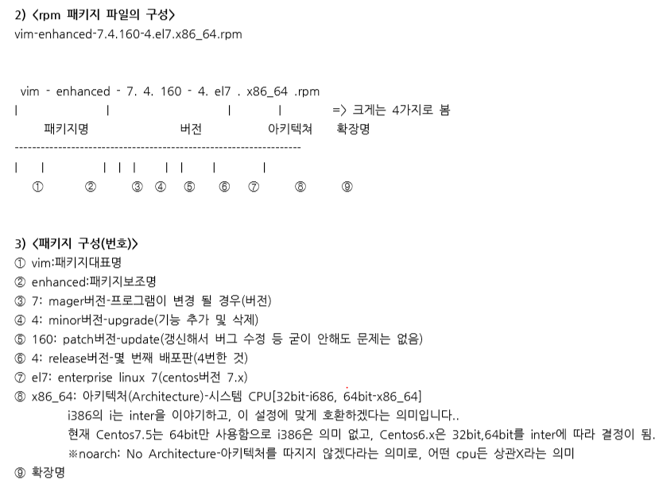

# [2020-06-21 일 TIL]

### `Linux`

### 패키지 관리

- **rpm** (**r**edhat **p**ackages **m**anagement)
  - 클라이언트 시장 - 윈도우 점유이후 나옴 
  - 리눅스에 프로그램 설치 시 사용

```shell
# rpm 작업 (외우기)

option 
-i(install) : Redhat계열 리눅스에 설치되어 있지않은 패키지를 설치 
-v(verbose) : 상세하게 과정을 출력 
-h(hash) : 패키지를 설치할때 해쉬마크(#)
-q : query
-a : all
-U : upgrade(해야함)/update
--nodeps : 

# 1. 패키지 설치
$ rpm -ivh [패키지 전체이름]

# 2. 패키지 삭제
$ rpm -e [패키지 명]

# 3. 설치된 패키지 확인 -> (설치/삭제)하기 전 확인 
$ rpm -qa | grep [패키지 명]

# rpm -qa : 전체 다보여줌 


$ rpm -qa | grep vim
vim-common-7.4.629-6.el7.x86_64
vim-filesystem-7.4.629-6.el7.x86_64
vim-enhanced-7.4.629-6.el7.x86_64
vim-minimal-7.4.629-6.el7.x86_64.rpm


$ vim-minimal-7.4.629-6.el7.x86_64.rpm

# 패키지 구조
vim-minimal-  : 패키지명들
7.4.629-6.el7 : 패키지 버전
.x86_64 	  : 시스템 Architeture (cpu 호환)  # 중요 : 잘못하면 시스템 망가짐 
i386은 32bit, i686은 64bit - x86_64과 기능이다름
noarch은 32,64bit 둘다 지원
.rpm		  : 확장명

```



***

### rpm 공식

1. 의존성 오류(Failed dependencies)를 **절대** 무시하지 말자
   - **의존성 오류가 나오면 무조건 왼쪽 / 오른쪽 파일명 확인**
2. 의존성 오류(Failed dependencies)를 제기한 패키지부터 작업을 진행한다
3. 디렉토리로 구성된 것들(/usr/bin/)은 패키지가 아니므로 의존성 오류를 무시한다
4. **'lib'** 으로 시작하고, 중간에 **'so'** 로 되어 있는 것들은 의존성 오류를 무시해도 된다
5. 모든 패키지들은 반드시 **동일한 버전** 이어야 한다
6. 모든 작업은 **대표 패키지부터** 작업을 진행한다
7. 나머지 패키지들은 보이는 화면 순서대로 작업을 진행한다
8. **가급적** 의존성 무시(--nodeps) 를 쓰지 않도록 한다 **(즉, 어쩔 수 없는 경우만 사용)**

***

### mariadb* 설치

```shell
$ perl(GD) is needed by mariadb-bench-1:5.5.65-1.el7.x86_64
왼쪽 / 오른쪽 확인 (is needed by)
```


***

### php 설치

```shell
$ 
```

 

