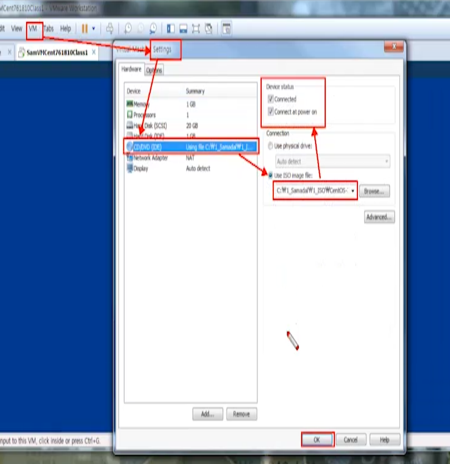

# [2020-06-22 월 TIL]

### `Linux HDD Partition & Monut`

- **HDD** : **데이터를 저장**할 수 있는 공간을 가진 **물리적 하드웨어** 장치 

- **Partition** : HDD를 원할하게 논리적으로 [분할, 나눈다, 쪼갠다]
  - Windows : RAID 
    - cmd에 diskmgmt.msc 검색 - 디스크관리
  - Linux : LVM
- **Filesystem** : HDD를 알맞게(유용성있게) **파티션을 생성(포맷)** 해서 관리를 해줌 
  - 파일시스템 유형 - (포맷을 뭘로 했나)
    - NTFS - 주파티션
    - FAT32 (usb : 대용량은 못하게 막음) - 논리 파티션 
    - Linux : ext4로 포맷 - monut 까지 해야함 
- 파티션 / 파일시스템 / 포맷 비슷한의미


- 파티션 종류
  - **Primary** partition : 주 파티션
    - **최대 4개 사용 가능** 
    - 단 4개 사용 시 더이상 파티션 불가능 
  - **Extended** partition : 확장 파티션 
    - **최대 1개만 사용됨**
    - 논리 파티션을 사용하기 위해 사용 
    - 감싸는 역할만 해줌
    - 파티션이라기엔 어려움 - 파티션 갯수셀때 세지 않음
  - **logical** partition :논리 파티션
    - extended 가 먼저 감싸줘야 생성 가능 


#### HDD Type

- 시스템이 이름 부여

- IDE (병렬)
  - 참고 : 이 기종은 이미 단종됨 (7버전부터)
  - `/dev/hd/`  ->  hd + 문자
  - HDD이름형식 : hda, hdb, hdc(CD-ROM 장치),  hdd, hde ...
- SCSI (직렬)
  - `/dev/sd/` -> sd + 문자
  - HDD이름형식 : sda, sdb, sdc, sdd, sde ...

#### Partition Type

- 사용자가 직접이름 부여

- IDE (병렬)
  - `/dev/hd*/`  ->  hd + 문자 + 숫자
  - HDD 파티션이름형식 : hda5, hdb2, hdc(CD-ROM 장치),  hdd7, hde1 ...
- SCSI (직렬)
  - `/dev/sd*/` -> sd + 문자 + 숫자
  - HDD 파티션이름형식 : sda5, sdb1, sdc2, sdd4, sde5 ...

#### 논리파티션은 5번부터 시작, 주 파티션은 4개하면 더 이상 안됨


#### Mount

- 장치 드라이버를 포맷까지 한 후, 사용자가 사용 할 수 있게 연동(연결) 을 해주는 역할

- 형식 

- `mount [디스크 장치의 파티션명] [mountpoint]`

- `umount [디스크 장치의 파티션명] 또는 [M.P]`

  

#### HDD 추가

1. 반드시 전원을 끈후 HDD 추가 

2. HDD 인식 또는 이름확인 

   - `fdisk -l`

3. 파티션 구성 

   - `fdisk HDD 이름`

   - 명령 m에 들어가서  d, n, p, q, t(LVM), w 메뉴만 기억하면 됨

     

   - **p - 파티션 구성확인**

   - **n - 파티션 생성**

     - `Last sector, +sectors or +size{K,M,G} (2048-2097151, default 2097151): +500M    `

   - **d - 파티션 삭제**

   - **q - 저장하지않고 종료 (== :q)**

   - **w - 파티션 구성저장 및 종료 (== :wq)**

4. 파일 시스템생성 (포맷 : 새로운 파티션생성)

   - `mkfs.ext4 [HDD 파티션이름]`

   - mkfs : make filesystem

5. 마운트

   - 형식
     - 마운트
       - `mount [HDD 파티션이름] [M.P]` ---> M.P는 마운트 포인트 **(사용하지않는 임의의 디렉토리 지정가능)**
       - **마운트 명령어는 전원을 끄면 해제가 됨 - 수동**
       - 마운트 포인트 잡는것 - 사용하지 않는 빈 디렉토리면 됨 
       - ex) 
         - /a 생성 하고 마운트 포인트를 적용하면 파티션과 /a 가 연동된다 (동격) - 이 경우 더이상 일반 디렉토리가 아니라 파티션 디렉토리가 된 것 이다 
     - 언마운트
       - `umount [HDD 파티션이름] 또는 [M.P]`


#### <vmware - CD 삽입>

?


```shell
# 마운트 됬는지 확인 하는 명령어 
$ df -h

Filesystem      Size  Used Avail Use% Mounted on
devtmpfs        472M     0  472M   0% /dev
tmpfs           487M     0  487M   0% /dev/shm
tmpfs           487M  8.4M  478M   2% /run
tmpfs           487M     0  487M   0% /sys/fs/cgroup
/dev/sda1        18G  4.3G   13G  26% /
tmpfs            98M   20K   98M   1% /run/user/0
/dev/sr0        9.6G  9.6G     0 100% /run/media/root/CentOS 7 x86_64 # cd가 마운트 된상태 


# cdrom = sr0 
# /mnt : 마운트를 사용하기 위한 임시 디렉토리 , 마운트 용도로 많이씀 
$ mount [HDD 파티션이름] [M.P]
$ mount /dev/sr0 /mnt
```


**< Mount 유의사항 >** 

1. **M.P는 반드시 임의의 디렉터리로 되있어야함.** 
2. `mount / umount` 명령 시 **현재경로가 마운트 포인트만 아니면** 어떤 곳이던 상관없다. 
3. 사용자와 관련된 디렉터리를 M.P로 지정해서는 절대 안된다. 
4. **한 개의 파티션은 반드시 한 개의 M.P만 사용**  (1:1 대응관계)
5. 마운트 작업 대상은 반드시 파티션(primary, logical)만 대상, HDD와 extended는 작업 대상 불가능


