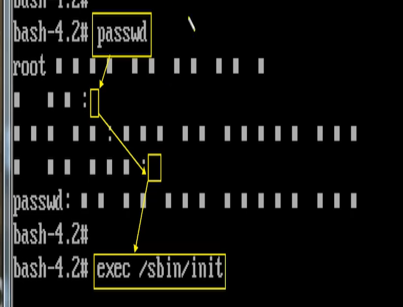
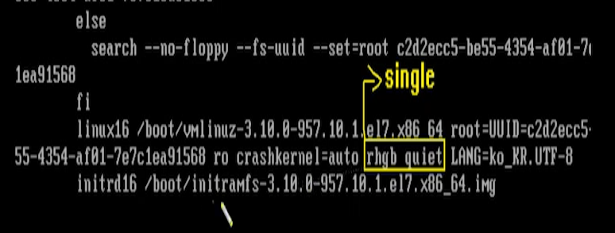
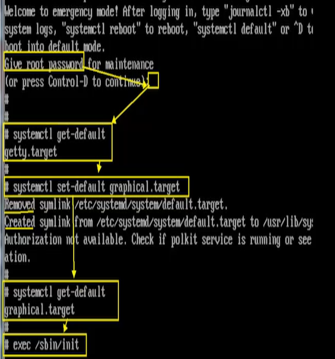

# [2020-06-23 화 TIL]

### `Linux 시스템 응급복구`

1. C:\Users\82105\Downloads\SamVM15_Cent782003Class2\SamVM15_Cent782003Class2_20200615 파일이 부팅이 안되는 상태 

2. `Ctrl + ALt + Insert`  (TUI환경 : 재부팅 ) 누른 후 재빨리 `e`키를 누른다  - **커널 모드 접근**

3. 체크 부분 수정해야함 

   


4. 수정 후 `Ctrl + x`

5. bash 모드 진입 -  **`관리자 비밀번호 분실 했을 때 주로 사용`**

   

6. passwd 암호 임의로 변경 

   - 권한 바꿈 : `mount -o remount.ro /`

7. ```shell
   $ exec /sbin/init <- 
   
   # 참고 
   $ /usr/bin 과 /bin 은 링크가 되있어서 같음 
   ```

8. 부팅 모드 변경 해줘야함 - 관리자모드 변경 (싱글 모드)




9. 차례로 입력 (systemctl : 시스템 컨트롤)




