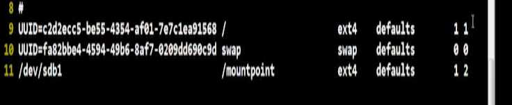
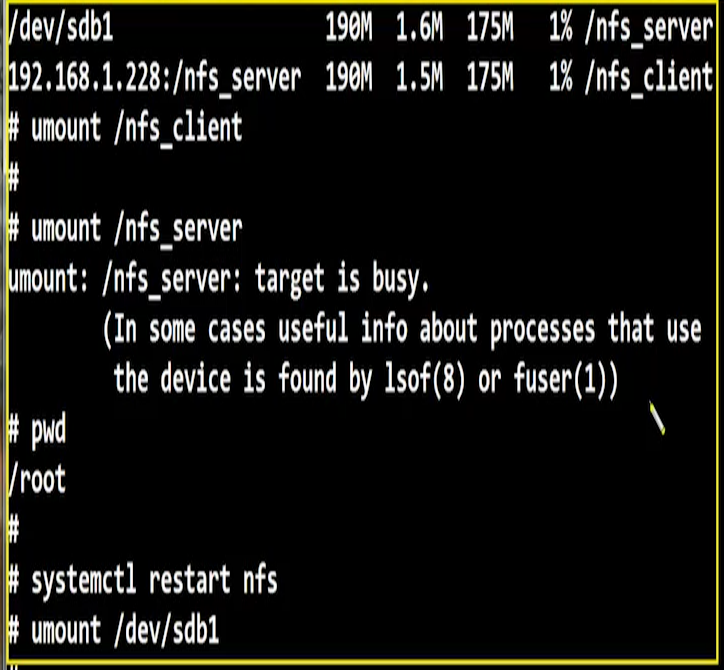
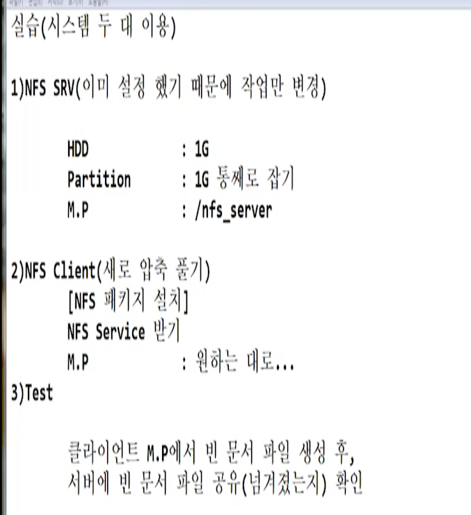
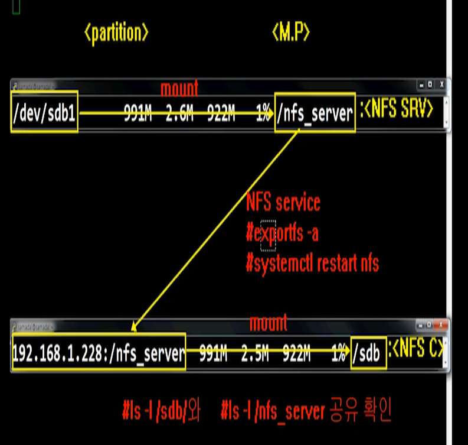

# [2020-06-25 목 TIL]

### Linux 

### FTP server

1. `vsftpd*` 패키지 설치

2. 방화벽 설정

   - 21번 ,20번도 사용가능 


```shell
$ firewall-cmd --permanent --add-port=21/tcp
$ firewall-cmd --permanent --add-port=20/tcp
$ firewall-cmd --permanent --add-service=ftp
$ firewall-cmd --reload

$ firewall-cmd --list-ports
$ firewall-cmd --list-services
$ firewall-cmd --list-all
```

1. 데몬 실행 

```shell
$ systemctl enable vsftpd.service
$ systemctl restart vsftpd.service
$ systemctl status vsftpd.service
```


4. ftp 접속 -- 방법은 3가지 있음 

   - **익명 계정으로 접속 : anonymous**

   - 시스템 관리하려면 익명 접속 되는 것은 막아야한다.

     

   1. 윈도우 cmd 		`$ ftp [IP주소]`
   2. ftp 프로그램 이용
   3. 웹 접속 **ftp://IP주소** -> 단 실행창에서 사용 
      - `/pub`  -- 원래 경로 `/var/ftp/pub`


5. ftp 환경 설정 변경

   - 파일경로 

     - **`/etc/vsftpd/vsftpd.conf`**


```shell
# 익명 사용자 막고 파일 전송 관련 설정 해주기 - 보안설정 

# chroot : 관리자의 권한으로 바꾸겟다 의미 

101 chroot_local_user=YES        # 일반사용자가 접속 할때 :100관리자가 아니면 접근 X
102 allow_writeable_chroot=YES
103 use_localtime=YES
```

- 보안 로그 확인 

  - `/var/log/xferlog`


***

### AutoMount

- 자동으로 마운트 해줌 

- 시스템에 대한 부팅을 처리 해야함 

- **환경설정 파일**
  - `/etc/fstab/`  - 9,10 라인처럼 작성해주면 automount 작동 

```shell
1 #  
2 #
3 # /etc/fstab
4 # Created by anaconda on Mon Jun 22 18:38:57 2020
5 #
6 # Accessible filesystems, by reference, are maintained under '/dev/disk'
7 # See man pages fstab(5), findfs(8), mount(8) and/or blkid(8) for more info
8 #

# 시스템이 알아서 값을 만듬
# UUID = 파티션이름 나타냄 (써줘야함)
$ blkid # block id
/dev/sda1: UUID="f08bb8c5-a64a-4c0e-a2bf-ff26020d0034" TYPE="ext4" 
/dev/sda2: UUID="f75a7257-f359-4baa-8666-de95f1bf03ad" TYPE="swap" 
/dev/sdb1: UUID="4746a21d-c58b-43ef-ad86-0573465ad0ce" TYPE="ext4" 
/dev/sdc1: UUID="eb86217c-0070-445f-8b20-9a9e490ef45c" TYPE="ext4" 
/dev/sdc2: UUID="f3573c48-57f7-428b-92de-0611655c8c40" TYPE="ext4" 
/dev/sr0: UUID="2020-04-22-00-55-24-00" LABEL="CentOS 7 x86_64" TYPE="iso9660" PTTYPE="dos" 


9 UUID=f08bb8c5-a64a-4c0e-a2bf-ff26020d0034 
[M.P]	      [f.s type][Automount여부][dump][filesystem check]
/                ext4    defaults        1 1
10 UUID=f75a7257-f359-4baa-8666-de95f1bf03ad 
swap             swap    defaults        0 0

```

- **dump(백업)**
  - 기존에 설정 유지 (재부팅 시에도 백업유지)
  - 처음에 설정한 셋팅으로 초기화 
- **file system check**
  - **부팅 할 때, 부팅 순서를 체크 후 구동 된다** 
    - 0 : 비활성
    - 1 : 활성 (OS 관련 )
    - 2 : 남은 파티션 잡음 



- 11번 라인 automount 실패시 부팅이안됨 (관리자 모드 부팅)


***

### NFS (Network File System)

- 유래

  - 썬 마이크로 에서 개발 (2008 오라클과 합병) - 유닉스 이용

  - 클라이언트의 HDD에 용량이 모두 가득찬 상황에 HDD 추가 불가능 상태 , 불필요한 파일 삭제 불가능 상태일 때 NFS 시스템 도입 
  - 옛날 시절에는 중요했음 (현재 클라우드의 도입으로 거의 사용하지않음)

- 서버에 공간이 남아있는 HDD의 일부의 용량을 클라이언트에게 넘겨줌 

- **즉 , 네트워크를 통하여 파티션을 서로 공유한다**  = **클라우드**와 비슷함 


#### 1. NFS Server 설정

- Automount 를 잡아야한다 

- **포트 : 2049**
- 환경설정
  - `/etc/exports` - 파일이 존재하지만 내용은 비어있다
    - squash - 으깨다 , 뿌시다
    - no_root_squash
      - nfs server의 관리자 권한 부여 
    - sync
      - 공유 디렉토리를 동기화 시킴 

```shell
#[NFS server M.P] [NFS service를 받을 시스템들] [사용할 권한값 설정]  
/nfs_server    		 192.168.1.101(rw,no_root_squash,sync)
```


#### exportfs 명령으로 사용

```shell
# 설정 적용 - 데몬 재실행이랑 비슷함 
$ exportfs -a

# 설정 보기 
$ exportfs -v 

# 설정 후 데몬 재시작
systemctl restart nfs.service

# rpcbind 패키지 존재 확인
$ rpm -qa | grep rpcbind
rpcbind-0.2.0-49.el7.x86_64 

$ rpcinfo -p # 정보출력
# portmapper, nfs 가 있는지 확인한다 
program vers proto   port  service
100000    4   tcp    111  portmapper
100000    3   tcp    111  portmapper
100000    2   tcp    111  portmapper
100000    4   udp    111  portmapper
100000    3   udp    111  portmapper
100000    2   udp    111  portmapper
100024    1   udp  40635  status
100024    1   tcp  53760  status
100005    1   udp  20048  mountd
100005    1   tcp  20048  mountd
100005    2   udp  20048  mountd
100005    2   tcp  20048  mountd
100005    3   udp  20048  mountd
100005    3   tcp  20048  mountd
100003    3   tcp   2049  nfs
100003    4   tcp   2049  nfs
100227    3   tcp   2049  nfs_acl
100003    3   udp   2049  nfs
100003    4   udp   2049  nfs
100227    3   udp   2049  nfs_acl
100021    1   udp  42451  nlockmgr
100021    3   udp  42451  nlockmgr
100021    4   udp  42451  nlockmgr
100021    1   tcp  38484  nlockmgr
100021    3   tcp  38484  nlockmgr
100021    4   tcp  38484  nlockmgr


$ rpcinfo -p 192.168.1.101
program vers proto   port  service
100000    4   tcp    111  portmapper
100000    3   tcp    111  portmapper
100000    2   tcp    111  portmapper
100000    4   udp    111  portmapper
100000    3   udp    111  portmapper
100000    2   udp    111  portmapper
100024    1   udp  40635  status
100024    1   tcp  53760  status
100005    1   udp  20048  mountd
100005    1   tcp  20048  mountd
100005    2   udp  20048  mountd
100005    2   tcp  20048  mountd
100005    3   udp  20048  mountd
100005    3   tcp  20048  mountd
100003    3   tcp   2049  nfs
100003    4   tcp   2049  nfs
100227    3   tcp   2049  nfs_acl
100003    3   udp   2049  nfs
100003    4   udp   2049  nfs
100227    3   udp   2049  nfs_acl
100021    1   udp  42451  nlockmgr
100021    3   udp  42451  nlockmgr
100021    4   udp  42451  nlockmgr
100021    1   tcp  38484  nlockmgr
100021    3   tcp  38484  nlockmgr
100021    4   tcp  38484  nlockmgr

```


- portmapper
  - 클라이언트가 NFS 서버로 가기위한 징검다리 매개체 역할


#### 2. NFS Client 설정

```shell
#  					 [파티션](server)     [M.P](client)
$ mount -t nfs 192.168.1.101:/nfs_server /nfs_client

# 설정이 잘못됨 : 클라이언트가 전부를 건드릴수 있음 
# 넘겨준 대상이 잘못됨 
Filesystem                 Size  Used Avail Use% Mounted on
/dev/sda1                   18G  4.5G   13G  27% /
192.168.1.101:/nfs_server   18G  4.5G   13G  27% /nfs_client

# 설정이 잘된 경우 
/dev/sdb1                  190M  1.6M  175M   1% /nfs_server
192.168.1.101:/nfs_server  190M  1.5M  175M   1% /nfs_client


```


#### <이슈1 > 마운트 해제 작업 과정 

- 시스템은 "클라이언트가 마운트 해제 하면 안된다" 라고 판단해서 데몬 재실행을 해서 알려야함 




<실습> 해결







#### <이슈2> 클라이언트에서 Automount 설정은 안됨 

```shell

# 이 스크립트에서는 ext4 부분이 문제 
# 서버의 포맷형식이다 
# /etc/fstab

192.168.1.101:/nfs_server /nfs_client	ext4	defaults	1 2

# 파일형식 바꿈
192.168.1.101:/nfs_server /nfs_client	nfs 	defaults	1 2
```

- 결과는 되는데 결론적으로 저렇게 설정하면 안됨
  - 여러명의 클라이언트 측면 생각했을때 서비스는 해줄수 있는데 automount 설정한 클라이언트 들은 **부팅이 안되는 현상이 발생함** 
  - 클라이언트가 컴퓨터 고장이라 착각할 수 있음 
  - 이런 이유로 NFS 자체에서 auto 로 잡을 수 있다 - (클라이언트 환경에서 설정 가능)


#### 클라이언트 - autofs 

```shell
# find /etc -name auto* -type f | nl
     1	/etc/auto.smb
0     2	/etc/sysconfig/autofs
     3	/etc/autofs_ldap_auth.conf
     4	/etc/auto.net      
0     5	/etc/auto.master
0     6	/etc/auto.misc
0     7	/etc/autofs.conf

```

