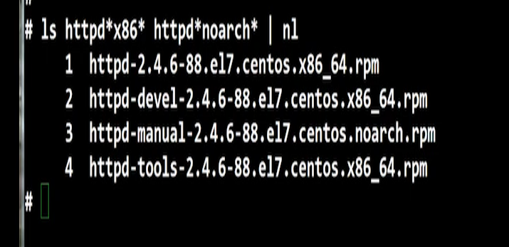
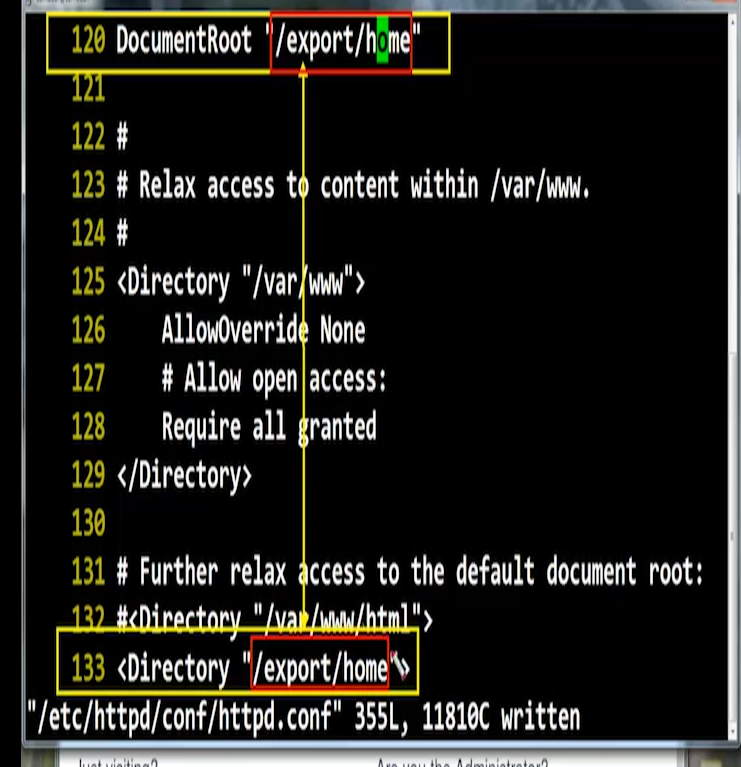

# [2020-06-29 월 TIL]

# Linux Web Server

- 패키지
  - httpd-*



- 데몬
  - **httpd**

- 포트 : 80, 443

- 서비스 : http, https

***

- html 문서 파일 존재위치 
  - `/var/www/html`


#### 웹 검색 착오 발생시 간단 해결방법 

1. 데몬 재실행 named, httpd
2. 파이어폭스 방문 기록 삭제 (인터넷 쿠키)
3. 네임서버 (nameserver) : `/etc/resolv.conf`
4. 데몬 재실행 
5. 이렇게 해서 안되면 서버환경이 잘못된 경우 


### 웹서버 환경설정 

- `/etc/httpd?conf/httpd.conf`

```shell
$ Listen 8080  
# 포트번호만 우회해서 관리자만 접속할 수 있게하고 환경설정 작업할때 씀 
# 여러가지 포트번호로 설정도 가능 - 방화벽을 올리지않고 포트번호만 쓴것처럼 보이지만 실제로 장소를 우회함 

Listen 192.168.1.101:80 # 이렇게 쓸경우 이ip만 서비스를 이용할수 있다 
Listen 80 
# 이 두가지 방법을 동시에 사용하면 안된다 : 문법적으로 에러 

DocumentRoot "/var/www/html" 
# 웹서버의 디렉토리 위치, 기본 리눅스 웹서버페이지의 기본경로를 지정 
# <Directory> 의 경로까지 꼭 맞춰줘야함 

```




```shell
146 Options Indexes FollowSymLinks  
# 디렉토리 블록의 옵션으로 실행 - index로 되있는 이름의 파일을 (화면으로 출력) 
: index.이름 이여야 html파일을 불러와서 모듈화 가능 (다른 이름이면 못찾음)
```

***

### 종합실습

```
예제)
user : main
$HOME : /export/home/
Auto Creating Directory : public_html/
main.samadal.com을 검색시 main 이라는  내용을 출력

스켈 디렉토리에 추가 이후 useradd 이후 
samadal.com.zone , samadal.com.rev 도메인 추가 
httpd.conf 의 웹문서 경로 바꿔줌 
main 유저의 권한변경 

**********************************************************

실습)
기존에 작업했던 시스템들은 삭제

Domain : sauron.co.kr
user   : sauron
$HOME  : /sauron_dir/home/
Auto_Creating_Dir : public_html/
Auto_Creating_File : .sauron(user_sauron 이라는 내용출력 파일)
사용자 지정 SKEL : /skel/


조건
HDD (1G(sauron) 통으로 파티션) NFS 이용하여 기본문서 index를 넘길것 
(기본문서는 반드시 윈도우에서 생성 후 업로드)
결과 : index.html이 기본 웹화면 페이지로 출력하게 하시오
(단 도메인 검색은 Client에서 해보기 )
```


- 하드 디스크 추가해서 파티션 잡기 
- 스켈 디렉토리/파일 추가해서 유저 생성 / 마운트 
  - 무엇을 마운트 / 오토마운트?
    - sauron	- 오토마운드 
    - nfs_server - `/etc/fstab` : 서비스 받을 클라이언트 설정
    - nfs_client : 서버 파티션마운트 
- CD 마운트 - 패키지 다운 : DNS, WEB, NFS, FTP, SSH
- 방화벽 / 데몬 설정
- FTP 설정
- AutoMount 설정 
- DNS 설정
- WEB 설정

> * 실습결과  : 도메인 검색 X , 서버 IP 검색 O

***

```shell
실습

1. 하드디스크 / 파티션 추가

2. 사용자 M.P를 빈 디렉토리로 잡아야한다 -> 사용자 디렉토리로 잡아버림 .. 
	제일좋은 위치의 M.P는 /sauron_dir/home안에 설정해주고 사용자home을 그안에 옴겨준다 (임의의 M.P)
	- /sauron_dir/home/mp/유저 홈디렉토리  (오토마운트 : /etc/fstab)
	
3. 사용자 지정 스켈 파일/디렉토리 생성

4. useradd -mk /etc/skel -d /sauron_dir/home/mp/sauron sauron

5. 사용자 계정 확인

6. autofs 설정시 /misc에 nfs디렉토리가 잡힘 
	
7. DNS 설정
	/etc/hosts
	/etc/resolv.conf
	/etc/named.conf
	/etc/named.rfc1922.zone
	/var/named/named.localhost (새파일로 생성해야함 , 기존파일 손상/변화 시키면 안됨)

8. Web 설정
	경로 
	
9. sauron 허가권 바꾸기 

10. 클라이언트의 resolv.conf 의 네임서버 서버IP를 작성 해준다 
```

