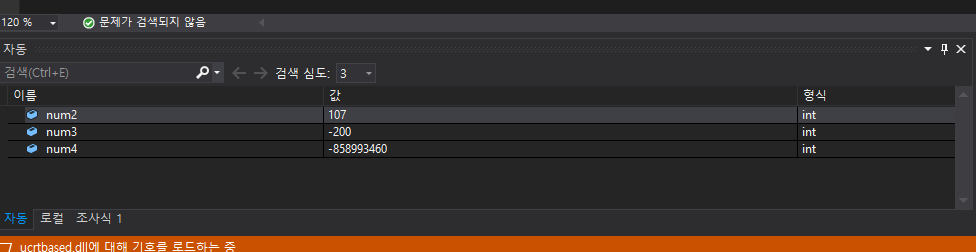
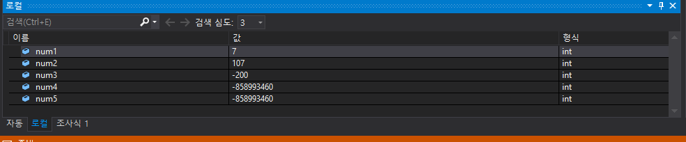
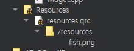

## 2020 03 31 화  / TIL

### 1.  커밋 메시지 작성법

- 제목과 본문을 한 줄 띄워 __분리__ 하기

  - 커밋 메시지는 50자 이내의 요약문장과 빈 줄 하나, 그리고 설명문으로 구성하면 좋다.
  - 이는 git log 명령으로 확인 했을 때 커밋본문 내용까지 확인 할수 있고, git log --oneline 명령으론 제목만 확인할 수 있도록 함으로써 협업 이나 자기 자신이 해당 프로젝트의 어떤 내용을 업데이트 했는지 효율적으로 가독성 있게 확인 가능하다.
  - 출처 : [google] 커밋 메시지 줄바꿈 검색 -> [CLI 커밋 메시지 작성]([https://webisfree.com/2017-02-18/git-%EC%BB%A4%EB%B0%8B-%EB%AA%85%EB%A0%B9%EC%8B%9C-%EC%97%AC%EB%9F%AC%EC%A4%84%EC%9D%84-%EC%9E%85%EB%A0%A5%ED%95%98%EB%8A%94-%EB%B0%A9%EB%B2%95](https://webisfree.com/2017-02-18/git-커밋-명령시-여러줄을-입력하는-방법))

  

- 제목은 영문 기준 50자 이내로 정하기

  

- 제목 첫글자를 __대문자__ 로 정하기 

  

- 제목 끝에 ```.``` __금지__ 하기

  

- 제목은 __```명령조```__로 작성하기 , 본문은 과거형이나 현재형 시제를 사용하여 변경점을 서술

  - 첫 단어는 __```동사원형```__으로 작성하기  (우리말로 커밋 메시지를 읽을때 누군가에게 안 일어난 일을 하도록 지시하는 명령문보다는 일어난 일을 보고 하는 설명문을 더 편안히 받아들인다.) -> 커밋기록은 과거 이기 때문 
  - Ex) 올바른 예
    - If applied, this commit will (제목)
      - (If applied, this commit will) __Refactor subsstem X for readability__
      - (If applied, this commit will) __Update getting started documentation__
      - (If applied, this commit will) __Remove deprecated methods__
      - (If applied, this commit will) __Release version 1.0.0__
      - (If applied, this commit wil) __Merge pull request #123 from user/branch__
  - Ex) 올바르지 않은 예
    - (if applied, this commit will) __Fixed bug with Y__
    - (If applied, this commit will) __Changing behavior of X__
    - (If applied, this commit will) __More fixes for broken stuff__
    - (If applied, this commit will) __Sweet new API methods__

  

- 본문은 영문 기준 72자 마다 줄 바꾸기 - git log에서 볼 때 가독성 높음 

  

- 본문은 __```어떻게```__보다 __```무엇을```__, __```왜```__ 에 맞춰 작성 하기 

  - Ex) 좋은 예시 = Bitcoin Core 프로젝트 

    ```github
    commit eb0b56b19017ab5c16c745e6da39c53126924ed6
    Author: Pieter Wuille <pieter.wuille@gmail.com>
    Date:   Fri Aug 1 22:57:55 2014 +0200
    
       Simplify serialize.h's exception handling
    
       Remove the 'state' and 'exceptmask' from serialize.h's stream
       implementations, as well as related methods.
    
       As exceptmask always included 'failbit', and setstate was always
       called with bits = failbit, all it did was immediately raise an
       exception. Get rid of those variables, and replace the setstate
       with direct exception throwing (which also removes some dead
       code).
    
       As a result, good() is never reached after a failure (there are
       only 2 calls, one of which is in tests), and can just be replaced
       by !eof().
    
       fail(), clear(n) and exceptions() are just never called. Delete
       them.
    ```

    

***

### 2.  교재 - 디버깅 기초 

 환경  : win10, tool : visual studio 2019

- break point : 중단점, 프로그램이 실행되는 도중 멈추고자 하는 코드 부분
  - 디버깅 하려는 코드 부분에 커서를 놓고 딘축키 F9 또는 코드라인에 마우스를 눌러 설정 (빨간 표시)
  - 디버그 - 디버깅 시작 (F5)


```c
#include <stdio.h>c

int methodA(int a) {
	return a + 100;
}

int methodB() {
	return -200;
}

int methodC(int a, int b) {
	int c = 0;
	if (a < 0) {
		a *= -1;
	}
	c = a * 1000;
	return c;
}

int main(void) {
	
    int num1 = 7;

    int num2 = methodA(num1);

    int num3 = methodB();

    int num4 = methodC(num2, num3); // break point 찍음

    int num5 = methodC(num3, num2);

    return 0;
}
```
***

그림 1-1. 디버깅 화면 - 자동 창



- num4는 methodC() 가 아직 호출되지않아 -858993460이라는 쓰레기값 가짐 

***

그림1-2. 디버깅 화면 - 로컬 창



- 로컹 창은 디버깅 중 현재 멈춘 위치의 모든 변수를 표시해준다.

- 중단점을 찍은 이후 다시 디버깅(F5)를 실행하지 않고 한 단계씩 코드실행 (F11) 이나 프로시저 단위 실행 (F!0)을 선택하여 중단점 이후의 코드를 한 줄씩 실행하면 된다.
- 프로시저 단위 실행  = 눈에 보이는 그대로 한 줄씩 실행
- 한 단계씩 코드 실행 = 내부적으로 실행하는 모든 코드를 한 줄씩 실행 


## 이해안되는 것들, 궁금한점

1. 



.qrc 파일이 있는 저런 박스 모양 파일을 오른쪽 클릭으로 remove directory를 실행후 새로고침해도 삭제가 왜 안되는 걸까요? 

