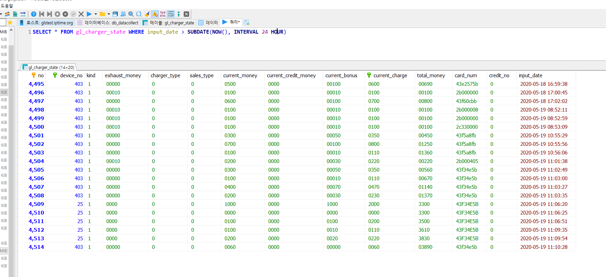

# 2020 05 19 화 TIL

### MySQL

- 현재 시간을 기준으로 이전 날짜 데이터 조회

- 참고

  - https://baessi.tistory.com/31
  - https://sun-kakao.tistory.com/52

  ```mysql
  SELECT 컬럼명,
  	   날짜형식의 컬럼명 
  FROM 테이블명
  WHERE 날짜형식의 컬럼명 > SUBDATE(NOW(), INTERVAL 24 HOUR) 
  /* 현재 시간의 24시간 이전의 데이터만 조회*/
  ```

  

```mysql
SELECT * FROM gl_charger_state WHERE DATE_FORMAT(input_date(날짜 필드명), "%Y-%m-%d") = CURDATE()
```


***

### Debian 

- [systemd 부팅 서비스 시작 1](https://www.linode.com/docs/quick-answers/linux/start-service-at-boot/)

- [systemd 부팅 서비스 시작 2](https://www.tanzolab.it/systemd)
- [파이썬 스크립트 시작](https://serverfault.com/questions/951254/debian-9-rc-local-deprecated-how-to-launch-python-at-startup)

- [데비안 포럼](https://www.debian.org/doc/debian-policy/#)

- [우분투 apt-get 패키지 설치 및 제거, 업그레이드 방법](https://cezacx2.tistory.com/1246)

- [리눅스 하드웨어 정보 및 용량확인](https://dbrang.tistory.com/584)